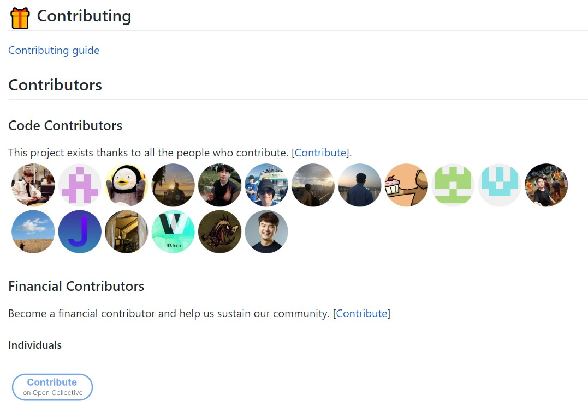

# 구민규 (Kooku)

_어제보다 나은 나_

**저는 `____` 하는 개발자입니다.**

1. 좋은 코드와 설계를 고민하는
2. 성장하기 위해 노력하는
3. 배우는 것을 좋아하는
4. 대화하며 발전해나가는 것을 좋아하는
5. 기억보다는 기록을 하는
6. 효율적인 것을 좋아하는

|            |                              |
| :--------: | :--------------------------: |
| **GitHub** | https://github.com/koomg9599 |
|  **Blog**  |  https://kooku.netlify.com   |
| **Email**  |       kooku@kakao.com        |

# Experiences

## KASA

|              |                                      |
| :----------: | :----------------------------------: |
|  **period**  |         20.08 ~ **current**          |
| **position** | Frontend Chapter / Frontend Engineer |
| **Project**  | Brand-site, Web View, Operation Center|

### 1) Brand site 개발 ([kasa.co.kr](https://kasa.co.kr))

- 개발스택: Next.js, Emotion
- 웹 호환성 & 웹 표준 준수

### 2) Web View 개발
- Event, Service Guide의 Web View 개발
- Client 개발자와 소통하며 Scheme을 이용한 Native 기능 사용

### 3) Operation Center 개발
- 운영자가 사용하는 Operation Center 개발

## Doosan Digital Innovation

|              |                                               |
| :----------: | :-------------------------------------------: |
|  **period**  |                 19.12 ~ 20.07                 |
| **position** | Digital Dev Platform Chapter / Cloud Engineer |

### Chapter 소개

- Cloud Service Vendors(AWS, Azure, GCP, etc..), Agile Tool Chain(Atlassian, Trello)등의 업체와 회사간의 계약
- 계열사 프로젝트의 아키텍쳐 큐레이팅&컨설팅
- 계열사 프로젝트에 사용된 Third party(DB, Cloud, etc..) 서비스 billing

## LINE Financial Plus (Intern)

|              |                                     |
| :----------: | ----------------------------------- |
|  **period**  | 19.07 ~ 19.08 (2m)                  |
| **position** | F Web Dev 2 / Front-End             |
| **Projects** | 웹 성능 측정 서비스 (Deungdae Jigi) |

### 웹 성능 측정 서비스 (Front-End, Back-End 개발)

Lighthouse 모듈을 이용하여 웹 성능을 측정하고 기록할 수 있으며, CI 서버로도 사용할 수 있는 웹 서비스.

- 19.07 ~ 19.08 (2m)
- TypeScript, React(hooks), Redux, Express.js

#### Description

- 프로젝트 초기 React + TypeScript Application Architecture 설계
- Node.js + TypeScript Architecture 설계
- History, My Page, Report
- ChartJS를 이용한 점수 시각화
- OAuth 2
- 자체 CI서버 구축(+GitHub Bot)
  - GitHub Webhook을 이용하여 Pull Request시 해당 Branch를 Clone -> Build -> Deploy -> Audit
  - 설정한 Threshold 값 못 넘을 시 Fail(Merge 불가)

## 이노매틱 (Intern)

|              |                       |
| :----------: | --------------------- |
|  **period**  | 18.12 ~ 19.06 (6m)    |
| **position** | 개발 / Front-End      |
| **Projects** | Ad-Tech (Mr. Doochie) |

### 미스터 두치 (Front-End 개발 담당, PM)

Ad-Tech 서비스로 가게를 등록하면 거리, 리뷰수, 메뉴, 별점, 가격 등 여러가지 항목을 통해 경쟁사를 추천. 네이버, 페이스북, 인스타그램에서 관련 검색어 상위노출 여부, 포스팅 수, 리뷰 수 등의 정보를 가져와 시각화한 후 Reporting.

- 18.12 ~ 19.06 (6m)
- React, Redux

#### Description

- 프로젝트 초기 React Application Architecture 설계
- 경쟁사 추천 알고리즘 제작
- ChartJS를 이용한 Reporting 시각화
- Project Manager
- 기획

# Open Source Projects

## gatsby-starter-bee

- GitHub Repository link: https://github.com/JaeYeopHan/gatsby-starter-bee
- React, Scss, Gatsby

기존의 템플릿을 커스터마징하여 블로그 활동, Usecase

# ETC

## 나만의 커밋 메시지 가이드

- GitHub Repository link: https://github.com/koomg9599/commit-message-guide

커밋 메시지를 작성하는 가이드 작성

ps. +[협업할 때 사용하는 Commitlint-bot](https://kooku.netlify.com/etc/%ED%98%91%EC%97%85%ED%95%A0%20%EB%95%8C-%EC%82%AC%EC%9A%A9%ED%95%98%EB%8A%94-commitlint-bot/)

# Education

## Pusan National University

(14.03 ~ 20.02) 전기컴퓨터공학부 정보컴퓨터공학전공
