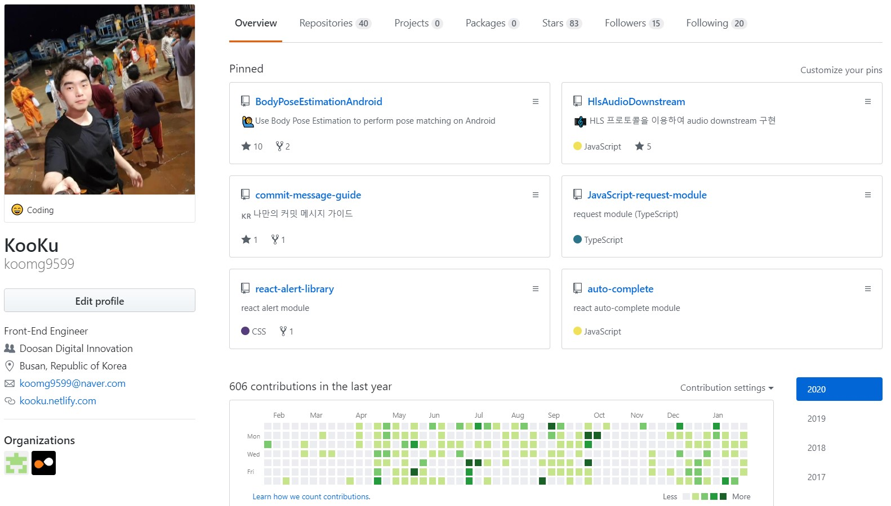
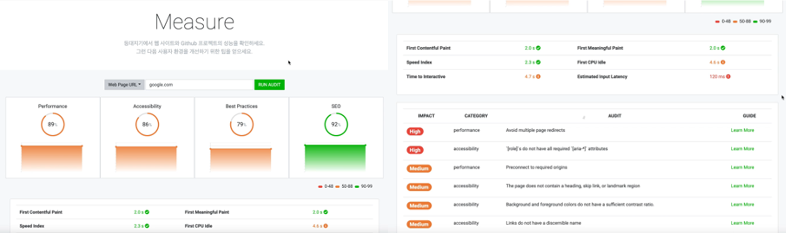
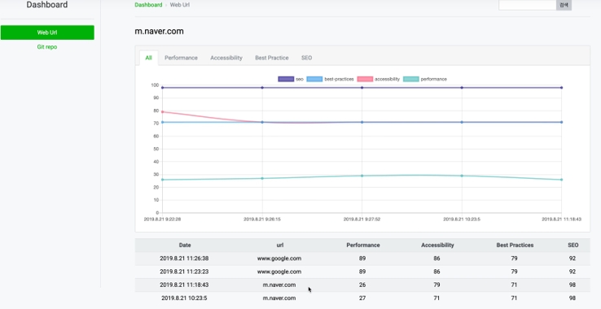
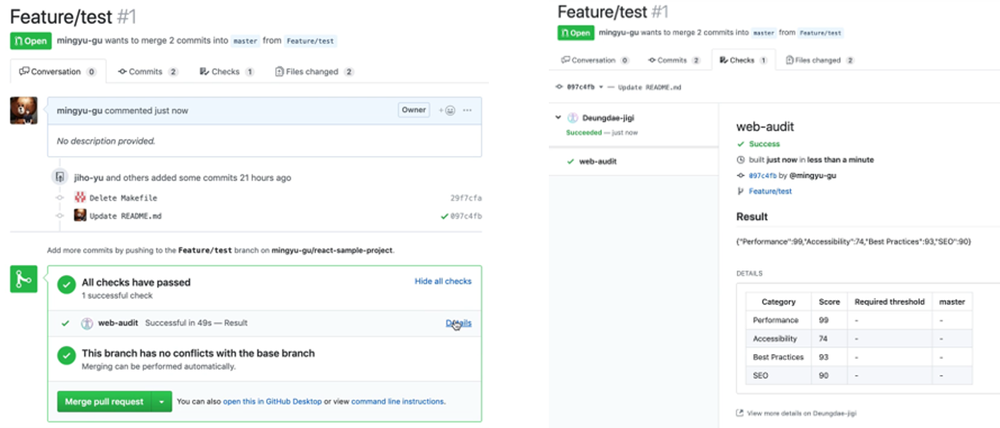
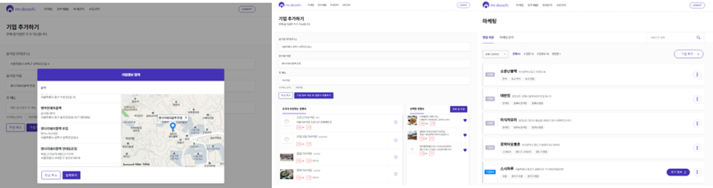
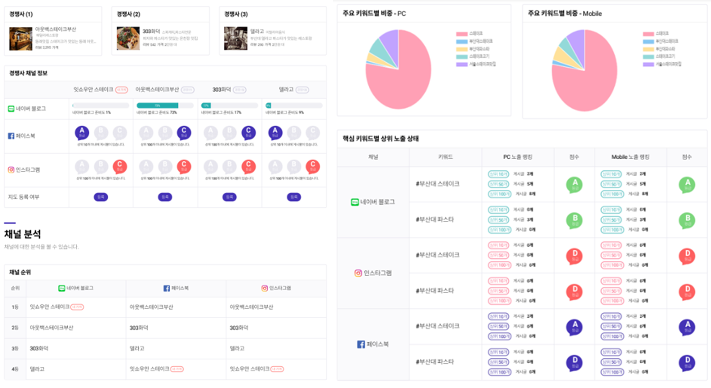

# 구민규 (Kooku)

_성장에 목이 마른 사람, 이쁜 코드를 보면 기뻐하는 사람_

 

**저는 `____` 하는 개발자입니다.**

1. 좋은 코드와 설계를 고민하는
2. 성장하기 위해 노력하는
3. 배우는 것을 좋아하는
4. 대화하며 발전해나가는 것을 좋아하는
5. 기억보다는 기록을 하는
6. 효율적인 것을 좋아하는

|            |                              |
| :--------: | :--------------------------: |
| **GitHub** | https://github.com/koomg9599 |
|  **Blog**  |  https://kooku.netlify.com   |
| **Email**  |       kooku@kakao.com        |

# Experiences

## Doosan Digital Innovation

|              |                                               |
| :----------: | :-------------------------------------------: |
|  **period**  |              19.12 ~ **current**              |
| **position** | Digital Dev Platform Chapter / Cloud Engineer |

### Chapter 소개

* Cloud Service Vendors(AWS, Azure, GCP, etc..), Agile Tool Chain(Atlassian, Trello)등의 업체와 회사간의 계약
* 계열사 프로젝트의 아키텍쳐 큐레이팅&컨설팅
* 계열사 프로젝트에 사용된 Third party(DB, Cloud, etc..) 서비스 billing

## LINE Financial Plus (Intern)

|              |                              |
| :----------: | ---------------------------- |
|  **period**  | 19.07 ~ 19.08 (2m)           |
| **position** | F Web Dev 2 / Front-End      |
| **Projects** | 웹 성능 측정 서비스  (Deungdae Jigi) |

### 웹 성능 측정 서비스 (Front-End, Back-End 개발)

Lighthouse 모듈을 이용하여 웹 성능을 측정하고 기록할 수 있으며, CI 서버로도 사용할 수 있는 웹 서비스.

* 19.07 ~ 19.08 (2m)
* TypeScript, React(hooks), Redux, Express.js

#### Description

* 프로젝트 초기 React + TypeScript Application Architecture 설계
* Node.js + TypeScript Architecture 설계
* History, My Page, Report
* ChartJS를 이용한 점수 시각화
* OAuth 2
* 자체 CI서버 구축(+GitHub Bot)
  * GitHub Webhook을 이용하여 Pull Request시 해당 Branch를 Clone -> Build -> Deploy -> Audit
  * 설정한 Threshold 값 못 넘을 시 Fail(Merge 불가)

### Images

  

  _url 입력 시 성능과 취약한 부분 표시_

 

  

_성능측정결과를 저장하여 그래프로 시각화_

 

  

_GitHub Repo RP 시 자동 빌드, 배포 후 성능측정 결과 표시_

## 이노매틱 (Intern)

|              |                       |
| :----------: | --------------------- |
|  **period**  | 18.12 ~ 19.06 (6m)    |
| **position** | 개발 / Front-End        |
| **Projects** | Ad-Tech (Mr. Doochie) |

### 미스터 두치 (Front-End 개발 담당, PM)

Ad-Tech 서비스로 가게를 등록하면 거리, 리뷰수, 메뉴, 별점, 가격 등 여러가지 항목을 통해 경쟁사를 추천. 네이버, 페이스북, 인스타그램에서 관련 검색어 상위노출 여부, 포스팅 수, 리뷰 수 등의 정보를 가져와 시각화한 후 Reporting.

* 18.12 ~ 19.06 (6m)
* React, Redux

#### Description

* 프로젝트 초기 React Application Architecture 설계
* 경쟁사 추천 알고리즘 제작
* ChartJS를 이용한 Reporting 시각화
* Project Manager
* 기획

#### Images

  

_가게 등록 및 경쟁사 추천_

 

  

_가게, 경쟁사 데이터 수집 Report_

# Open Source Projects

## gatsby-starter-bee

* GitHub Repository link: https://github.com/JaeYeopHan/gatsby-starter-bee
* React, Scss, Gatsby

기존의 템플릿을 커스터마징하여 블로그 활동, Usecase

# ETC

## 나만의 커밋 메시지 가이드

* GitHub Repository link: https://github.com/koomg9599/commit-message-guide
  

커밋 메시지를 작성하는 가이드 작성

ps. +[협업할 때 사용하는 Commitlint-bot](https://kooku.netlify.com/etc/%ED%98%91%EC%97%85%ED%95%A0%20%EB%95%8C-%EC%82%AC%EC%9A%A9%ED%95%98%EB%8A%94-commitlint-bot/)

## Node.js(TypeScript) Template Code

* GitHub Repository link: https://github.com/koomg9599/TypeScript-Node.js-Template
* Winston, ExpressJS, TypeScript

TypeScript로 Node.js Server를 구축하는 템플릿 코드

## Auto-Complete module

* GitHub Repository link: https://github.com/koomg9599/auto-complete
* React(hooks)

React Hook을 이용하여 Auto-Complete module 제작

## Alert module

* GitHub Repository link: https://github.com/koomg9599/react-alert-library
* React(hooks), Redux, CSS

React Hook을 이용하여 Alert module 제작

## Request module

* GitHub Repository link: https://github.com/koomg9599/react-alert-library
* TypeScript, React

TypeScript를 이용하여 request 모듈을 제작. axios등 라이브러리들은 사용하지 않고 XMLHttpRequest만 사용

## HLS Audio Downstream server

* GitHub Repository link: https://github.com/koomg9599/HlsAudioDownstream
* ExpressJS

HLS 프로토콜을 이용한 Audio Downstream Node 서버 제작

## Circle Chart module

* GitHub Repository link: https://github.com/koomg9599/circle-chart-react-hooks
* React(hooks)

Circle Chart module 제작

# Education

## Pusan National University

(14.03 ~ 20.02) 전기컴퓨터공학부 정보컴퓨터공학전공