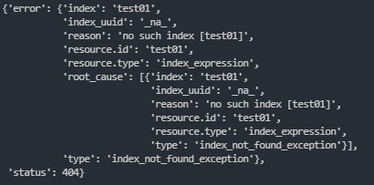

## 개요

프로젝트 진행중에 python에서 elasticsearch를 사용하는 경우가 있었다. 이때 많이 사용한 함수들의 사용법들을 정리하였다.

## 정리

#### elasticsearch 연동

```
import elasticsearch

es = elasticsearch.Elasticsearch("localhost:9200")
```

#### index 생성

```
# ignore 400 cause by IndexAlreadyExistsException when creating an index
es.indices.create(index='test01', ignore=400)
```

기존에 있는 index라면 400에러가 발생한다. Try/Catch를 사용하면 되겠지만 사용하기 싫다면 ignore=400을 적어주어라. 해당 에러의 원인을 return해줄 것이다.

#### id 생성

```
 es.create(index='test01', doc_type='test', id=0, body=d0)
```

위와 같이 생성하게 되면 기존에 id값이 있다면 덮어쓰고, 없다면 생성한다. 에러는 발생하지 않는다.

#### index 삭제

```
# ignore 404 and 400
es.indices.delete(index='test-index', ignore=[400, 404])
```

#### index 내용 출력

```
es.indices.get(index = 'test01', ignore=[400, 404])
```

없는 index라면 404에러가 발생한다. Try/Catch를 사용하면 되겠지만 사용하기 싫다면 ignore=404를 적어주어라. 해당 에러의 원인을 return해줄것이다.

**ignore 붙혀줄 시 404에러 출력값**



#### id 내용 가지고오기

```
es.get(index='test01', doc_type='doc', id='_id')
```

#### 모든 index 출력

가장 유용하게 사용한 것 중 하나이다.

```
es.indices.get_alias().keys()
# dict_key(['index01', 'index02'])
```

#### index 존재여부

```
es.indices.exists(index='test03')
```

#### id 문서 존재여부

```
es.exists(index = 'test01', doc_type = 'text', id = 1)
```

#### elastic 설정 정보

```
ex.info()
```

#### id 와 type 출력

```
es.search(index='test01', filter_path=['hits.hits._id', 'hits.hits._type'], size=1000)
```

search의 경우 default size가 10이므로 많은 데이터를 가지고 오기 위해서는 뒤에 size를 붙혀주는게 좋다.

#### index 관련정보 모두 출력

```
es.search(index='test01', filter_path=['hits.hits._*'])
```

#### 모든 index의 id값을 출력

```
id_list = []
index_list = list(es.indices.get_alias().keys())
for index in index_list:
    id_list = es.search(index=username, filter_path=['hits.hits._id'], size = 1000)
    for _id in id_list['hits']['hits']:
        id_list.append(_id['_id'])
```

### Reference

[elasticsearch 공식문서](https://elasticsearch-py.readthedocs.io/en/master/api.html)