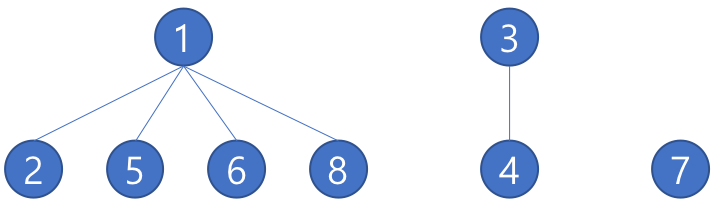

이번 카카오 인턴 코딩테스트에서 유니온 파인드 알고리즘이 나와서 정리하였다.

*내 생각* : 매우매우 유용한(?) 알고리즘이다. 

## 유니온 파인드(Union Find)란?

#### 정의

- 유니온 파인드(Union Find) : 서로소 집합(Disjoint Set) 그리고 병합 찾기 집합(Merge Find Set)이라고도 불리며 여러 서로소 집합의 정보를 저장하고 있는 자료구조를 의미합니다.

#### 예시

- 다음 아래와 같이 원소들이 있다고 가정을 했을 때


- 각각의 원소들이 어떤 원소들과 연결이 되어있는지 입력을 받는다고 가정하면(1-2, 2-5, 5-6, 5-8, 3-4 이런 방식으로) 아래와 같이 3개의 서로소 집합이 나올 수 있다.


## 구현

#### 원리

- 배열을 이용해서 Tree 자료구조를 만들어 구현하며 위에 나와 있는 `{1, 2, 5, 6, 8}, {3, 4}, {7}`의 경우에는 아래처럼 표현 및 구현이 가능합니다.
- 즉, 최상단 노드인 Root노드를 집합을 구분하는 ID처럼 생각하면 이해가 더 편합니다.



- 주어진 두 원소 또는 집합을 합하는 `Union`부분과 원소가 어떤 집합에 있는지 찾는 `Find`함수로 이루어져있다.
- `parent[i]` : 원소 `i`의 부모 노드를 가지고 있는 배열, `parent[i]`는 `i`의 부모 노드

## 예시

이 문제 한번만 풀어보면 완벽히 이해할듯 싶다.

- 집합의 표현
- <https://www.acmicpc.net/problem/1717>

```c++
#include <iostream>
#include <vector>

using namespace std;

vector<int> parent(1000010, -1);

int find(int a) {
	if (parent[a] == -1) return parent[a] = a;
	if (parent[a] == a) return a;
	else return parent[a] = find(parent[a]);
}

void setParent(int a, int b) {
	int rootA = find(a);
	int rootB = find(b);
	parent[rootA] = rootB;
}

int main() {
	ios_base::sync_with_stdio(false); cin.tie(NULL); cout.tie(NULL);
	int n, m;
	cin >> n >> m;
	
	int a, b, c;
	for (int i = 0; i < m; i++) {
		cin >> a >> b >> c;
		if (a == 0) {
			setParent(b, c);
		}
		else {
			if (find(b) == find(c)) cout << "YES" << "\n";
			else cout << "NO" << "\n";
		}
	}
	return 0;
}
```


## Reference

[[Algorithm] 유니온 파인드(Union Find)와 서로소 집합(Disjoint Set) :: twpower](https://twpower.github.io/115-union-find-disjoint-set)