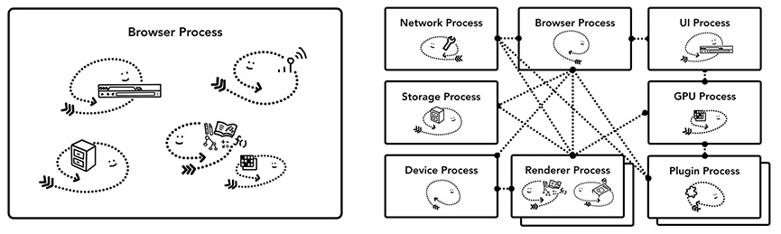

NAVER D2 [최신 브라우저의 내부 살펴보기](https://d2.naver.com/helloworld/2992312)를 요약하였습니다.

이 글은 [Google Developers 사이트](https://developers.google.com/)에 공개된 [Mariko Kosaka](https://developers.google.com/web/resources/contributors/kosamari)의 "Inside look at modern web browser"(최신 브라우저의 내부 살펴보기) 시리즈를 번역한 글입니다. 이 시리즈는 Chrome을 중심으로 최신 브라우저를 들여다봅니다. Chrome이 속도뿐만 아니라 안정성을 위해 어떤 아키텍처를 사용하는지 설명하는 것에서 시작해, 웹 페이지가 어떤 단계를 거쳐 화면에 그려지는지 설명합니다. 이와 더불어 성능 향상을 위해 웹 개발자가 고려하면 좋을 사항도 다룹니다.

> **저작권** 
> 이 글의 원문은 다음과 같은 저작권 기준을 따릅니다.
>
> *Except as otherwise noted, the content of this page is licensed under the Creative Commons Attribution 3.0 License, and code samples are licensed under the Apache 2.0 License. For details, see our Site Policies. Java is a registered trademark of Oracle and/or its affiliates.*

## 1. CPU, GPU, 메모리 그리고 다중 프로세스 아키텍처

### CPU

 첫 번째로 볼 부품은 CPU(central processing unit, 중앙처리장치)이다. CPU는 컴퓨터의 두뇌라 할 수 있다. CPU 코어는 여러 종류의 작업을 하나씩 순서대로 처리할 수 있다. 

### GPU

GPU(graphics processing unit, 그래픽처리장치)는 컴퓨터의 또 다른 부품이다. CPU와 달리 GPU는 간단한 작업에만 특화되어 있지만 여러 GPU 코어가 동시에 작업을 수행할 수 있다. 그래픽처리장치라는 이름에서 알 수 있듯이 GPU는 그래픽 작업을 처리하기 위해 개발되었다. 최근 몇 년 동안 GPU 가속을 통해 GPU가 단독으로 처리할 수 있는 계산이 점점 더 많아졌다.

> 특정 작업을 CPU가 아닌 다른 특별한 장치를 통해 수행 속도를 높이는 것을 '하드웨어 가속(hardware accelerated)'이라 한다. 그래픽이나 사운드와 관련된 작업에 하드웨어 가속을 많이 사용한다. 브라우저에서 하드웨어 가속은 주로 GPU를 사용한 그래픽작업의 가속을 의미한다. 간단한 작업을 동시에 수 많은 코어가 수행하는 GPU의 특성을 기반으로 그래픽 작업이 훨씬 빠르게 처리될 수 있다.

### 프로세스와 스레드로 프로그램 실행

프로세스는 애플리케이션이 실행하는 프로그램이라 할 수 있다. 스레드는 프로세스 내부에 있으며 프로세스로 샐행되는 프로그램의 일부를 실행한다.

애플리케이션을 시작하면 프로세스가 하나 만들어진다. 프로세스가 작업을 하기 위해 스레드를 생성할 수도 있지만 선택 사항이다. 운영체제는 프로세스가 작업할 메모리를 "한 조각"주는데, 이 전용 메모리 공간에 애플리케이션의 모든 상태가 저장된다. 애플리케이션을 닫으면 프로세스가 사라지고 운영체제가 메모리를 비운다.

프로세스는 여러 작업을 수행하기 위해 운영체제에 다른 프로세스를 실행하라고 요청할 수 있다. 그러면 메모리의 다른 부분이 새 프로세스에 할당된다. 두 프로세스가 서로 정보를 공유해야 할 때는 IPC(inter process communication, 프로세스 간 통신)를 사용한다. 많은 애플리케이션이 이러한 방식으로 작동하도록 설계되어 있다. 그래서 작업 프로세스가 응답하지 않을 때 애플리케이션의 다른 부분을 실행하는 프로세스를 중지하지 않고도 응답하지 않는 프로세스를 다시 시작할 수 있다.

### 브라우저 아키텍처

그렇다면 브라우저는 프로세스와 스레드를 어떻게 사용할까? 스레드를 많이 사용하는 프로세스 하나만 사용할 수도 있고, 스레드를 조금만 사용하는 프로세스를 여러 개 만들어 IPC로 통신할 수도 있다.

여기에서 주목해야 할 중요한 점은 이러한 서로 다른 아키텍처가 구현 세부 사항이라는 점이다.  브라우저를 만드는 방법에 대한 표준은 없다.

이 시리즈에서는 다음 그림에 표현된 Chrome의 최근 아키텍처를 살펴보겠다.

제일 위에 있는 브라우저 프로세스는 애플리케이션의 각 부분을 맡고 있는 다른 프로세스를 조정한다. 렌더러 프로세스는 여러 개가 만들어져 각 탭마다 할당된다. 최근까지 Chrome은 탭마다 프로세스를 할당했다. 이제는 사이트마다 프로세스를 할당한다.

> 탭마다 프로세스를 할당하는 방법을'process per tab'이라 하고, 사이트마다 프로세스를 할당하는 방법을 'process per site'라고 한다.

Chomr의 다중 프로세스 아키텍처. Chrome은 탭마다 렝더러 프로세스를 실행하기 때문에 렌더러 프로세스를 여러 겹으로 표현했다.

### 어떤 프로세스가 무엇을 담당하나

다음은 Chrome의 각 프로세스가 무엇을 제어하는지 설명하는 표이다.

| 프로세스          | 프로세스가 제어하는 부분                                     |
| ----------------- | ------------------------------------------------------------ |
| 브라우저 프로세스 | 주소 표시줄, 북마크 막대, 뒤로 가기 버튼, 앞으로 가기 버튼 등 애플리케이션의 "chrome" 부분을 제어한다. 네트워크 요청이나 파일 접근과 같이 눈에 보이지는 않지만 권한이 필요한 부분도 처리한다. |
| 렌더러 프로세스   | 탭 안에서 웹 사이트가 표시되는 부분의 모든 것을 제어한다.    |
| 플러그인 프로세스 | 웹 사이트에서 사용하는 플러그인(예: Flash)을 제어한다.       |
| GPU 프로세스      | GPU 작업을 다른 프로세스와 격리해서 처리한다. GPU는 여러 애플리케이션의 요청을 처리하고 같은 화면에 요청받은 내용을 그리기 때문에 GPU 프로세스는 별도 프로세스로 분리되어 있다. |

### 다중 프로세스 아키텍처가 Chrome에 주는 이점

#### 1) 안정성

Chrome이 렌더러 프로세스를 여러 개 사용한다고 설명했다. 가장 간단한 예로 탭마다 렌더러 프로세스를 하나 사용하는 경우를 생각해 보자. 3개의 탭이 열려 있고 각 탭은 독립적인 렌더러 프로세스에 의해 실행된다. 이때 한 탭이 응답하지 않으면 그 탭만 닫고 실행 중인 다른 탭으로 이동할 수 있다. 만약 모든 탭이 하나의 프로세스에서 실행 중이었다면 탭이 하나만 응답하지 않아도 모든 탭이 응답하지 못하게 된다.

>**한 탭이 응답하지 않더라도 다른 탭은 사용 가능하다는 점은 각 탭마다 독립적인 렌더러 프로세스를 유지했을 때의 이점이다.** 웹 페이지에서 처리할 작업이 많아 응답하지 못하는 경우나 웹 페이지를 담당하던 렌더러 프로세스의 실행이 중단된 경우 등에 이런 이점을 확인할 수 있다. 
>한편 같은 원리로 브라우저 프로세스와 렌더러 프로세스를 분리했을 때의 장점도 생각할 수 있다. 렌더러 프로세스가 웹 페이지를 그리는 도중 오류가 발생해 실행이 중단되더라도 브라우저 전체가 종료되지 않고 오류 페이지를 보여 주는 정도로 문제를 처리할 수 있다.

#### 2) 보안과 격리

브라우저의 작업을 여러 프로세스에 나눠서 처리하는 방법의 또 다른 장점은 보안과 격리(sandbox)이다. **운영체제를 통해 프로세스의 권한을 제한할 수 있어 브라우저는 특정 프로세스가 특정 기능을 사용할 수 없게 제한할 수 있다.** 예를 들어 Chrome은 렌더러 프로세스처럼 임의의 사용자 입력을 처리하는 프로세스가 임의의 파일에 접근하지 못하게 제한한다.

> '임의의 사용자 입력'은 웹 페이지의 실행으로 이해할 수 있다.

프로세스는 전용 메모리 공간을 사용하기 때문에 공통부분(예를 들어 Chrome의 JavaScript 엔진인 V8)을 복사해서 가지고 있는 경우가 많다. 동일한 프로세스의 스레드가 메모리를 공유할 수 있는 데 반해 서로 다른 프로세스는 메모리를 공유할 수 없어 메모리 사용량이 더 많아질 수밖에 없다. **Chrome은 메모리를 절약하기 위해서 실행할 수 있는 프로세스의 개수를 제한한다.** 정확한 한도는 기기의 메모리 용량과 CPU 성능에 따라 다르지만 프로세스의 개수가 한도에 다다르면 동일한 사이트를 열고 있는 여러 탭을 하나의 프로세스에서 처리한다.

> 다중 프로세스 아키텍처가 Chrome이 메모리를 많이 사용하는 이유였다는 것을 알 수 있다. 다만 다중 프로세스 아키텍처는 안정적이고 빠른 사용자 경험과 보안을 제공한다는 장점이 있다. Chrome 개발팀은 이런 장점을 살리면서도 메모리를 절약할 수 있는 새로운 아키텍처를 도입하기 위해 지속적으로 노력하고 있다. 다음 장에 설명할 서비스화가 이런 노력의 하나이다.

### 더 많은 메모리 절약 - Chrome의 서비스화

**동일한 접근 방식이 브라우저 프로세스에도 적용된다. Chrome은 브라우저의 각 부분을 서비스로 샐행해 여러 프로세스로 쉽게 분할하거나 하나의 프로세스로 통합할 수 있도록 아키텍처를 변경하고 있다.**

> 성능이 좋은 하드웨어에서는 Browser Process에서 하는 작업들을 Network Process, Storage Process, UI Process, Device Process로 분할한다.

성능이 좋은 하드웨어에서 Chrome이 실행 중일 때에는 각 서비스를 여러 프로세스로 분할해 안정성을 높이고, 리소스가 제한적인 장치에서 실행 중일 때에는 서비스를 하나의 프로세스에서 실행해서 메모리 사용량을 줄이는 것이 기본 아이디어이다. 메모리 절약을 위해 프로세스를 합치는 이런 방식은 Android와 같은 플랫폼에서는 이전부터 사용되었다.

### 프레임별로 실행되는 렌더러 프로세스 - 사이트 격리

[사이트 격리(site isolation)](https://developers.google.com/web/updates/2018/07/site-isolation)는 Chrome에서 최근 도입된 기능으로, iframe의 사이트를 별도의 렌더러 프로세스에서 실행하는 것이다. 탭마다 렌더러 프로세스를 할당하는 모델에서는 iframe의 사이트가 같은 렌더러 프로세스에서 작동하기 때문에 서로 다른 사이트 간에 메모리가 공유될 수 있다는 문제가 있어 지속적으로 논의가 있었다. `a.com` 사이트의 웹 페이지와 `b.com` 사이트의 웹 페이지를 동일한 렌더러 프로세스에서 실행하는 것이 문제가 없어 보일 수 있다. 하지만 [동일 출처 정책(same origin policy)](https://developer.mozilla.org/en-US/docs/Web/Security/Same-origin_policy)은 웹 보안 모델의 핵심이다. 한 사이트는 동의 없이 다른 사이트의 데이터에 접근할 수 없어야 한다. 이 정책을 우회하는 것이 바로 보안 공격의 주요 목표이다. 프로세스를 격리하는 것이 사이트를 격리하는 가장 효과적인 방법이다. [Meltdown과 Spectre](https://developers.google.com/web/updates/2018/02/meltdown-spectre) 사태로 여러 프로세스를 사용해 사이트를 격리해야 한다는 것이 더욱 분명해졌다. Chrome 67부터 데스크톱에서 사이트 격리를 기본으로 사용하도록 설정하면서 탭에서 iframe의 사이트에 별도의 렌더러 프로세스가 적용된다.

사이트 격리를 위해 여러 해에 걸친 노력이 있었다. 사이트 격리는 다른 렌더러 프로세스를 할당하는 것만큼 간단하지 않다. iframe이 서로 통신하는 방식을 근본적으로 바꿔야 하기 때문이다. 다른 프로세스에서 실행되는 iframe이 있는 웹 페이지에서 개발자 도구를 자연스럽게 사용하게 하려면 눈에 보이지 않은 많은 작업이 뒤에서 이루어져야 한다. 또 단순히 **Ctrl + F** 키를 눌러 페이지에서 단어를 찾으려고 해도 서로 다른 렌더러 프로세스를 오가며 찾아야 한다. 왜 브라우저 엔지니어가 사이트 격리 기능의 배포를 주요 마일스톤으로 여기는지 알 수 있을 것이다.

## 2. 내비게이션 과정에서 일어나는 일

사용자가 사이트를 요청하고 브라우저가 페이지 렌더링을 준비하는 과정인 내비게이션에서 Chrome의 여러 프로세스와 스레드가 어떤 일을 담당하는지 살펴봅니다. 그리고 내비게이션 과정의 속도를 높이기 위한 기술인 서비스 워커와 내비게이션 프리로드를 소개합니다.

### 내비게이션 과정에서 일어나는 일

웹 사이트를 표시하기 위해 각 프로세스와 스레드가 어떻게 통신하는지 좀 더 깊게 알아본다.

브라우저의 주소 표시줄에 URL을 입력하면 브라우저가 인터넷에서 데이터를 가져와서 페이지를 표시한다. 간단한 이 동작에서 사용자가 사이트를 요청하고 브라우저가 페이지 렌더링을 준비하는 과정(이 글에서는 이 과정을 '네비게이션'이라고 하겠다)에 초점을 맞춰 살펴보겠다.

> '네비게이션'을 '(사이트 간의) 이동'이라 생각하면 이 글을 이해하기 좀 더 쉬울 것이다.

### 브라우저 프로세스에서 시작한다

**브라우저 프로세스**가 탭 영역 밖에 있는 모든 부분을 제어한다고 설명했다. 브라우저 프로세스에는 UI 스레드와 네트워크 스레드, 스토리지 스레드 등이 있다.

**UI thread**는 브라우저의 버튼과 입력란을 그린다.

**Network thread**는 인터넷에서 데이터를 가져오기 위해 네트워크 스택을 다룬다.

**Storage thread**는 파일에 대한 접근을 제어한다.

주소 표시줄에 URL을 입력하면 브라우저 프로세스의 **UI 스레드**가 입력을 처리한다.

### 간단한 내비게이션

#### 1단계: 입력 처리

사용자가 주소 표시줄에 타이핑을 시작하면 UI 스레드는 먼저 '입력되는 내용이 검색어(search query)인지 URL인지' 확인한다. Chrome에서 주소 표시줄은 검색창이기도 하다. UI 스레드는 입력되는 내용을 파싱해서 검색 엔진으로 이동할지 요청한 사이트로 이동할지 결정해야 한다.

> 사용자가 입력한 문자열이 '검색어'라면 문자열을 사용자가 선택한 검색 엔진의 URL과 조합해 새로운 URL 형태로 변환한다. 이런 변환을 위해 Chrome은 검색 엔진의 URL 주소를 관리한다.
>
> 입력된 문자열이 검색어인지 URL인지 판별하는 것은 어려운 일이기 때문에 브라우저는 이를 도와줄 서버와 통신하거나 DNS Lookup을 실행하기도 한다. 네이버에서 개발한 브라우저인 Whale의 '사이트 곧장 가기'기능도 이 단계에서 실행되는 기능이다.

#### 2단계: 내비게이션 시작

사용자가 **Enter** 키를 누르면 사이트의 콘텐츠를 가져오기 위해 **UI 스레드**가 네트워크 호출을 시작한다. 로딩 스피너가 네트워크 호출을 시작한다. **네트워크 스레드**는 요청에 대한 DNS Lookup 및 TLS 연결 설정과 같은 적절한 프로토콜을 거쳐 요청을 처리한다.

이때 **네트워크 스레드**가 HTTP 301과 같은 서버 리디렉션 헤더를 수신할 수도 있다. 그런 경우에는 **네트워크 스레드**가 **UI 스레드**와 통신해 서버가 리디렉션을 요청했다는 것을 알린다. 그런 다음 새로운 URL 요청이 시작된다. 

#### 3단계: 응답 읽기

응답 본문인 페이로드가 들어오기 시작하면 **네트워크 스레드**는 필요에 따라 스트림의 처음 몇 바이트를 확인한다. 페이로드가 어떤 형식의 데이터인지는 응답 헤더의 Content-Type 헤더가 알려 주지만 정보가 없거나 잘못된 정보가 있을 수 있다. 그래서 이때 MIME 스니핑을 실행해 데이터의 실제 형식을 알아낸다.

> **MIME 타입**이란 클라이언트에게 전송된 문서의 다양성을 알려주기 위한 메커니즘입니다: 웹에서 파일의 확장자는 별  의미가 없습니다. 그러므로, 각 문서와 함께 올바른 MIME 타입을 전송하도록, 서버가 정확히 설정하는 것이 중요합니다. 브라우저들은 리소스를 내려받았을 때 해야 할 기본 동작이 무엇인지를 결정하기 위해 대게 MIME 타입을 사용합니다.

응답이 HTML파일이라면 데이터를 **렌더러 프로세스**에 전달하는 단계로 넘어간다. 하지만 응답이 ZIP 형식 파일이나 다른 형식의 파일이라면 다운로드 요청이므로 다운로드 매니저에 데이터를 전달하는 단계로 넘어가야 한다.

> 좀 더 정확하게 구분하자면 '렌더러 프로세스가 다룰 수 있는 데이터 형식일 때'와 '렌더러 프로세스가 다룰 수 없는 데이터 형식일 때'로 구분하는 것이 좋다. 예를 들어 PDF 파일을 반환하는 주소로 접근했을 때 다운로드로 넘어가지 않고 브라우저에 문서를 바로 표시하는 경우를 생각할 수 있다.

이 단계는 또한 **Safe Browsing**의 검사가 실행되는 단계이다. 도메인과 응답 데이터가 악성 사이트로 알려진 사이트와 일치하는 것 같다면 네트워크 스레드는 경고 페이지를 표시하라고 알린다. 이에 더해서 CORS(Cross-Origin Read Blocking) 기능이 서로 다른 사이트의 민감한 데이터가 렌더러 프로세스에서 실행되지 않게 검사한다.

#### 4단계: 렌더러 프로세스 찾기

모든 검사가 끝나고 브라우저가 요청된 사이트로 이동해야 한다고 **네트워크 스레드**가 확신하게 되면 **네트워크 스레드**는 **UI 스레드**에 데이터가 준비되었음을 알린다. 그러면 **UI 스레드**는 웹 페이지의 렌더링을 수행할 **렌더러 프로세스**를 찾는다.

네트워크 요청이 응답을 받기까지 수백 밀리초가 걸릴 수 있기 때문에 이 과정을 더 빨리 진행하기 위한 최적화가 적용되어 있다. 2단계에서 **UI 스레드**가 **네트워크 스레드**로 URL 요청을 보낼 때 **UI 스레드**는 이미 어느 사이트로 이동할지 알고 있다. **UI 스레드**는 **렌더러 프로세스**를 먼저 찾거나 네트워크 요청과 동시에 **렌더러 프로세스**를 시작한다. 이런 방식에서는 모든 것이 예상대로 잘 진행된다면 **네트워크 스레드**가 데이터를 받을 때 이미 **렌더러 프로세스**는 준비 상태에 있게 된다.

#### 5단계: 내비게이션 실행

이제 데이터와 렌더러 프로세스가 준비되었으므로 내비게이션을 실행하도록 브라우저 프로세스에서 렌더러 프로세스로 IPC메시지를 전송한다. 또한 렌더러 프로세스가 HTML데이터를 계속 수신할 수 있도록 브라우저 프로세스는 데이터 스트림을 전달한다. 렌더러 프로세스에서 내비게이션이 실행되었다는 것을 브라우저 프로세스가 확인하고 나면 내비게이션이 완료되고 문서 로딩 단계가 시작된다.

이 시점에서 주소 표시줄이 업데이트되고 보안 표시와 사이트 설정 UI도 새 페이지의 사이트 정보를 반영해 갱신된다. 탭에 대한 세션 기록이 업데이트되어 뒤로 가기 버튼과 앞으로 가기 버튼도 방금 이동한 사이트를 반영해 작동한다. 탭이나 창을 닫은 이후 탭과 세션을 복원할 수 있게 세션 기록이 디스크 드라이브에 저장된다.

브라우저 프로세스와 렌더러 프로세스 간의 IPC 통신, 페이지 렌더링을 요청한다.

#### 추가 단계: 초기 로드 완료

내비게이션이 실행되면 렌더러 프로세스는 계속 리소스를 로딩하고 페이지를 렌더링한다. **렌더러 프로세스**가 렌더링을 끝내면 **브라우저 프로세스**로 IPC메세지를 보낸다. 그러면 **UI 스레드**는 탭에서 로딩 스피너의 작동을 중지한다.

### 서비스 워커

최근에 [서비스 워커](https://developers.google.com/web/fundamentals/primers/service-workers/)가 도입되며 내비게이션 과정에도 변화가 생겼다. 서비스 워커는 애플리케이션의 코드에 네트워크 프락시를 작성할 수 있는 수단이다. 서비스 워커를 통해 웹 개발자는 무엇을 로컬 캐시에 저장할지, 언제 네트워크에서 새 데이터를 가져올지 제어할 수 있다. 서비스 워커가 캐시에서 페이지를 로드하도록 설정되었다면 네트워크에서 데이터를 가져오도록 요청할 필요가 없다.

기억해야 할 중요한 점은 서비스 워커가 렌더러 프로세스에서 실행되는 JavaScript 코드라는 점이다. 그렇다면 내비게이션 요청이 들어왔을 때 브라우저 프로세스는 사이트에 서비스 워커가 있다는 것을 어떻게 알 수 있을까?

브라우저 프로세스의 **네트워크 스레드**가 스비스 워커의 범위를 찾는다.

서비스 워커가 등록되면 서비스 워커의 범위는 참조(reference)로 유지된다(서비스 워커의 범위에 관한 더 자세한 내용은 "[The Service Worker Lifecycle](https://developers.google.com/web/fundamentals/primers/service-workers/lifecycle)"(서비스 워커 수명 주기)을 참고한다). 내비게이션이 발생하면 **네트워크 스레드**는 도메인을 등록된 서비스 워커의 범위와 비교한다. 해당 URL에 등록된 **서비스 워커**가 있으면 **UI 스레드**는 서비스 워커 코드를 실행하기 위해 **렌더러 프로세스**를 찾는다. **서비스 워커**는 네트워크에 데이터를 요청하지 않고 캐시에서 데이터를 가져올 수 있다. 또는 네트워크에 새 리소스를 요청할 수도 있다.