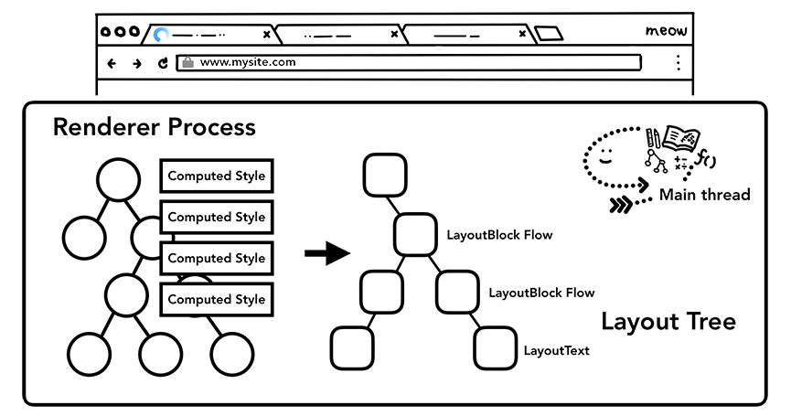
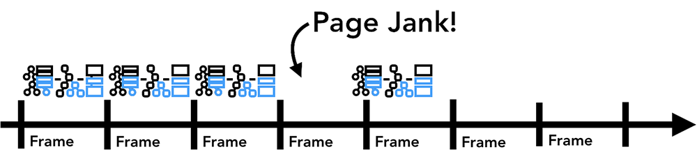

NAVER D2 [최신 브라우저의 내부 살펴보기](https://d2.naver.com/helloworld/2992312)를 요약하였습니다.

이 글은 [Google Developers 사이트](https://developers.google.com/)에 공개된 [Mariko Kosaka](https://developers.google.com/web/resources/contributors/kosamari)의 "Inside look at modern web browser"(최신 브라우저의 내부 살펴보기) 시리즈를 번역한 글입니다. 이 시리즈는 Chrome을 중심으로 최신 브라우저를 들여다봅니다. Chrome이 속도뿐만 아니라 안정성을 위해 어떤 아키텍처를 사용하는지 설명하는 것에서 시작해, 웹 페이지가 어떤 단계를 거쳐 화면에 그려지는지 설명합니다. 이와 더불어 성능 향상을 위해 웹 개발자가 고려하면 좋을 사항도 다룹니다.

> **저작권** 
> 이 글의 원문은 다음과 같은 저작권 기준을 따릅니다.
>
> *Except as otherwise noted, the content of this page is licensed under the Creative Commons Attribution 3.0 License, and code samples are licensed under the Apache 2.0 License. For details, see our Site Policies. Java is a registered trademark of Oracle and/or its affiliates.*

## 3. 렌더러 프로세스의 내부 동작

이 글에서는 렌더러 프로세스 내부에서 어떤 일이 일어나는지 살펴볼 것이다.

렌더러 프로세스는 여러 측면에서 웹 페이지의 성능에 영향을 끼친다. 렌더러 프로세스 내부에서 많은 일이 일어나기 때문에 이 글은 개요 수준의 일반적인 내용만을 다루겠다. 웹 페이지의 성능에 관해 더 깊이 알아보고 싶다면 [Google Developers 사이트](https://developers.google.com/)의 [**Web Fundamentals**](https://developers.google.com/web/fundamentals/) 카테고리에서 [**Performance**](https://developers.google.com/web/fundamentals/performance/why-performance-matters/) 항목의 글들을 참고한다.

### 렌더러 프로세스는 웹 콘텐츠를 처리한다

**렌더러 프로세스**는 탭 내부에서 발생하는 모든 작업을 담당한다. **렌더러 프로세스**의 메인 스레드가 브라우저로 전송된 대부분의 코드를 처리한다. 간혹 **웹 워커**나 **서비스 워커**를 사용하는 경우에는 워커 스레드가 JavaScript 코드의 일부를 처리한다. 웹 페이지를 효율적이고 부드럽게 렌더링하기 위해 별도의 **컴포지터 스레드**와 **래스터 스레드**가 **렌더러 프로세스**에서 실행된다.

**렌더러 프로세스**의 주요 역할은 HTML과 CSS, JavaScript를 사용자와 상호작용을 할 수 있는 웹 페이지로 변환하는 것이다.

### 파싱

#### DOM 구축

페이지를 이동하는 내비게이션 실행 메시지를 렌더러 프로세스가 받고 HTML 데이터를 수신하기 시작하면 **렌더러 프로세스**의 메인 스레드는 문자열(HTML)을 파싱해서 DOM(document object model)으로 변환하기 시작한다.

DOM은 브라우저가 내부적으로 웹 페이지를 표현하는 방법일 뿐만 아니라 웹 개발자가 JavaScript를 통해 상호작용할 수 있는 데이터 구조이자 API이다.

HTML 문서를 DOM으로 파싱하는 방법은 [HTML 표준](https://html.spec.whatwg.org/)에 정의되어 있다. 브라우저에서 HTML 문서를 열었을 때 오류를 반환받은 적이 없을 것이다. 예를 들어 닫는 `
` 태그가 누락된 HTML 도 유효한 HTML이다. `Hi! <b>I'm <i>Chrome</b>!</i>`와 같이 잘못된 마크업(`<b>` 태그가 `<i>` 태그보다 먼저 닫혔다)도 `Hi! <b>I'm <i>Chrome</i></b><i>!</i>`라고 쓴 것처럼 다뤄진다. 오류를 우아하게 처리하도록 HTML 명세가 설계됐기 때문이다. 이러한 일이 어떻게 처리되는지 궁금하다면 HTML 명세에서 "[An introduction to error handling and strange cases in the parser](https://html.spec.whatwg.org/multipage/parsing.html#an-introduction-to-error-handling-and-strange-cases-in-the-parser)"(파서의 오류 처리 개요와 오류 사례)를 읽어 보길 바란다.

#### 하위 리소스(subresource) 로딩

웹 사이트는 일반적으로 이미지, css, JavaScript와 같은 외부 리소스를 사용한다. 이러한 파일은 네트워크나 캐시에서 로딩해야 한다. DOM을 구축하기 위해 파싱하는 동안 이런 리소스를 만날 때마다 메인 스레드가 하나하나 요청할 수도 있을 것이다. 하지만 속도를 높이기 위해 '프리로드(Preload) 스캐너'가 동시에 실행된다. HTML 문서에 `` 또는 `<link>`와 같은 태그가 있으면 프리로드 스캐너는 HTML파서가 생성한 토큰을 확인하고 브라우저 프로세스의 네트워크 스레드에 요청을 보낸다.

#### 자바 스크립트가 파싱을 막을 수 있다

`<script>`태그를 만나면 HTML 파서는 HTML 문서의 파싱을 일시 중지한 다음 JavaScript 코드를 로딩하고 파싱해 실행해야 한다. 왜 그럴까? JavaScript는 DOM 구조 전체를 바꿀 수 있는 document.write() 메서드와 같은 것을 사용해 문서의 모양을 변경할 수 있기 때문이다. HTML 파싱을 재개하기 전에 HTML 파서는 JavaScript의 실행이 끝나기를 기다려야 한다.

#### 스타일 계산

DOM만으로는 웹 페이지의 모양을 알 수 없다. CSS로 웹 페이지 요소의 모양을 결정할 수 있기 때문이다. 메인 스레드는 CSS를 파싱하고 각 DOM 노드에 해당되는 계산된 스타일(computed style)을 확정한다. 계산된 스타일은 CSS 선택자(selector)로 구분되는 요소에 적용될 스타일에 관한 정보이다. 개발자 도구의 **computed** 패널에서 이 정보를 볼 수 있다.

CSS를 전혀 적용하지 않아도 DOM 노드에는 계산된 스타일이 적용되어 있다. `<h1>` 태그는 `<h2>` 태그보다 크게 표시되며 바깥 여백(margin)이 모든 요소에 적용된다. 브라우저에 기본 스타일 시트가 있기 때문이다.

#### 레이아웃

레이아웃은 요소의 기하학적 속성(geometry)를 찾는 과정이다. 메인 스레드는 DOM과 계산된 스타일을 훑어가며 레이아웃 트리를 만든다. 레이아웃 트리는 x, y 좌표, 박스 영역(bounding box)의 크기와 같은 정보를 가지고 있다. 레이아웃 트리는 DOM 트리와 비슷한 구조일 수 있지만 웹 페이지에 보이는 요소에 관련된 정보만 가지고 있다. `display: none` 속성이 적용된 요소는 레이아웃 트리에 포함되지 않는다(그러나 `visibility: hidden` 속성이 적용된 요소는 레이아웃 트리에 포함된다). 이와 비슷하게 `p::before{content:"Hi!}` 속성과 같은 의사 클래스(pseudo class)의 콘텐츠는 DOM에는 포함되지 않지만 레이아웃 트리에는 포함된다.

웹 페이지의 레이아웃을 결정하는 것은 어려운 작업이다. 가장 단순하게 위에서 아래로 펼쳐지는 블록 영역 하나만 있는 웹 페이지의 레이아웃을 결정할 때에도 폰트의 크기가 얼마이고 줄 바꿈을 어디서 해야 하는지 고려해야 한다. 단락의 크기와 모양이 바뀔 수 있고, 다음 단락의 위치에 영향이 있기 때문이다.

CSS는 요소를 한쪽으로 흐르게(float) 하거나, 크기를 벗어난 부분을 보이지 않게 하거나, 글이 쓰이는 방향을 변경할 수 있다. 레이아웃 단계가 엄청난 임무를 맡고 있다는 것을 알 수 있다. Chrome에서는 한 팀이 레이아웃만 전담하고 있을 정도이다. 

> 레이아웃 트리와 다음에 설명할 페인트 트리 사이에 한 가지 작업이 더 있다. 레이아웃 트리를 순회하면서 속성 트리(property tree)를 만드는 작업이다. 속성 트리는 `clip`, `transform`, `opacity`등의 속성 정보만 가진 트리이다. 기존에는 이런 정보를 분리하지 않고 노드마다 가지고 있었다. 그래서 특정 노드의 속성이 변경되면 해당 노드의 하위 노드에도 이 값을 다시 반영하면서 노드를 순회해야 했다. 최신 Chrome에서는 이런 속성만 별도로 관리하고 각 노드에서는 속성 트리의 노드를 참조하는 방식으로 변경되고 있다.

#### 페인트

DOM, 스타일, 레이아웃을 가지고도 여전히 페이지를 렌더링할 수 없다. 그림을 하나 따라 그리려고 한다고 생각해 보자. 요소의 크기, 모양, 위치를 알더라도 어떤 순서로 그려야 할지 판단해야 한다.

예를 들어 어떤 요소에 `z-index` 속성이 적용되었다면 HTML에 작성된 순서로 요소를 그리면 잘못 렌더링된 화면이 나온다.

> 즉, DOM에 선언된 노드 순서와 페인트 순서는 많이 다를 수 있다.

페인트 단계에서 메인 스레드는 페인트 기록(paint record)을 생성하기 위해 레이아웃 트리를 순회한다. 페인트 기록은 '배경 먼저, 다음은 텍스트, 그리고 직사각형'과 같이 페인팅 과정을 기록한 것이다. JavaScript로 `<canvas>` 요소에 그림을 그려 봤다면 이 과정이 익숙할 것이다.

#### 렌더링 파이프라인을 갱신하는 데는 많은 비용이 든다

렌더링 파이프라인에서 파악해야 할 가장 중요한 점은 각 단계에서 이전 작업의 결과가 새 데이터를 만드는 데 사용된다는 것이다. 예를 들어 레이아웃 트리에서 변경이 생겨 문서의 일부가 영향을 받으면 페인팅 순서도 새로 생성해야 한다.

요소에 애니메이션을 적용하면 브라우저는 모든 프레임 사이에서 이러한 작업을 해야 한다. 대부분의 디스플레이 장치는 화면을 초당 60번 새로 고친다(60fps). 요소의 움직임이 모든 프레임에 반영되어야 사람이 볼 때 부드럽게 느껴진다. 애니메이션에서 프레임이 누락되면 웹 페이지가 '버벅대는(janky)' 것처럼 보인다.

화면 주사율에 맞추어 렌더링 작업이 이루어져도 이 작업은 메인 스레드에서 실행되기 때문에 애플리케이션이 JavaScript를 실행하는 동안 렌더링이 막힐 수 있다.

JavaScript 작업을 작은 덩어리로 나누고 `requestAnimationFrame()` 메서드를 사용해 프레임마다 실행하도록 스케줄을 관리할 수 있다.

### 합성

#### 페이지는 어떻게 그려질까

브라우저는 문서의 구조와 각 요소의 스타일, 요소의 기하학적 속성, 페인트 순서를 알고 있다. 브라우저는 이제 웹 페이지를 어떻게 그릴까? 이 정보를 화면의 픽셀로 변환하는 작업을 래스터화(rasterizing)라고 한다.

가장 단순한 래스터화는 아마 뷰포트 안쪽을 래스터하는 것일 것이다. 사용자가 웹 페이지를 스크롤하면 이미 래스터화한 프레임을 움직이고 나머지 빈 부분을 추가로 래스터화한다. 이 방식은 Chrome이 처음 출시되었을 때 래스터화한 방식이다. 그러나 최신 브라우저는 합성(compositing)이라는 보다 정교한 과정을 거친다.

#### 합성이란 무엇인가

합성은 웹 페이지의 각 부분을 레이어로 분리해 별도로 래스터화하고 컴포지터 스레드(compositor thread)라고 하는 별도의 스레드에서 웹 페이지로 합성하는 기술이다. 스크롤되었을 때 레이어는 이미 래스터화되어 있으므로 새 프레임을 합성하기만 하면 된다. 애니메이션 역시 레이어를 움직이고 합성하는 방식으로 만들 수 있다.

Chrome 개발자 도구의 [**Layers** 패널](https://blog.logrocket.com/eliminate-content-repaints-with-the-new-layers-panel-in-chrome-e2c306d4d752)에서 웹 사이트가 어떻게 레이어로 나뉘어 있는지 볼 수 있다.

> **역주** 
> [DEVIEW 2018](https://deview.kr/2018) 콘퍼런스의 "[웹 성능 최적화에 필요한 브라우저의 모든 것](https://www.slideshare.net/deview/125-119068291/)" 발표 자료 22쪽에 있는 다음 그림을 참고하면 레이어 합성을 이해하는 데 도움이 될 것이다. 
> 
>
> **역주** 
> 컴포지터 스레드를 별도로 유지하는 것이 오히려 부담이 더 클 때에는 싱글 스레드에서 합성을 실행하기도 한다. 브라우저의 UI 부분(chrome)을 담당하는 컴포지터는 싱글 스레드로 작동한다.
>
> **역주** 
> "[The Animation Process From 1938](https://www.youtube.com/watch?v=M2ORkIrHUbg&feature=youtu.be&t=217)"(1938년의 애니메이션 제작 과정) 영상을 보면 레이어를 나누는 것과 애니메이션 성능 향상의 관계를 이해하는 데 도움이 될 것이다. 이 영상에서는 배경은 그대로 두고 앞에서 움직여야 하는 전경만 별도의 셀로 만들어서 프레임을 촬영한다. 만약 배경과 전경을 분리하지 않았다면(즉, 레이어를 나누지 않았다면) 애니메이션 프레임마다 배경도 같이 그려야 했을 것이다.

#### 메인 스레드 이후 래스터화와 합성

레이어 트리가 생성되고 페인트 순서가 결정되면 메인 스레드가 해당 정보를 컴포지터 스레드에 넘긴다(commit). 그러면 컴포지터 스레드는 각 레이어를 래스터화한다. 어떤 레이어는 페이지의 전체 길이만큼 클 수 있다. 그래서 컴포지터 스레드는 레이어를 타일(tile) 형태로 나눠 각 타일을 래스터 스레드로 보낸다. 래스터 스레드는 각 타일을 래스터화해 GPU 메모리에 저장한다.

