AWS에 처음 계정을 만들게 되면 12개월 프리티어로 사용할 수 있습니다.

프리티어를 활용해서 EC2 인스턴스를 생성하고 Nginx를 설치하여 배포해보겠습니다.

# 1. EC2 인스턴스 생성

먼저 서비스탭을 선택하여 EC2를 선택합니다.

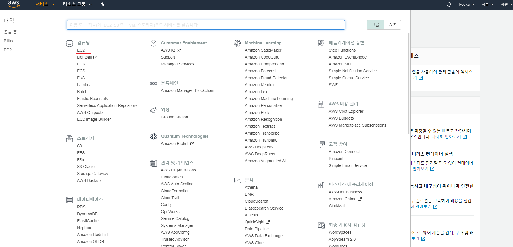

Amazon Machine Image(AMI)는 가장 익숙한 Ubuntu Server로 하겠습니다.

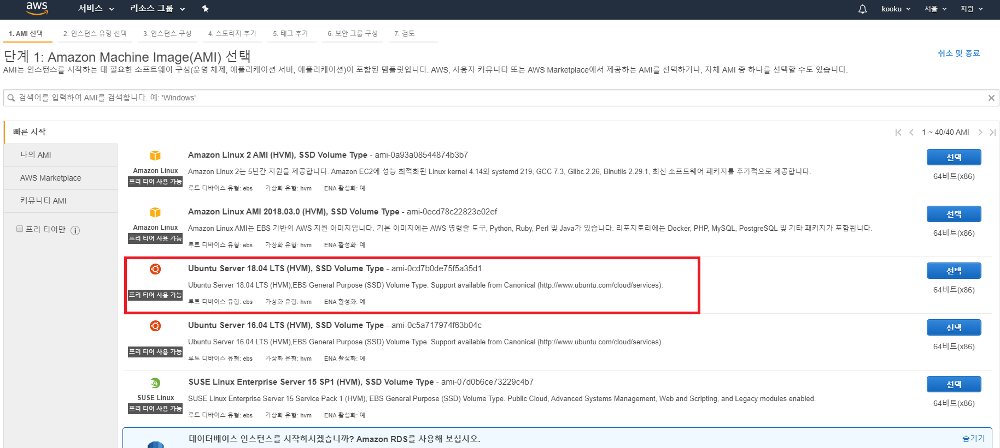

Nginx 배포를 위해 HTTP(80) 를 White-List에 추가합니다. (규칙 추가)

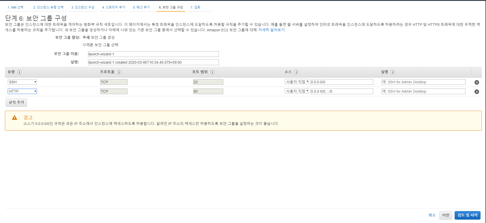

마지막으로 내가 설정한 내용을 확인한 후 인스턴스를 시작합니다.

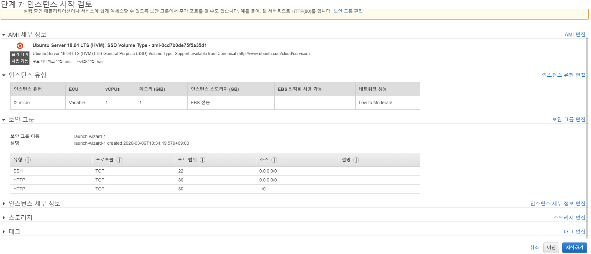

이때 SSH 접속을 위한 보안키를 저장해야 하는데 저는 키 이름을 `SECURITY_KEY`로 다운받았습니다.

이제 성공입니다.

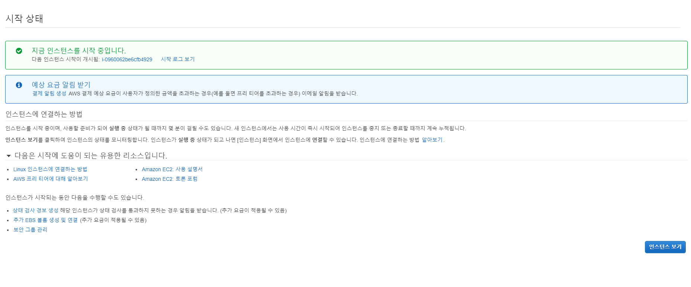

이제 SSH 접속을 한 번 해보겠습니다.

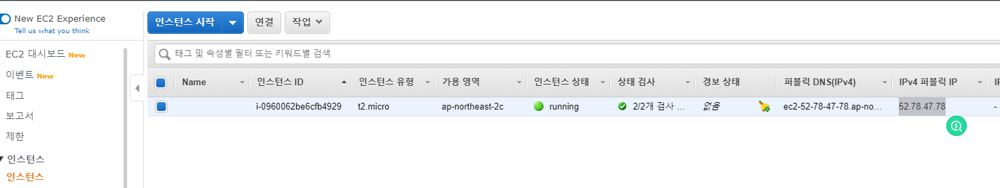

GCP와는 다르게 이번에는 PuTTY로 접속하려고 합니다.

PuTTY로 접속하는 가이드는 [PuTTY를 사용하여 Windows에서 Linux 인스턴스에 연결](https://confluence.d-platform.doosan.com/pages/createpage.action?spaceKey=DDPCHAPTER&title=PuTTY를+사용하여+Windows에서+Linux+인스턴스에+연결&linkCreation=true&fromPageId=6291956) 을 참고하시면 됩니다. 매우 설명이 잘 되어있습니다.

간단히 설명 드리자면 다음과 같습니다.

[PuTTY Download](https://www.chiark.greenend.org.uk/~sgtatham/putty/)에서 PuTTY를 다운받습니다.

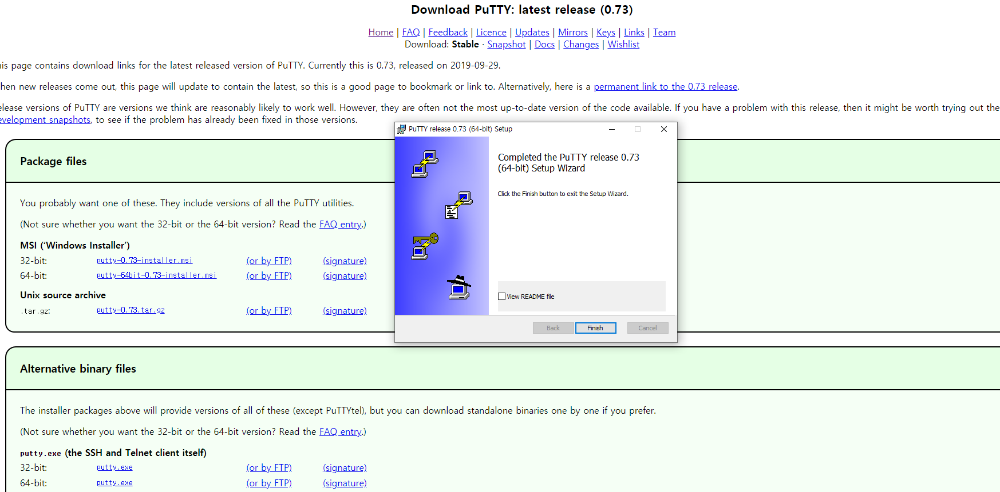

이후 PuTTYgen을 켜고, 다운 받았던 SECURITY_KEY.pem 을 load 합니다.

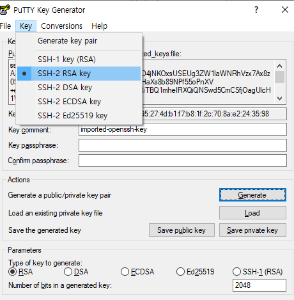

그리고 **Save Private Key** 를 선택하여 .pem 파일과 같은 이름으로 key를 생성합니다. **SECURITY_KEY.ppk** 

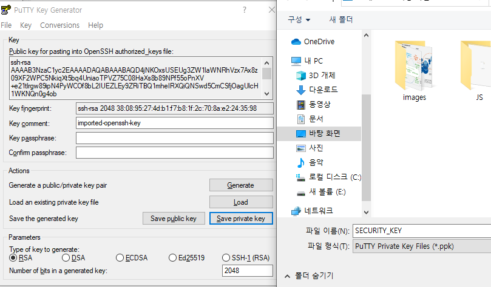

이제 PuTTY를 켜서 접속해봅니다.

Connect → SSH → Auth를 선택한 후 생성한 Private key file(SECURITY_KEY.ppk)를 등록합니다.

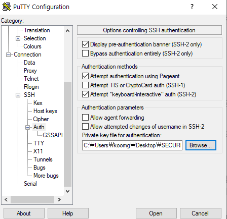

Session에 들어가 Host Name을 적어주고, 22번 포트, 그리고 Name을 적어 Save 해줍니다.

> Host Name은 위의 인스턴스 정보에 적혀있습니다.

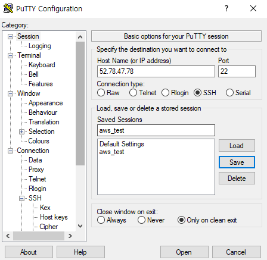

다음으로 Open을 누르고 Alert 창에서 '예'를 누릅니다.

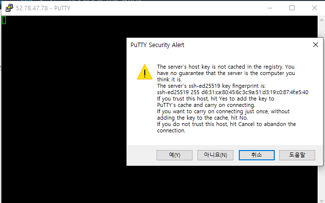

마지막으로 default login username인 'ubuntu'를 입력하면 SSH접속이 완료됩니다.

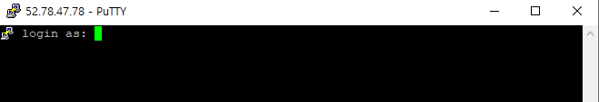

# 2. Nginx 배포

다음으로 Nginx를 배포해보겠습니다.

먼저 apt-get을 update & upgrade 해줍니다.

```shell
sudo apt-get update
sudo apt-get upgrade
```

다음으로 Nginx를 설치하고 배포합니다.

```shell
sudo apt-get install nginx
sudo systemctl enable nginx
sudo systemctl status nginx
```

그런다음 웹으로 접속하면 정상적으로 접속되는 것을 확인할 수 있습니다.

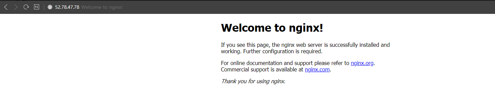


# 3. ETC

인스턴스 종료는 생명~!

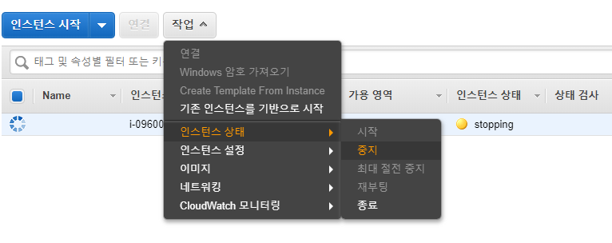

[  ](https://confluence.d-platform.doosan.com/pages/viewpage.action?pageId=6291956)