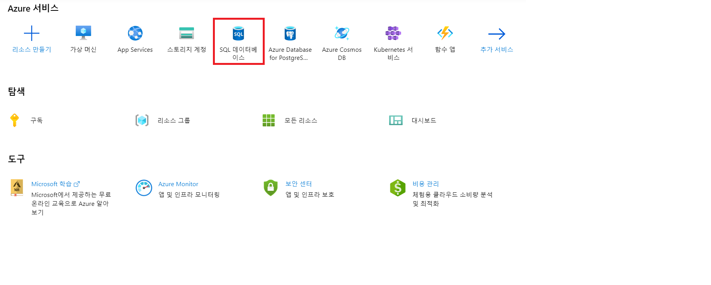
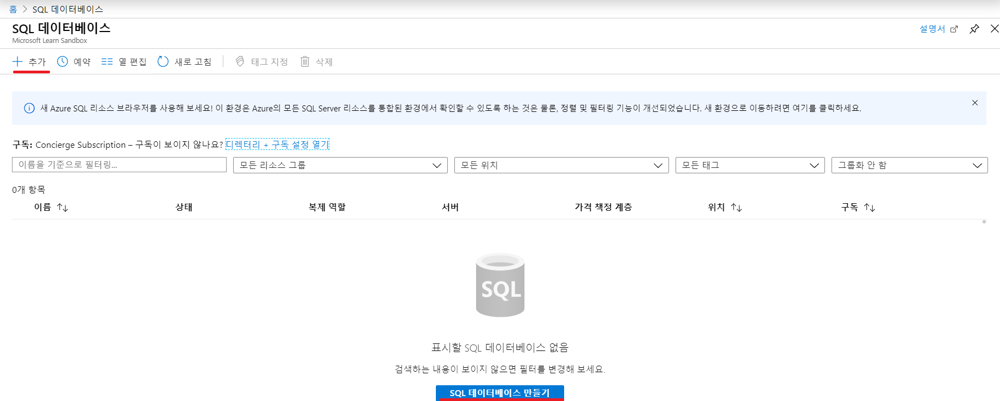
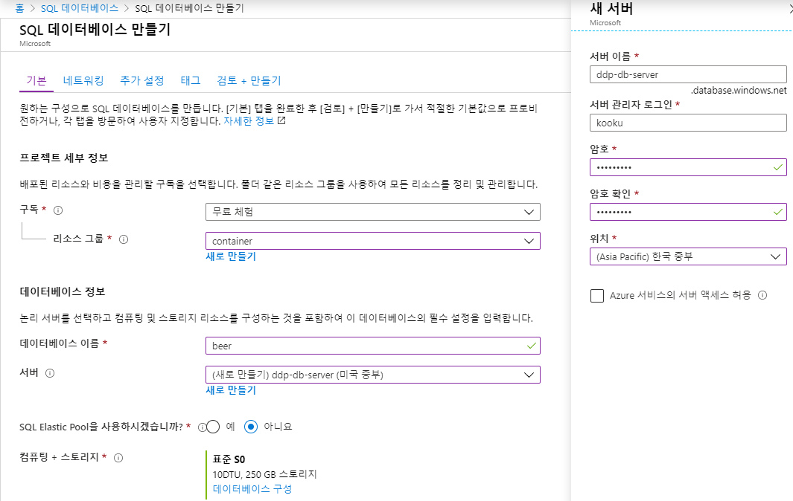
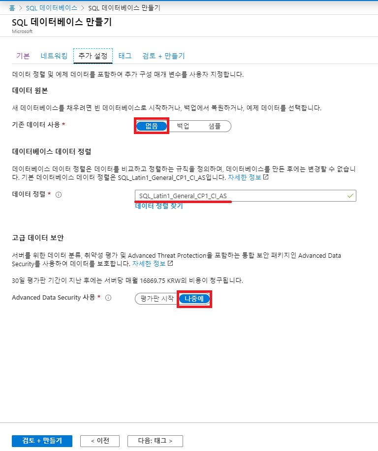
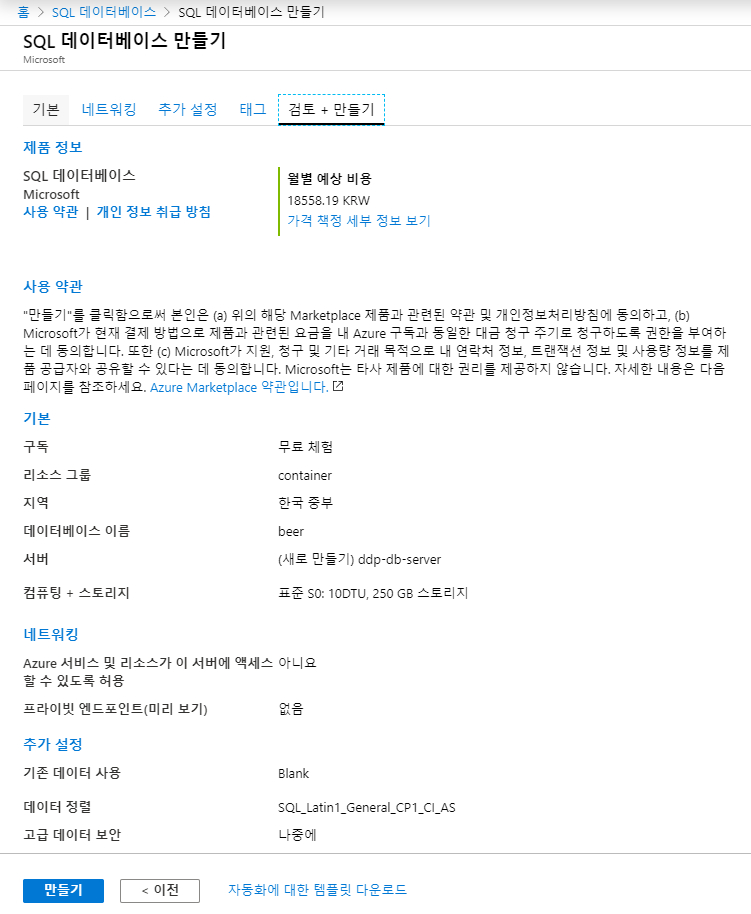
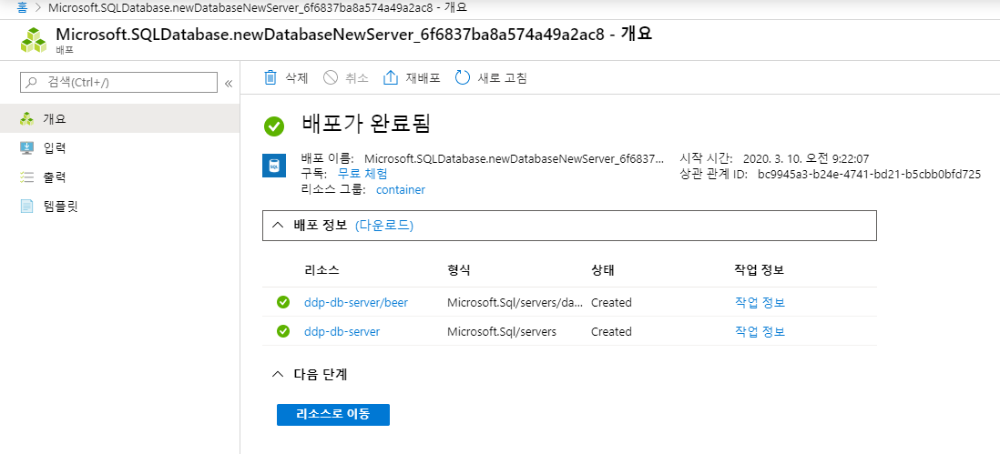
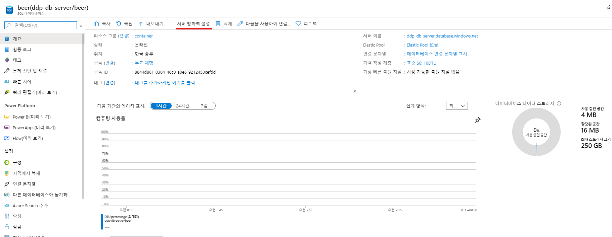
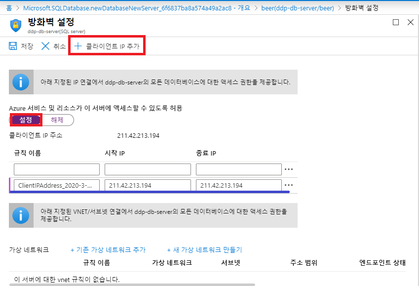
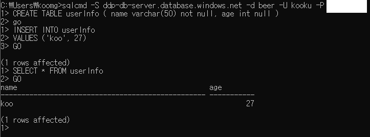

Azure 대표적인 PaaS 서비스인 SQL DB 를 생성하고, Query 를 날려보겠습니다.

# 1. SQL DB 만들기

## 1) 서비스 선택

Azure 홈페이지의 포탈 탭으로 들어가 **SQL 데이터베이스** 서비스를 클릭합니다.





## 2) SQL 데이터 베이스 만들기

이제 본격적으로 SQL DB를 만들어 보겠습니다.

1. 리소스 그룹 생성
2. 데이터베이스 이름 생성(왠만하면 영어로)
3. 서버 생성 (입력하는 정보는 모두 잘 기억해야 한다.)
   1. 서버 이름
   2. 로그인 ID
   3. 암호
   4. 위치 (한국 중부)
4. SQL Elastic Pool: 아니요
   - DB auto-scale 기능이지만 현재는 필요하지 않으니 체크하지 않는다.





마지막으로 입력한 값들을 확인한 후 만들기를 누릅니다.



만들기 버튼을 누르고 조금 기다리면 배포가 완료됩니다.



## 3) 방화벽 설정

외부에서 DB에 접속할 수 있도록 방화벽을 열어주도록 하겠습니다.



클라이언트 IP 추가를 누르면 자동으로 현재 접속한 IP를 등록 해줍니다.



# 2. DB 접속 및 Query 실행

이제 외부에서 DB에 접속한 후 Query를 날려보겠습니다.

## 1) DB 접속

접속할 Client는 SQLCMD 입니다.

sqlcmd에 관한 정보는 [sqlcmd 유틸리티](https://docs.microsoft.com/ko-kr/sql/tools/sqlcmd-utility?view=sql-server-ver15)에서 확인할 수 있습니다.

설치가 되어 있는지 여부는 다음의 명령어로 확인할 수 있습니다


```
sqlcmd -?
```

### sqlcmd 유틸리티 설치

만약 설치가 되어 있지 않다면 다음 두개의 파일을 설치하시면 됩니다.

1. **[SQL Server용 Microsoft 명령줄 유틸리티 15(x64) 다운로드(2.6MB)](https://go.microsoft.com/fwlink/?linkid=2082790)**
2. [Microsoft ODBC Driver 17 for SQL Server](https://www.microsoft.com/download/details.aspx?id=56567)

### DB 접속

DB 접속은 다음의 명령어로 접속을 합니다. 옵션의 대소문자는 구분하니 정확히 따라 쳐야 합니다.


```
sqlcmd -S {server} -d {DB} -U {user} -P {password}
```

## 2) Query 날리기

간단한 예제로 Table 생성, data insert, data 조회를 해보겠습니다.


```sql
CREATE TABLE userInfo (
    name varchar(50) not null,
    age int null
)
GO
 
INSERT INTO userInfo
VALUES ('koo', 27)
GO
 
SELECT * FROM userInfo
GO
```


다음과 같이 결과가 잘 조회됨을 알 수 있습니다.


