Azure 에 처음 계정을 만들게 되면 대략 ₩224,930 크레딧 정도를 받을 수 있습니다.

크레딧을 활용하여 VM 인스턴스를 생성하고, Nginx를 배포해보겠습니다.

# 1. 가상머신 인스턴스 생성

먼저 포탈탭을 클릭한 후 VM 서비스를 선택합니다.

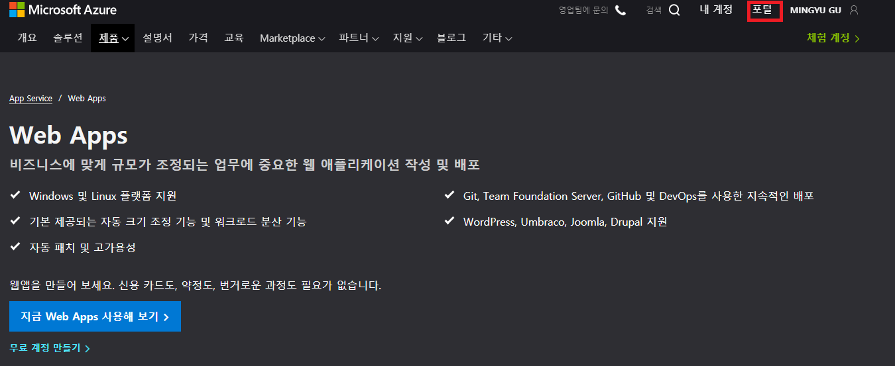

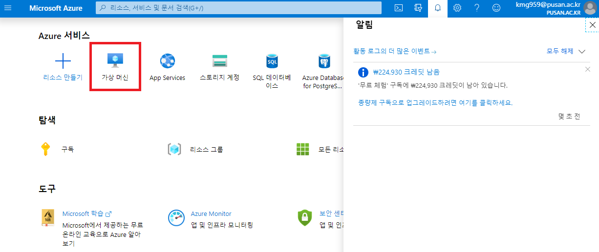


가상머신을 추가합니다.


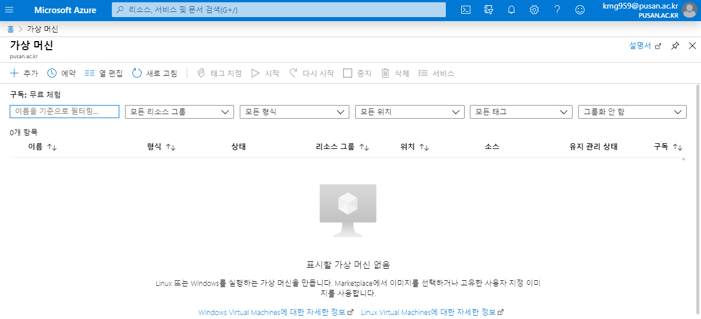


그 후에 가상머신을 셋팅합니다.


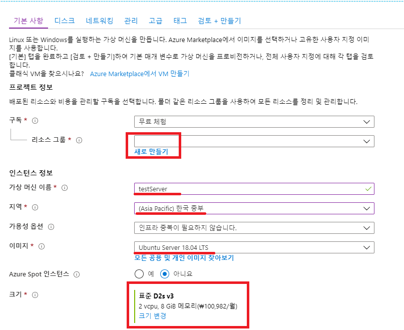

## SSH 키 만들기

다음으로 ssh 키를 넣어줘야 하는데 여기가 조금 많이 복잡합니다.

[자세한 단계: Azure에서 Linux VM 인증을 위해 SSH 키 만들기 및 관리](https://docs.microsoft.com/ko-kr/azure/virtual-machines/linux/create-ssh-keys-detailed) 공식문서를 참고해도 되지만 제가 더 자세히 설명 드리겠습니다.

먼저 PuTTY를 설치하셔야 합니다.

이후 CMD창을 열어 keygen을 해줍니다. **keygen** 에 대한 설명은 다음과 같습니다.

### keygen 옵션 예제

다음 예제에서는 SSH RSA 키 쌍을 만드는 추가 명령 옵션을 표시합니다. SSH 키 쌍이 현재 위치에 있으면 이러한 파일은 덮어쓰여집니다.

```shell
ssh-keygen \
    -m PEM \
    -t rsa \
    -b 4096 \
    -C "azureuser@myserver" \
    -f ~/.ssh/mykeys/myprivatekey \
    -N mypassphrase
```

**
설명된 명령**

`ssh-keygen` = 키를 만드는 데 사용한 프로그램

`-m PEM` = 키의 형식을 PEM으로 지정 합니다.

`-t rsa` = 이 경우 RSA 형식으로 만들 키 유형

`-b 4096` = 이 경우 키의 비트 수는 4096

`-C "azureuser@myserver"` = 쉽게 식별할 수 있도록 공개 키 파일의 끝에 추가된 주석 일반적으로 이메일 주소는 주석으로 사용되지만 인프라에 가장 적합한 것을 사용합니다.

`-f ~/.ssh/mykeys/myprivatekey` = 기본 이름을 사용하지 않으려는 경우 프라이빗 키 파일의 파일이름입니다. `.pub`에 추가된 해당 공개 키 파일은 동일한 디렉터리에 생성됩니다. 디렉터리가 있어야 합니다.

`-N mypassphrase` = 프라이빗 키 파일에 액세스하는 데 사용된 추가 암호입니다.


### 키 생성

```shell
ssh``-keygen -m PEM -t rsa -b 4096
```


```shell
ssh-keygen -t -m PEM rsa -b 4096
Generating public/private rsa key pair.
Enter file in which to save the key (C:/Users/koomg/.ssh/id_rsa):
Enter passphrase (empty for no passphrase):
Enter same passphrase again:
Your identification has been saved in C:/Users/koomg/.ssh/id_rsa.
Your public key has been saved in C:/Users/koomg/.ssh/id_rsa.pub.
The key fingerprint is:
SHA256:vFfHHrpSGQBd/oNdvNiX0sG9Vh+wROlZBktNZw9AUjA azureuser@myserver
The key's randomart image is:
+---[RSA 4096]----+
|        .oE=*B*+ |
|          o+o.*++|
|           .oo++*|
|       .    .B+.O|
|        S   o=BO.|
|         . .o++o |
|        . ... .  |
|         ..  .   |
|           ..    |
+----[SHA256]-----+
```


이렇게 키를 생성하게 되면 C:\Users\koomg\.ssh 폴더에 키가 만들어집니다.

생성된 파일은 다음과 같습니다.

|   파일명   |    설명     |
| :--------: | :---------: |
|   id_rsa   | private key |
| id_rsa.pub | public key  |


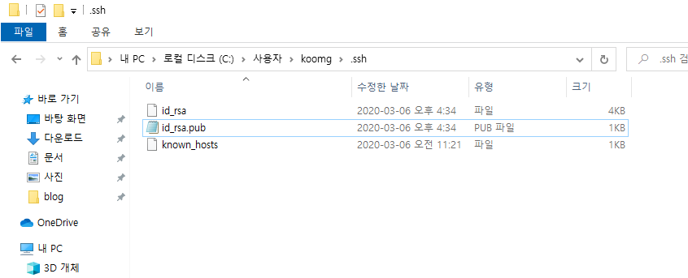

만들어진 키 중 **public key** 인 **id_rsa.pub** 파일을 열어 **SSH 공개 키** Field에 넣어줍니다.

사용자 이름은 꼭 기억해야 합니다. 나중에 ssh 접속해서 login id로 사용됩니다.

그리고 접속을 허용할 포트들을 넣어줍니다.

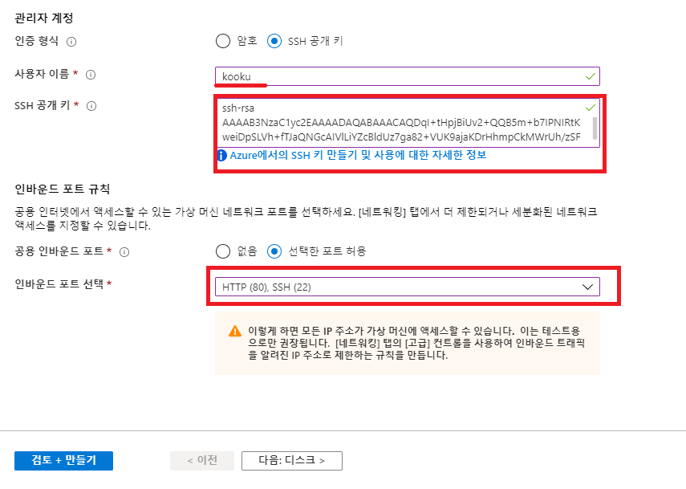

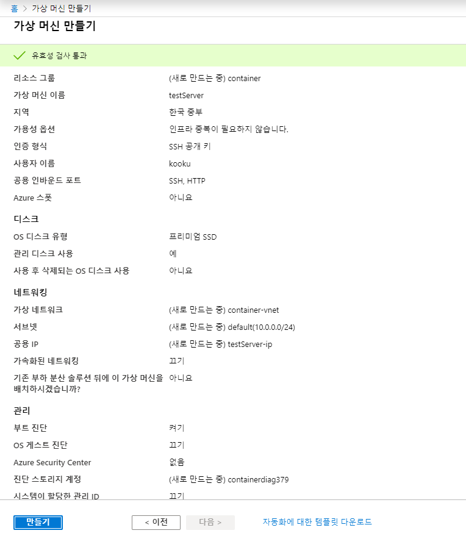

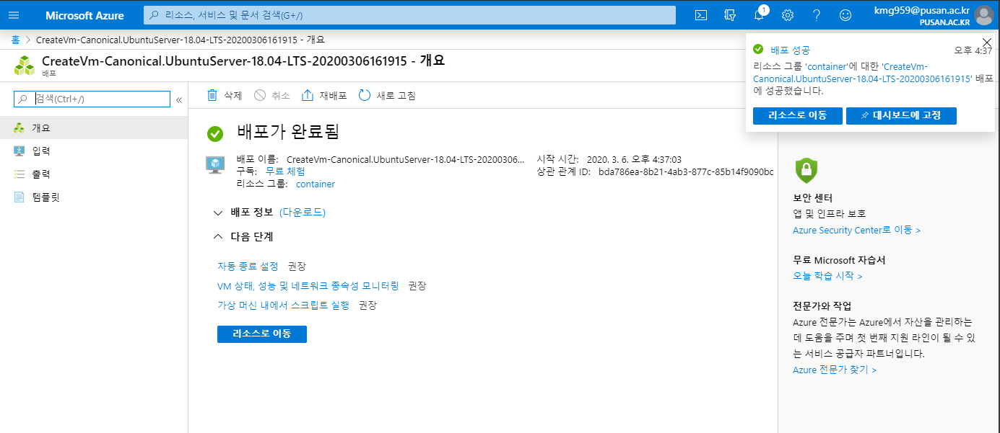

이렇게 하면 가상머신이 만들어 집니다.

보통, 접속하는 Client로 PuTTY를 사용하지만 저는 기본적인 CMD 창으로 접속하겠습니다.

## SSH 접속 - CMD

### ssh 명령어 옵션

| 옵션 |                             설명                             |
| :--: | :----------------------------------------------------------: |
|  -1  |           ssh가 프로토콜 버전1만 사용하도록 한다.            |
|  -2  |           ssh가 프로토콜 버전2만 사용하도록 한다.            |
|  -4  |                ssh가 IPv4만 사용하도록 한다.                 |
|  -6  |                ssh가 IPv6만 사용하도록 한다.                 |
|  -C  | 모든 데이터의 압축을 요청한다. 압축 알고리즘은 gzip에서 사용하는 것과 동일하다. |
|  -c  | 세션을 암호화하는데 필요한 암호 사양을 선택한다. idea가 기본값이고, arcfour가 가장 빠르며, none은 **rlogin**이나, **rsh**( 암호화 없음 )를 사용하는 것과 같다. |
|  -e  | 세션에 대한 이스케이프 문자를 설정한다. (기본값 :' **~** ' ) 이스케이프 문자는 행의 시작 부분에서만 인식이된다. 마침표 ( ' . ' ) 다음에 오는 이스케이프 문자는 연결을 닫는다. |
|  -f  | ssh가 명령 실행 직전( 인증과 전송이 설정된 후 ) 백그라운드로 이동하도록 요청한다. 이것은 ssh가 암호를 요구할 때 유용하지만 사용자가 백그라운드에서 암호를 원할 때 더 유용하다. |
|  -i  | 공개 키 인증을위한 ID( 개인키 )가 읽히는 파일을 선택한다. 주로  RSA인증을 위한 비밀 키를 읽어 올 아이덴티티 파일을 선택할때 쓰인다. |
|  -L  | 지정된 원격 호스트와 포트에 전송할 로컬 포트를 지정한다. 이 작업은 소켓을 할당하여 로컬 측의TCP 포트를 수신하거나, 선택적으로 지전된 bind_address에 바인드하거나, 유닉스 소켓을 수신하는 방식으로 작동 |
|  -l  |          원격시스템에서 로그인할 사용자를 지정한다.          |
|  -q  | 대부분의 경고 및 진단 메세지가 표시되지 않도록한다. ( 치명적 오류 제외 ) |
|  -v  |   ( 디버깅에 유용한 ) 자세한 정보 표시 모드를 활성화 한다.   |

### ssh 접속

저희가 사용할 명령은 다음과 같습니다.

CMD창을 열고 다음과 같이 명령어를 입력합니다.

```shell
ssh -i {private key 위치} {로그인 ID}@{공인 IP 주소}
```


제가 입력하는 명령어는 다음과 같습니다.

```shell
ssh -i c:\User\koomg\.ssh\id_rsa kooku@52.231.74.27
```


 그러면 다음과 같이 접속이 됩니다.

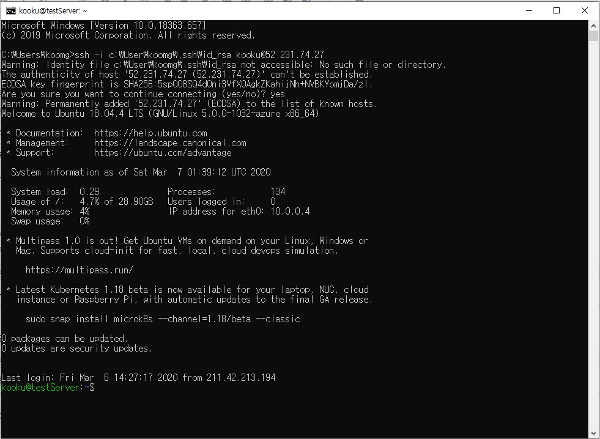

# 2. Nginx 배포

```shell
sudo apt-get update
sudo apt-get upgrade
sudo apt-get install nginx
```

위의 명령어를 입력하고 접속을 하면 다음과 같이 nginx가 배포됨을 확인할 수 있습니다.

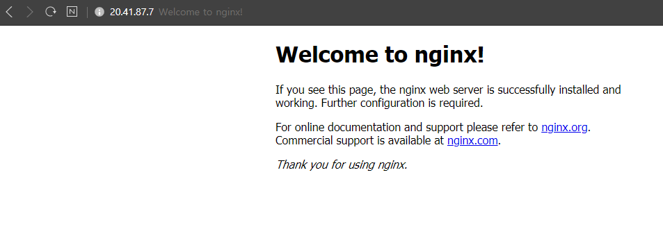


# 3. ETC

사용하지 않을때 인스턴스 종료는 필수~!

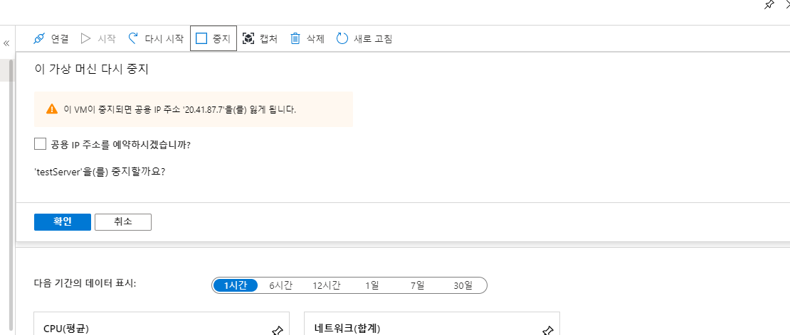