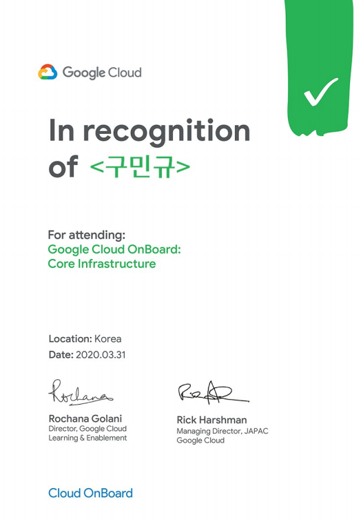

> 해당 포스팅은 3월 31, 2020 에 있었던 **Cloud OnBoard Seoul Online** 내용을 정리한 것 입니다.
>
> 영상링크: https://cloudonair.withgoogle.com/events/korea-cloud-onboard-online-2020

# 1. GCP 소개

## 기존의 기술 발전 / 이후의 기술 방향


### 클라우드를 사용하지 않을 시 발생하는 문제

1. 유틸리제이션의 문제

   실제 서버를 샀지만, 사용하지 않는 문제가 생긴다. 아니면 특정 지점에만 사용자가 많은 문제가 생긴다.

2. 관리의 문제

   서버 사오고 설치, 에러를 잡고 문제를 해결해야하는 번거러움이 생긴다.

이러한 문제들로 등장한게 가상화가 등장하게 되었다. 이로 가상화 문제를 해결할 수 있었다. 물리적인 서버위에 어플리케이션을 설치하여 운영했는데, 이제는 물리적인 서버위에 가상화를 통해 운영체제를 2~3개를 설치한 후 각각의 운영체제 위에 어플리케이션을 설치함으로써 서버를 효율적으로 사용할 수 있게 되었다.

관리의 문제를 해결하기 위해서 많은 업체들에서 전문적으로 담당하게 되었다.

그럼에도 불구하고 유틸리제이션이 원하는 수준까지 올라가지않고, 관리가 힘들었기에 Serverless가 등장하게 되었다. 클라우드에서는 Serverless라는 개념을 많이 사용하고, 앞으로도 많이 사용할 예정이다.

Serverless는 서버가 없다는게 아니고 사용자 입장에서 더이상 서버에 대하여 고민하고 관리할 필요가 없어진다는 개념이다.

Serverless의 대표적인게 BigQuery이다.

```SQL
SELECT
	language, SUM(views) as views // language 와 views를 가지고 와라
FROM `bigquery-samples.wikipedia_benchmark.wiki10B` //프로젝트의 dataset의 wiki10B라는 테이블에서 data를 가지고 와라
WHERE
	title like "%google%" // google 문자는 필터링
GROUP by language // 언어별로
ORDER by views DESC // 내림차순
```


415.8GB가 약 7.7 초 만에 수행이 되었고, 이때 약 1000개 정도의 VM이 처리하였고, 이게 대표적인 Serverless 이다.

## 모든 회사가 데이터 회사로 탈바꿈하고 있다.

이제는 데이터를 기반으로 정확하게 예측하고 의사결정을 해야하는 시대로 변화되었다.


Zone이 3개가 이루어지면 리전이라고 하며 리전이 여러개 모이면 멀티 리전이라고 부른다.


전세계에 22개의 리전이 존재하며 각각의 리전에는 총 3개의 Zone이 존재한다. 아이오아이에는 예외적으로 4개의 Zone이 존재한다.


전세계의 22개의 리전이 존재하고 모두 연결이 되어 있어야하는데, 리전 근처에는 PoP(Point of Presence)가 존재한다. 전세계에는 134개의 PoP가 존재한다.

전용선이므로 훨씬 빠르고 안전하다는 장점이 있다.


지금 가지고 있는 Workload를 GCP로 옮기고 나중에 못 빼내면 어떻하지? 라는 고민이 생기는데, 이를 위해 GCP에서는 가능하면 개방형 API, 오픈소스등을 많이 활용하고 있다. 다양한 오픈소스들을 마음껏 사용이 가능하다. Lock-in 되는 걱정을 하지 않아도 된다.


Organization -> Folders -> Projects -> Resource 4가지 계층으로 나뉘어져 있다.


빨간 네모 버튼을 누르게 되면 클라우드 쉘을 사용할 수 있다. 작은 VM을 사용할 수 있는데, 데비안 OS를 올려 놓아서 간단히 명령어를 이용하여 Google Cloud SDK를 사용할 수 있다.


BigQuery를 사용할 때 클라이언트 라이브러리를 사용하면 좋은데, 굉장히 간단하게 BigQuery로 부터 Data를 불러와서 머신러닝이라던가 데이터 분석을 할 수 있다.

# 2. 가상 머신

## Virtual Private Cloud(VPC) 네트워크

### Network에 대한 기본적인 개념 설명


컴퓨터를 연결하여 네트워크를 구성할 수 있다. 컴퓨터가 많아지면 연결할 수 있는 모양도 바뀌게 되는데 원으로 연결하면 Ring Topology 라고 하며, 하나의 컴퓨터를 중심에 두고 연결한 경우에는 Star Topology라고 부른다. Router를 중심으로 여러개의 컴퓨터를 연결시키는 개념이다.

회사의 사무실에 컴퓨터가 굉장히 많은데 이를 router 하나에 연결시키면 작은 Network가 형성이 된다. 이렇게 작은 범위의 네트워크를 Local Area Network라고 하여 LAN이라고 부른다.

LAN들을 묶어서(router들끼리 연결) 넓은 Network를 만들면 Wide Area Network라고 하여 WAN이라고 부른다.

그 사이에는 Router들이 중심이 되어 Data를 주고 받는다. 여기서 보면 LAN, WAN 모두 지역적 제한이 있게 되는데 Google에서는 이를 추상화 시켜 지역적 한계를 뛰어 넘게 되었는데 이를 VPC라고 한다.


VPC의 특성을 보면 기존과 다른 부분이 있는데 하나의 Router가 있고 SDN(Software Define Network)를 통하여 하나의 Router를 통하여 전세계의 Network를 통합 시키게 되었다.

그림을 보면 US West, US East가 물리적으로 떨어져 있지만, 논리적으로는 하나의 Network로 연결시키게 되었다.

외부 IP로 서울에서 유럽의 서버에 접속하게 되면 30Hop 이상의 Router를 통하게 되지만, Google Cloud 내부에서 접속하게 되면 3Hop이내로 접속이 가능하게 된다.


가장 상위 레벨에는 프로젝트가 있고, 프로젝트 내부에서 여러개의 네트워크를 만들 수 있다. 그래서 지금 이 예시를 보면 총 5개의 Network를 만들었다. 여기에서 보면 Network Prod라는 곳에 2개의 VM을 만들었다. A VM은 us-esat1에 만들었고, B VM은 europe-west1에 만들었다.

A, B는 물리적으로 굉장히 멀리 떨어져 있지만 논리적으로는 같은 네트워크에 묶여 있기 때문에 내부 IP로 빠르고 안정적으로 연결이 되어 있다.

그에비해서 C, D는 물리적으로는 같은 지역에 있지만 논리적으로 다른 Network에 존재한다. 그래서 내부 IP로는 소통할 수 없고 외부 IP로 돌아가야 한다.


하나의 프로젝트안에 5개 이상의 Network를 만들 수 있고, 원하다면 Peering을 통하여 Network를 연결할 수도 있다.


하나의 라우터를 기준으로 Network를 만들고 각각의 리전별로 sub-network를 구성할 수도 있다. 23개의 리전이 존재하며 각각의 리전에 sub-network를 만들 수 있다.

## Compute Engine


Migration하는데 Gap Time이 거의 발생하지 않는다.


선점형 인스턴스의 경우 PMVM은 최대 80%할인을 할 수 있다. 하지만 일반 고객이 오면 양보를 해줘야해서 꺼지는 경우가 있다. 이를 위해서 절반은 VM, 절반은 PMVM을 사용하면 저렴하게 사용할 수 있다.


사용자가 많아지면 자동으로 수요에 맞게 VM을 만들어지고, 사용자가 적으로 VM을 Shutdown시킨다. 수요에 맞게 탄력적으로 서비스를 제공할 수 있게 된다.

굉장히 큰 규모로 Scale-out을 할 수 있다. 예를 들어 Black-Friday 같은날에 사용할 수 있다.


**Compute 와 Disk를 분리시켜 Scale-out, Scale-down 시의 문제를 해결하였다.**

하지만 Disk에서 Memory까지가 너무 느린 속도의 문제가 발생하게 된다.

이러한 문제를 해결하기 위해 둘 사이에 엄청나게 많은 케이블로 연결을 시켰다.

## 중요한 VPC 기능


같은 프로젝트 안에서는 내부 IP를 통하여 굉장히 빠르게 통신이 가능하지만, 경우에 따라서는 다른 프로젝트 사이에서 연결이 필요할 수 있다.

#### 해결방안

1. Shared VPC

   - 하나의 중심이 되는 Host Project를 만든 후 여러개의 Service Project를 만든다면 여러개의 프로젝트를 연결해서 사용할 수 있다.

2. VPC Peering
   - VPC Peering을 통하여 VPC Network끼리 연결할 수 있고, 경우에 따라서는 다른 Network와도 연결할 수 있다.


갑자기 Client가 많아질 경우 서버가 많이 필요하게 된다. 그럴 경우 동일한 서버가 100개 있다고 가정했을 때 Assign하는 문제가 생기게 되는데 이를 해결해주는게 Load Balancer이다.

Load Balancer의 IP를 고객에게 노출시켜주면 LB가 각각의 Client를 Server에 연결시켜 준다.

#### Load Balancer의 역할

1. 지역성 고려

   - 미국에서 오는 요청은 미국에 있는 VM에 연결시켜주게 된다.

2. Health Check

   - 각각의 VM이 살아 있는지 지속적을 확인을 하고 VM이 ack를 보내면 살아 있다고 판단하여 req를 보내주게 되고, ack가 없다면 연결을 시켜주게 된다.

3. Auto Healing
   - VM이 죽었을 때 다시 살려주는 기능


전세계에 하나의 Load Balancer만 만들어주면 하나로 모두 처리가 가능하다.


경우에 따라서는 여러개의 LB를 사용해야하는 경우도 있다.

San Francisco, Iowa등에서 Global Load Balancing에 접속을 하게 되면, 각 리전에 연결을 시켜주게 된다. 그 리전내에서 다시 Internal Load Balancing을 통하여 각각의 VM에 연결시켜 준다.


100% SLA를 제공하고 있다.


#### 하이브리드 클라우드(On-Promise + Cloud)를 사용할 때 연결해야하는 경우

1. VPN을 이용하여 연결할 수 있다.

2. Peering: Google Network에 연결한다.

   - Direct Peering: 지정된 Location에 직접가서 연결한다.
   - Carrier Peering: 업체를 통해서 연결한다.

3. Interconnect: Google Cloud Network에 연결한다.
   - SLA(Service Level Agreement)를 제공한다. 어느 정도 서비스 레벨을 보장하겠다.
   - Dedicated Interconnect: 직접
   - Partner Interconnect: 업체를 통해서

# 3. 스토리지, 컨테이너


우리가 보통 Data를 저장하는 DB를 Transactional Database 또는 OLTP(On-Line Transactional Processing) DB라고 부른다.

#### 분석용 DB를 따로 두는 이유

1. 리스크 발생
   - Transactional DB는 운영중이는 DB이기에 Data가 삭제되는 Risk가 발생하면 문제가 생긴다.
2. DB 부담
   - DB에 부담을 주어 운영에 문제가 생길 가능성이 있다.
3. Data 전처리
   - Transactional DB의 Data는 Null값도 많고 누락된 Data도 많아서 Data를 정제할 필요가 있다.
   - Data를 정제하는 과정을 ETL(Extract Transform Load)라고 부르며 분석용 DB에 저장한다.

분석용 DB는 Analytic DB 또는 OLAP(On-Line Analytical Processing)라고 부른다.

위의 그림을 Data Pipeline이라고 부른다.


- STRUCTURED(정돈된 데이터): 표

  - TRANSACTIONAL
    - SQL: RDB - 행과 열로 구분이 되어 있는지
      - Cloud SQL: 기존의 RDB를 사용했다면 사용(MY SQL, PostgraSQL)
      - Cloud Spanner: 용량이 굉장히 많이 필요하다. 전세계에 Strong Consistence가 필요하면 사용
    - NO-SQL
      - Cloud Datastore -> Firestore로 업데이트
      - Firebase Realtime DB
  - 데이터 분석용
    - Cloud Bigtable: key-value 형태일때 사용
      - 굉장히 많은 데이터를 낮은 latency일 때 사용
    - BigQuery: RDB와 비슷한 형태일때 사용
      - latency는 조금 있지만 복잡한 연산을 하고 싶을때 사용

- UNSTRUCTURED(비정형 데이터): 이미지(0과1의 데이터), 오디오, 텍스트, 비디오
  - Cloud Storage: Data Lake가 필요할 경우 사용.
  - Firebase Store

### Data Lake, Data Warehouse, Data Mart

**Data Lake**: 데이터가 분산되어 있는 문제를 **Data Silos**라고 부르며 많은 조직에서 발생하는 문제이다. 그걸 해결하고자 Data를 다 끌어모아 한 곳에 집어 넣는데 이를 Data Lake라고 부른다.

**Data Warehouse**: Data Lake의 Data를 분석하기 위해 ETL하여 Data Warehouse에 저장한다. Data Warehouse로 사용하는 곳이 BigQuery이다. 잘 정제된 방대한 Data의 집합소이다.

**Data Mart**: 막상 분석을 하니 Data가 너무 커서 Data를 따로 빼서 작게 저장하는데 이를 Data Mart라고 부른다. Data Mart는 BigQuery내부에 있는 Data Set을 활용하면 된다.


## Cloud Storage


대단히 큰 저장공간

File 형태의 Data가 있다면 Cloud Storage에 올리면 된다.

장점이 용량이 크다.

용량이 큰 비디오나 파일이 있다면 여기에 올리면 된다.

자동으로 다 암호화를 한다. 저장되어 있을 때, 왔다갔다할 때 암호화를 시켜준다.


버킷의 이름은 globally unique 해야한다. 그 이유는 나중에 이 이름을 URI로 사용하기 때문이다.


GS util이라는 SDK를 사용하면 된다. Cloud Storage에서는 GS util을 사용하면 cli 명령줄로 데이터를 이동할 수 있다. 데이터가 많을 경우 데이터를 병렬로 복사를 한다. 네트워크에 문제가 생겼을 경우 다음에 문제가 생긴부분부터 다시 다운받는다.

타사 클라우드에서 옮겨 오거나 온프로미스에서 옮길때에 Transfer Service를 사용하면 된다.

Transfer Appliance는 물리적으로 디스크를 전달하는 것이다.


## Cloud Bigtable


- 분석용 DB로 사용.
- 엄청난 큰 데이터에 적용

- key-value 형식인 Data를 저장


컬러서스에 저장(Google File System v2) 데이터를 복제, 암호화하여 저장

ACL(Access Control List)누구에게는 읽고쓰기, 누구에게는 읽기 권한을 주는 세부적으로 권한을 주는 기능


Data는 컬러서스에 저장되어 있고, 읽기 요청이 들어왔을 때 Node를 거치게 된다. 이때 Node는 Data가 저장되어 있는 위치를 저장하고 있다. 그래서 매 요청시 포인팅을 해주는 역할을 하고 있다.

Node가 많을 수록 성능이 좋아진다. Node의 수에 따라 선형적으로 QPS(Query Per Second)가 증가한다.

Bigtable의 경우 Transactional DB로는 적절하지 않다. 왜냐하면 Eventual Consistence를 보장하기 때문이다.

#### Consistence

여러개의 저장소에 분산해서 저장하게 되는데, 어느 하나의 DB에 Update가 일어났을 때 다른 DB도 모두 Update가 빠르게 일어나면 Strong Consistence라고 부르고, 궁극적으로 Update가 일어난다고 보장될 때는 Eventual Consistence라고 한다. Cloud Storage는 Strong Consistence를 보장하고 Bigtable은 Eventual Consistence를 보장한다.

## Cloud SQL 및 Cloud Spanner

Cloud SQL, Cloud Spanner는 Strong Consistence를 보장해준다.


경우에 따라서는 더 많은 용량이 필요할 수 있는데 그때 Cloud Spanner를 사용하면된다. 전세계의 DB에 Strong Consistence를 보장한다. 굉장히 빠르다.(External Consistence)

## Cloud Datastore


NoSQL 데이터일 경우 사용한다. 그리고 자동 확장이 가능하다.

DataStore와 Spanner 사용기준은 Data 형식에 따라서이다.

## 스토리지 옵션 비교


# 컨테이너

### IaaS와 PaaS


## 컨테이너 소개


하나의 하드웨어 위에 두개의 VM을 올려 Utilization을 높힘


오른쪽의 경우 두개의 OS를 올리니 너무 무거워지는 문제가 생김

왼쪽의 경우 하나의 OS, 하나의 Dependencies 이러면 두개의 앱이 영향을 너무 받게 된다. 어플리케이션의 종속성 때문에 문제가 생긴다.


운영체제가 하나이고, 어플리케이션끼리 서로 독립이 되어 있어 서로 영향을 미치지 않는다. 추가적인 장점으로는 규격화하여 쉽게 이동시킬 수 있다. 운영체제에 대하여 독립적이기 때문에 관련 문제에 대하여 고민하지 않아도 된다.

## Kubernetes 및 Kubernetes Engine


개발을 하고 Cloud Build를 통하여 Container로 만든다. Cloud Container Registry에 업로드 한다.

사용하고 싶을 때 Container Registry에서 Container를 가지고와 2~3개씩 모아 Pod를 만든다. Pod끼리 통신할 경우 인증등의 문제로 Proxy를 통하여 커뮤니케이션을 하게 된다. 그렇게 떄문에 Proxy만 따로 Container로 만들어줘야하기 떄문에 하나의 pod에는 2~3개의 Container가 들어간다.

쿠버네티스의 경우 Master와 Node 두개로 구분이 되고 Node에 Pod가 들어간다.

Master관리가 번거로운데 GCP는 Master를 관리해준다.


- Kubernetes: Container관리해주는 것, 오픈소스
- Google Kubernetes Engine: Master를 관리해주는 제품
- Istio: 오픈소스, Pod안에서 통신을 위해 보안 인증의 과정을 거쳐야하는데 그런 것을 관리한다.
- Authos: 경우에 따라서 하이브리드 클라우드를 사용할 수 있다. 클러스터 하나는 GCP, 다른 하나는 On-Promise에 있을 때 모두 관리를 해주는 제품

## 개발, 배포, 모니터링


# 4. 빅데이터 및 머신러닝

## Google Cloud 빅데이터 플랫폼


2000년대 초반에 Map Reduce라는 논문을 발표하였는데, 이 아이디어를 기반으로 많은 오픈소스를 만들어 내게 되었다.


Dataproc을 사용하게 되면 90초가 걸린다. Cluster(Master, Worker Node), OpenSource 가 모두 설치된다.


Compute Node에서 저장되어 있는 부분을 분리하는걸 추천한다. Cloud Storage에 Data를 저장하고 분석할때 불러와서 하자.


Batch형태는 Cloud Storage에 저장, 실시간 Data는 Pub/Sub에서 받아서 분배해준다.

ETL과정을 거치는 과정은 Cloud Dataflow를 통하게 되는데 실시간 데이터와 Batch 데이터를 동시에 분석해줄 수 있는 장점이 있다.

정제된 Data는 BigQuery에 저장을 하게 된다.그리고 SQL이나 Notebook을 통해서 분석을 한다.


실시간 데이터가 왔을때 그 Data를 받아주는 역할

절대 죽으면 안된다. Pub/Sub이 다운되면 Data를 못받기 때문. 안정적으로 관리를 해줘야 한다.

많은 소스로 부터 데이터를 받고 많은 Client에 보낼 수 있어야한다. Capacity도 충분해야한다.

Google Search, Gmail도 이 기술을 사용한다.

최대 7일까지 Msg를 저장한다.


Dataflow에는 ETL처리를 해주는 역할을 한다.

기본적으로 Apache Beam API를 사용하며, 실시간 데이터와 Batch 데이터를 동시에 처리하는 것을 잘한다.

Dataflow의 경우 알아서 필요한 리소스를 프로비저닝을 하게 된다. (VM수를 자동으로 조절)


Pub/Sub이 Source, Dataflow가 Transform, Cloud Storage가 Sink

Transform에는 Grouping, Filtering, Windowing등의 과정이 있다.


BigQuery의 특징중 하나(Columnar Storage)

RDB의 경우 횡별로 데이터를 저장하고 읽어온다.

BigQuery는 Colum 별로 데이터를 저장한다. 그래서 Data의 Search는 빠르지만 Write Performance가 별로 안좋다. 하지만 최근에 성능이 많이 올랐다.

그래서 Transactional DB로는 적절하지 않다.

## Google Cloud AI Platform


AI Platform, Cloud AutoML, BigQueryML은 Training과 Prediction을 모두 할 수 있다.

- AI Platform은 자유도가 가장 높다.

- Cloud AutoML은 자동화된 형태로 제공한다. 모델도 알아서 선택해준다.
- BigQueryML은 SQL을 이용해서 머신러닝을 사용할 수 있다.


머신러닝을 하지 못하는 상황일때 빠르게 작업할 수 있는 장점이 있다.


까다로운 Hyperparameter tuning을 자동화해주는 장점이 크다.

# 마무리


# Certification


