# 1. VM 인스턴스 설치 & 실행

GCP에 들어간 후 새로운 프로젝트를 만들어 줍니다.

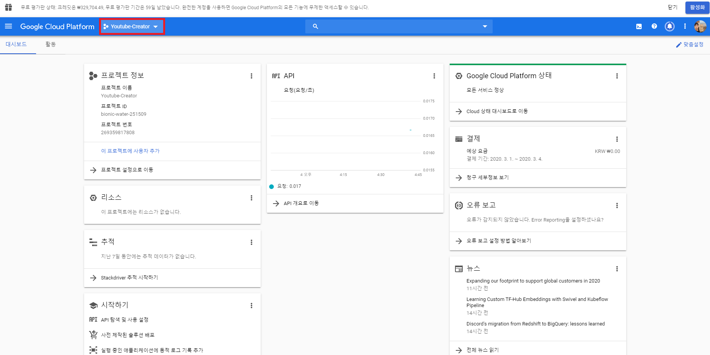

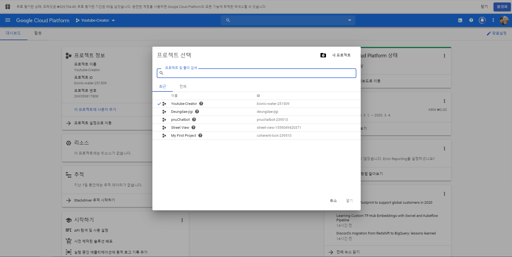

 프로젝트명은 TestServer로 하겠습니다.


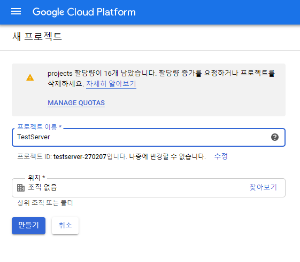


프로젝트를 만든 후 만든 프로젝트 페이지로 넘어갑니다.

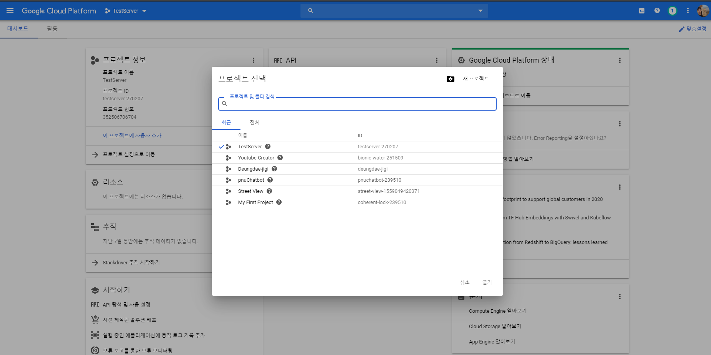

새로 만든 프로젝트에 VM을 설치해 보겠습니다. Compute Engine → VM 인스턴스를 클릭합니다.

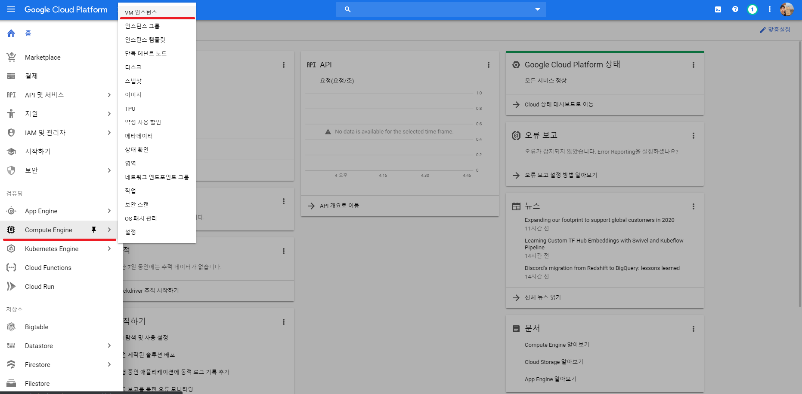

프로젝트 결제 계정은 계정설정을 눌러 본인계정으로 설정합니다.

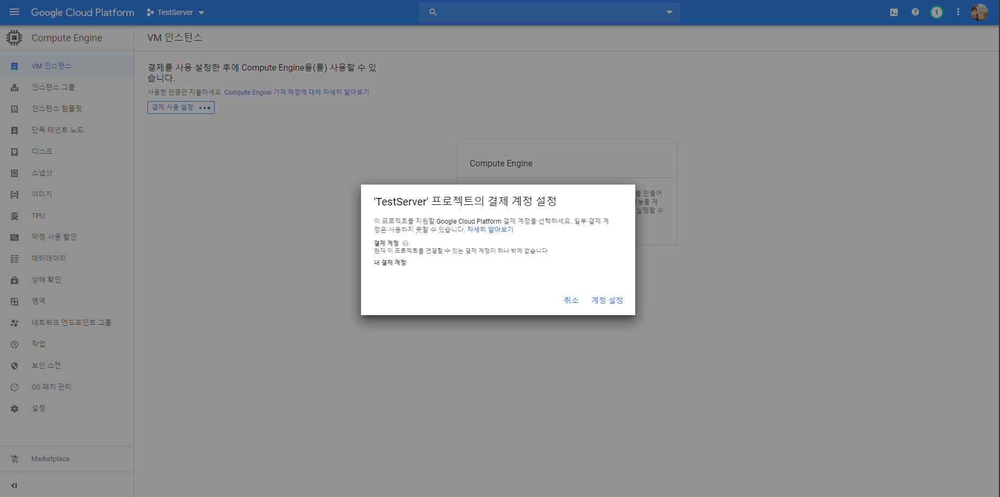

약 1분뒤 VM 인스턴스가 셋팅되게 됩니다. 저희는 **만들기** 를 클릭하여 텅 비어있는 VM 인스턴스를 사용해 보도록 하겠습니다.

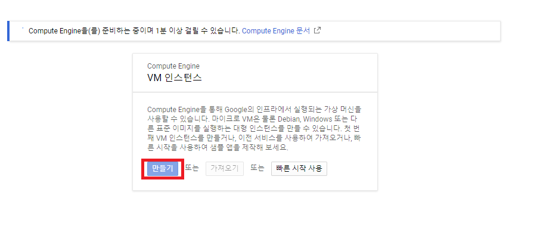

다음으로 인스턴스를 셋팅해줘야 합니다. 이름은 본인의 마음대로 정하면 됩니다.

리전은 서울, 영역은 asia-northeast3-a를 선택합니다.

머신 구성의 경우 vm의 사양을 나타내는 건데 CPU, RAM, GPU 등의 사양을 선택합니다. 어떤 것을 선택하는지에 따라 가격이 달라집니다.

방화벽의 경우 저는 웹 서버로 쓸것이기 때문에 HTTP, HTTPS 프로토콜을 열어 두었습니다. 원치 않으시다면 체크를 해제하시면 됩니다.

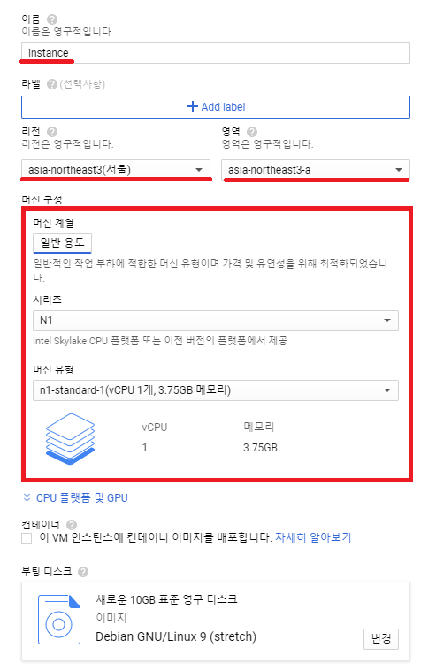


셋팅이 끝나게 되면 VM 인스턴스가 실행되게 됩니다.

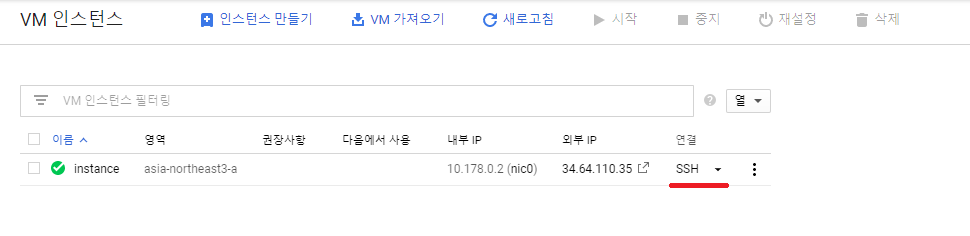

옆에 연결 SSH를 클릭한 후 나의 VM 인스턴스를 세팅 해보겠습니다.

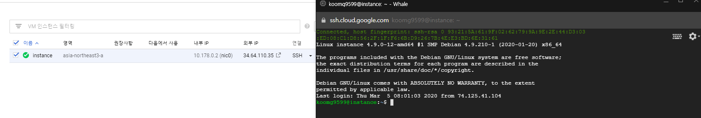

여기까지가 VM 인스턴스 설치 & 실행 단계입니다.

# 2. 웹서버 설치 & 배포

다음은 웹서버를 설치하고 React 프로젝트를 배포해보겠습니다.

Nginx를 통하여 빌드한 React 프로젝트를 배포할 것 입니다.

다음의 명령어를 순서대로 작성하며 필요한 패키지 들을 설치하겠습니다.

## 1) apt-get update & upgrade

```shell
sudo apt-get update
sudo apt-get upgrade
```

## 2) Nginx 설치

```shell
sudo apt-get install nginx
sudo systemctl enable nginx
sudo systemctl restart nginx
sudo systemctl status nginx
```

다음과 같은 화면이 나온다면 nginx가 제대로 설치되어 실행되고 있는 것이다.

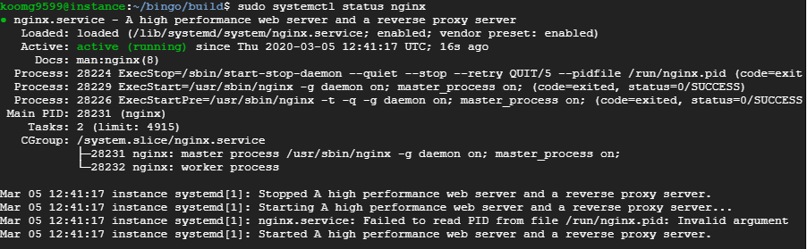

## 3) Git 설치 후 React 프로젝트 Clone

```
sudo apt-get install git-core
git clone https://github.com/koomg9599/bingo.git
ls -al
cd bingo
```

## 4) nodejs & npm 설치

```
curl -sL https://deb.nodesource.com/setup_10.x | sudo -E bash -
sudo apt install nodejs
```

## 5) React 프로젝트 모듈 설치 후 Build

```
npm install
npm run build
```

## 6) Nginx 경로 설정

```
sudo nano /etc/nginx/site-available/default
```

밑의 노란 네모의 내용을 수정해줍니다. root의 경로를 React 프로젝트 빌드 인덱스 파일로 설정해주는 것 입니다.

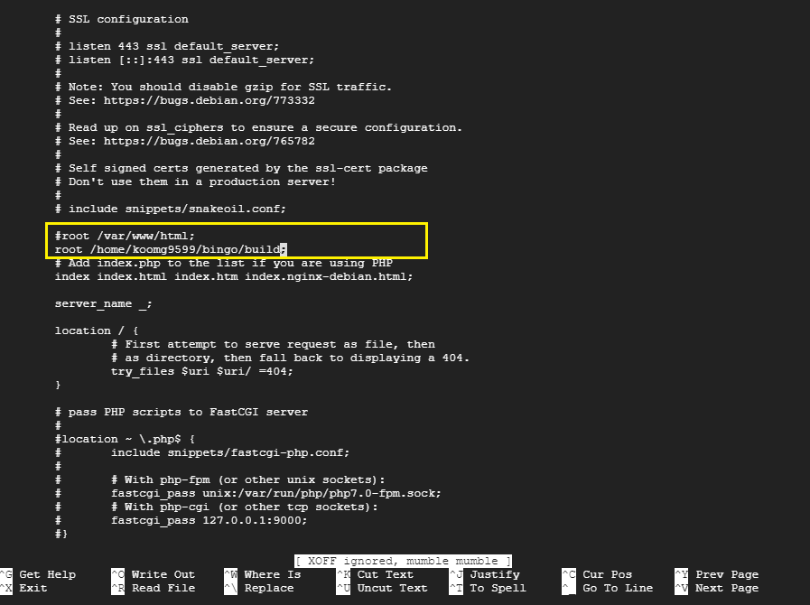

## 7) Nginx restart

nginx를 restart 한 후 status를 찍어 제대로 실행되고 있는지 한 번 더 확인합니다.

```
sudo systemctl restart nginx
sudo systemctl status nginx
```


## 8) 웹으로 접속하여 제대로 배포되고 있는지 확인합니다.

접속 IP는 인스턴스 관리 화면에서 확인할 수 있습니다. **중요한 것은 http 프로토콜로 접속해야 한다는 것 입니다.** default로 Nginx에서 80번 포트를 서브해주기 때문입니다.

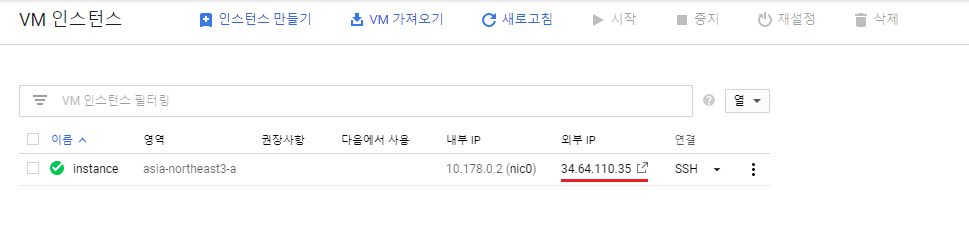

위의 과정을 제대로 수행했다면 다음과 같은 화면을 볼 수 있을 겁니다. 

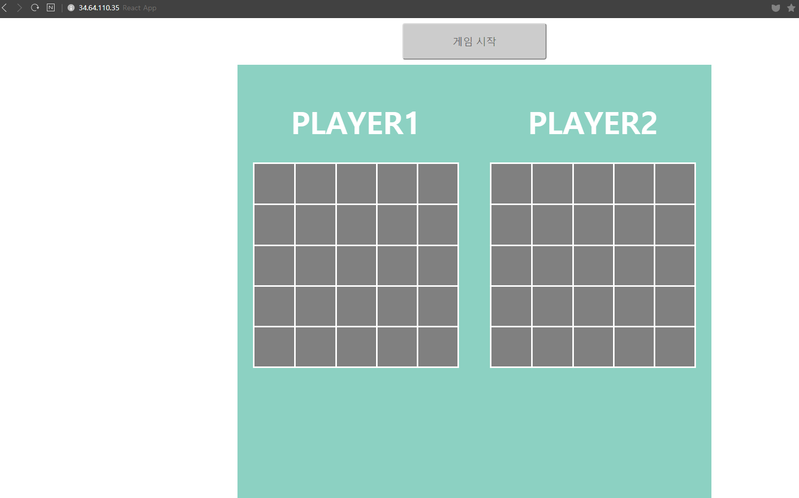

*재미있는 Bingo를 즐기세요~!*

# ETC

인스턴스 실행 후 중지를 하지 않으면 돈이 계속 나가니, 사용하지 않거나 배포하지 않을 때는 중지해주셔야 합니다.

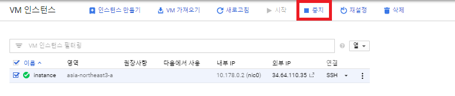