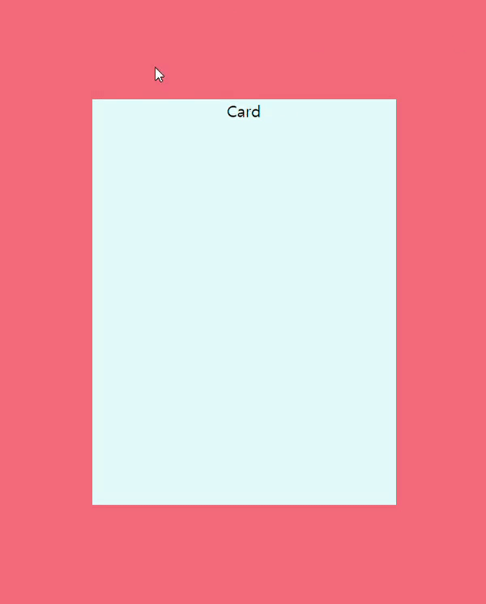

## Overview

주말에 GDG에서 개최하는 [프론트앤드 강의](https://festa.io/events/317)를 들으러 갔다. 유명한 연사분들께서 강의하셔서 표가 10초만에 매진하는등 경쟁이 치열하였다. 나는 운이 좋게 환불된 표를 구입하였다.

연사분들중 Toss 개발자 분들께서 강의를 하셨는데, 이때 mouseOver 3d effect를 보여주셨다. 

보자마자 구현하고 싶은 욕구가 나길래 집에 와서 바로 구현하였다~

css 와 js를 섞었고, 나름 재미있었다.


## Code

```html
<!DOCTYPE html>
<html lang="en">
<head>
  <meta charset="UTF-8">
  <meta name="viewport" content="width=device-width, initial-scale=1.0">
  <meta http-equiv="X-UA-Compatible" content="ie=edge">
  <title>Document</title>
  <style>
.container {
  height: 100vh;
  background-color: #ff7979;
  display: flex;
  justify-content: space-around;
  align-items: center;
  flex-wrap: wrap;
}

.card {
  perspective: 1000px;
  transform-style: preserve-3d;
}

.card-item {
  text-align: center;
  height: 400px;
  width: 300px;
  background-color: #dff9fb;
  transition: transform .2s ease;
}
  </style>
</head>
<body>
  <div class="container">
    <div class="card js-card">
      <div class="card-item">Card</div>
    </div>
  </div>
  <script>
let card = new Card('js-card');
card.run();

function Card(classCard) {
  this.cards = document.querySelectorAll('.' + classCard);
  this.bindEventsCard = function() {
    for (let i = 0, length = this.cards.length; i < length; i++) {
      this.cards[i].addEventListener('mousemove', this.startRotate);
      this.cards[i].addEventListener('mouseout', this.stopRotate);
    }
  }
  this.startRotate = function(event) {
    let cardItem = this.querySelector('.card-item'),
    halfHeight = cardItem.offsetHeight / 2,
    halfWidth = cardItem.offsetWidth / 2;
    cardItem.style.transform = 'rotateX(' + -(event.offsetY - halfHeight) / 5 + 'deg) rotateY(' + (event.offsetX - halfWidth) / 5 + 'deg)';
  }
  this.stopRotate = function(event) {
    let cardItem = this.querySelector('.card-item');
    cardItem.style.transform = 'rotate(0)';
  }
  this.run = () => {
    this.bindEventsCard();
  }
}
  </script>
</body>
</html>
```


## Demo




## Reference

[https://codepen.io/artemforsoff/pen/zQvWOx](https://codepen.io/artemforsoff/pen/zQvWOx)