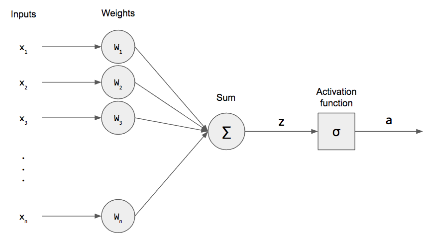

퍼셉트론에 대한 설명은 https://wikidocs.net/24958 이 곳에 진짜 잘 설명되어 있으니 참고하세요!

퍼셉트론을 이용하여 0부터9까지 숫자 인식 시스템을 만들었습니다.

코드는 이곳에 있습니다. <https://github.com/koomg9599/number-recognition-by-perceptron>

# number-recognition-system

number-recognition-system by perceptron

## Data set

from 0 to 9 (7 x 5 Matrix)

## Steps

### 1. initialize weight and threshold

- weight = initialize 4 X 35 Matrix by 0.5
- threshold = 0

### 2. target value setting

distinguish from 0 to 9 by 4 bits

0: -1 -1 -1 -1 

1: -1 -1 -1 1 

2: -1 -1 1 -1 

3: -1 -1 1 1 

4: -1 1 -1 -1 

5: -1 1 -1 1 

6: -1 1 1 -1

7: -1 1 1 1 

8: 1 -1 -1 -1

9: 1 -1 -1 1 

10: 1 -1 1 -1

### 3. weight update

#### Activate Function

#### Update Function

## Result Weight

[[-7.5 2.5 2.5 -1.5 -3.5 4.5 0.5 0.5 -3.5 4.5 4.5 0.5 0.5 -3.5 4.5 -7.5 10.5 10.5 10.5 -13.5 4.5 0.5 0.5 -3.5 2.5 4.5 0.5 0.5 -3.5 2.5 -3.5 -3.5 -3.5 -7.5 -9.5],
[14.5 0.5 0.5 2.5 -5.5 -3.5 0.5 0.5 2.5 -17.5 -3.5 0.5 0.5 2.5 -17.5 -5.5 -3.5 -3.5 -3.5 8.5 -9.5 0.5 0.5 2.5 6.5 -9.5 0.5 0.5 2.5 6.5 0.5 0.5 0.5 2.5 6.5],
[20.5 -1.5 -1.5 -3.5 -15.5 -23.5 0.5 0.5 -1.5 -5.5 -23.5 0.5 0.5 -1.5 -5.5 0.5 2.5 2.5 2.5 6.5 -1.5 0.5 0.5 -1.5 -1.5 -1.5 0.5 0.5 -1.5 -1.5 2.5 2.5 2.5 0.5 8.5],
[-1.5 2.5 2.5 0.5 4.5 -3.5 0.5 0.5 -1.5 4.5 -3.5 0.5 0.5 -1.5 4.5 -1.5 0.5 0.5 0.5 0.5 -5.5 0.5 0.5 -1.5 4.5 -5.5 0.5 0.5 -1.5 4.5 -1.5 -1.5 -1.5 -3.5 2.5]]

## Checking

## Testing

## Code

### Update Weight

weight update function

it's learning step

<table class="colorscripter-code-table" style="margin:0;padding:0;border:none;background-color:#fafafa;border-radius:4px;" cellspacing="0" cellpadding="0"><tr><td style="padding:6px;border-right:2px solid #e5e5e5">

1

2

3

4

5

6

7

8

9

10

11

12

13

14

15

16

17

18

19

20

21

22

23

</td><td style="padding:6px 0;text-align:left">

bool&nbsp;learning(vector&lt;int&gt;&nbsp;numV,&nbsp;vector&lt;int&gt;&nbsp;answerV)&nbsp;{

&nbsp;&nbsp;&nbsp;&nbsp;vector&lt;int&gt;&nbsp;tmpAnswer(4);

&nbsp;&nbsp;&nbsp;&nbsp;for&nbsp;(int&nbsp;i&nbsp;=&nbsp;0;&nbsp;i&nbsp;&lt;&nbsp;4;&nbsp;i++)&nbsp;{

&nbsp;&nbsp;&nbsp;&nbsp;&nbsp;&nbsp;&nbsp;&nbsp;int&nbsp;tmpSum&nbsp;=&nbsp;0;

&nbsp;&nbsp;&nbsp;&nbsp;&nbsp;&nbsp;&nbsp;&nbsp;for&nbsp;(int&nbsp;j&nbsp;=&nbsp;0;&nbsp;j&nbsp;&lt;&nbsp;35;&nbsp;j++)&nbsp;{

&nbsp;&nbsp;&nbsp;&nbsp;&nbsp;&nbsp;&nbsp;&nbsp;&nbsp;&nbsp;&nbsp;&nbsp;tmpSum&nbsp;+=&nbsp;numV[j]&nbsp;*&nbsp;W[i][j];

&nbsp;&nbsp;&nbsp;&nbsp;&nbsp;&nbsp;&nbsp;&nbsp;}

&nbsp;&nbsp;&nbsp;&nbsp;&nbsp;&nbsp;&nbsp;&nbsp;if&nbsp;(tmpSum&nbsp;&gt;=&nbsp;threshold)&nbsp;tmpAnswer[i]&nbsp;=&nbsp;1;

&nbsp;&nbsp;&nbsp;&nbsp;&nbsp;&nbsp;&nbsp;&nbsp;else&nbsp;tmpAnswer[i]&nbsp;=&nbsp;-1;

&nbsp;&nbsp;&nbsp;&nbsp;}

&nbsp;

&nbsp;&nbsp;&nbsp;&nbsp;int&nbsp;tmpCount&nbsp;=&nbsp;0;

&nbsp;&nbsp;&nbsp;&nbsp;for&nbsp;(int&nbsp;i&nbsp;=&nbsp;0;&nbsp;i&nbsp;&lt;&nbsp;4;&nbsp;i++)&nbsp;{

&nbsp;&nbsp;&nbsp;&nbsp;&nbsp;&nbsp;&nbsp;&nbsp;if&nbsp;(tmpAnswer[i]&nbsp;==&nbsp;answerV[i])&nbsp;tmpCount++;

&nbsp;&nbsp;&nbsp;&nbsp;&nbsp;&nbsp;&nbsp;&nbsp;else&nbsp;{

&nbsp;&nbsp;&nbsp;&nbsp;&nbsp;&nbsp;&nbsp;&nbsp;&nbsp;&nbsp;&nbsp;&nbsp;for&nbsp;(int&nbsp;j&nbsp;=&nbsp;0;&nbsp;j&nbsp;&lt;&nbsp;35;&nbsp;j++)&nbsp;{

&nbsp;&nbsp;&nbsp;&nbsp;&nbsp;&nbsp;&nbsp;&nbsp;&nbsp;&nbsp;&nbsp;&nbsp;&nbsp;&nbsp;&nbsp;&nbsp;W[i][j]&nbsp;+=&nbsp;n&nbsp;*&nbsp;(answerV[i]&nbsp;-&nbsp;tmpAnswer[i])&nbsp;*&nbsp;numV[j];

&nbsp;&nbsp;&nbsp;&nbsp;&nbsp;&nbsp;&nbsp;&nbsp;&nbsp;&nbsp;&nbsp;&nbsp;}

&nbsp;&nbsp;&nbsp;&nbsp;&nbsp;&nbsp;&nbsp;&nbsp;}

&nbsp;&nbsp;&nbsp;&nbsp;}

&nbsp;&nbsp;&nbsp;&nbsp;if&nbsp;(tmpCount&nbsp;==&nbsp;4)&nbsp;return&nbsp;true;

&nbsp;&nbsp;&nbsp;&nbsp;else&nbsp;return&nbsp;false;

}

<a href="http://colorscripter.com/info#e" target="_blank" style="color:#e5e5e5text-decoration:none">Colored by Color Scripter</a>
</td><td style="vertical-align:bottom;padding:0 2px 4px 0"><a href="http://colorscripter.com/info#e" target="_blank" style="text-decoration:none;color:white">cs</a></td></tr></table>

### Checking

checking function

<table class="colorscripter-code-table" style="margin:0;padding:0;border:none;background-color:#fafafa;border-radius:4px;" cellspacing="0" cellpadding="0"><tr><td style="padding:6px;border-right:2px solid #e5e5e5">

1

2

3

4

5

6

7

8

9

10

11

12

13

14

15

16

17

18

19

20

21

22

23

24

</td><td style="padding:6px 0;text-align:left">

void&nbsp;checking(vector&lt;int&gt;&nbsp;sampleV)&nbsp;{

&nbsp;&nbsp;&nbsp;&nbsp;vector&lt;int&gt;&nbsp;tmpAnswer(4);

&nbsp;&nbsp;&nbsp;&nbsp;for&nbsp;(int&nbsp;i&nbsp;=&nbsp;0;&nbsp;i&nbsp;&lt;&nbsp;4;&nbsp;i++)&nbsp;{

&nbsp;&nbsp;&nbsp;&nbsp;&nbsp;&nbsp;&nbsp;&nbsp;int&nbsp;tmpSum&nbsp;=&nbsp;0;

&nbsp;&nbsp;&nbsp;&nbsp;&nbsp;&nbsp;&nbsp;&nbsp;for&nbsp;(int&nbsp;j&nbsp;=&nbsp;0;&nbsp;j&nbsp;&lt;&nbsp;35;&nbsp;j++)&nbsp;{

&nbsp;&nbsp;&nbsp;&nbsp;&nbsp;&nbsp;&nbsp;&nbsp;&nbsp;&nbsp;&nbsp;&nbsp;tmpSum&nbsp;+=&nbsp;sampleV[j]&nbsp;*&nbsp;W[i][j];

&nbsp;&nbsp;&nbsp;&nbsp;&nbsp;&nbsp;&nbsp;&nbsp;}

&nbsp;&nbsp;&nbsp;&nbsp;&nbsp;&nbsp;&nbsp;&nbsp;if&nbsp;(tmpSum&nbsp;&gt;=&nbsp;threshold)&nbsp;tmpAnswer[i]&nbsp;=&nbsp;1;

&nbsp;&nbsp;&nbsp;&nbsp;&nbsp;&nbsp;&nbsp;&nbsp;else&nbsp;tmpAnswer[i]&nbsp;=&nbsp;-1;

&nbsp;&nbsp;&nbsp;&nbsp;}

&nbsp;&nbsp;&nbsp;&nbsp;

&nbsp;&nbsp;&nbsp;&nbsp;for&nbsp;(int&nbsp;j&nbsp;=&nbsp;0;&nbsp;j&nbsp;&lt;&nbsp;10;&nbsp;j++)&nbsp;{

&nbsp;&nbsp;&nbsp;&nbsp;&nbsp;&nbsp;&nbsp;&nbsp;int&nbsp;tmpCount&nbsp;=&nbsp;0;

&nbsp;&nbsp;&nbsp;&nbsp;&nbsp;&nbsp;&nbsp;&nbsp;for&nbsp;(int&nbsp;i&nbsp;=&nbsp;0;&nbsp;i&nbsp;&lt;&nbsp;4;&nbsp;i++)&nbsp;{

&nbsp;&nbsp;&nbsp;&nbsp;&nbsp;&nbsp;&nbsp;&nbsp;&nbsp;&nbsp;&nbsp;&nbsp;if&nbsp;(tmpAnswer[i]&nbsp;==&nbsp;answer[j][i])&nbsp;tmpCount++;

&nbsp;&nbsp;&nbsp;&nbsp;&nbsp;&nbsp;&nbsp;&nbsp;}

&nbsp;&nbsp;&nbsp;&nbsp;&nbsp;&nbsp;&nbsp;&nbsp;if&nbsp;(tmpCount&nbsp;==&nbsp;4)&nbsp;{

&nbsp;&nbsp;&nbsp;&nbsp;&nbsp;&nbsp;&nbsp;&nbsp;&nbsp;&nbsp;&nbsp;&nbsp;cout&nbsp;&lt;&lt;&nbsp;"answer:&nbsp;"&nbsp;&lt;&lt;&nbsp;j&nbsp;&lt;&lt;&nbsp;endl;

&nbsp;&nbsp;&nbsp;&nbsp;&nbsp;&nbsp;&nbsp;&nbsp;&nbsp;&nbsp;&nbsp;&nbsp;return;

&nbsp;&nbsp;&nbsp;&nbsp;&nbsp;&nbsp;&nbsp;&nbsp;}

&nbsp;&nbsp;&nbsp;&nbsp;}

&nbsp;&nbsp;&nbsp;&nbsp;cout&nbsp;&lt;&lt;&nbsp;"no&nbsp;matching"&nbsp;&lt;&lt;&nbsp;endl;

&nbsp;&nbsp;&nbsp;&nbsp;return;

}

<a href="http://colorscripter.com/info#e" target="_blank" style="color:#e5e5e5text-decoration:none">Colored by Color Scripter</a>
</td><td style="vertical-align:bottom;padding:0 2px 4px 0"><a href="http://colorscripter.com/info#e" target="_blank" style="text-decoration:none;color:white">cs</a></td></tr></table>

### Reference

- https://pythonmachinelearning.pro/perceptrons-the-first-neural-networks/
- https://wikidocs.net/24958