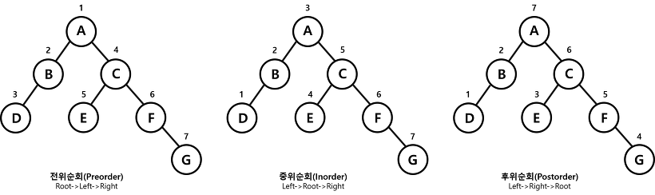
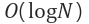

자료구조에서 가장 중요한건 배열이나 리스트이겠지만, 그 다음은 이진트리라고 나는 생각한다.

이진트리는 간단해 보이지만 배울게 많다.

## 정의

이진트리는 한 노드가 최대 두 개의 자식 노드를 가지는 트리를 뜻한다.

## 종류

### 정 이진 트리 (full binary tree)

단말 노드가 아닌 모든 노드가 2개인 자식을 가진 트리

### 포화 이진 트리 (perfect binary tree)

모든 단말 노드의 깊이가 같은 정 이진 트리

> 포화 이진 트리를 full binary tree로 알고 있는 분들이 있지만 아니다!

### 완전 이진 트리 (complete binary tree)

끝 부분을 제외하고 모든 노드가 채워진 이진트리. **마지막 레벨의 노드들은 왼쪽으로 채워져 있다.**

완전 이진트리들은 노드를 삽입할 때 왼쪽부터 차례대로 삽입하는 트리!

## 트리 순회

트리순회는 전위순회(preorder), 중위순회(inorder), 후위순회(postorder)가 있다.

### 시간 복잡도

최적: 

최악: O(N)

### Binary Tree 구현 (C++)

<table class="colorscripter-code-table" style="margin:0;padding:0;border:none;background-color:#fafafa;border-radius:4px;" cellspacing="0" cellpadding="0"><tr><td style="padding:6px;border-right:2px solid #e5e5e5">

1

2

3

4

5

6

7

8

9

10

11

12

13

14

15

16

17

18

19

20

21

22

23

24

25

26

27

28

29

30

31

32

33

34

35

36

37

38

39

40

41

42

43

44

45

46

47

48

49

50

51

52

53

54

55

56

57

58

59

60

61

62

63

64

65

66

67

68

69

70

71

72

73

74

75

76

77

78

79

80

81

82

83

84

85

86

87

88

89

90

91

92

93

94

95

96

97

</td><td style="padding:6px 0;text-align:left">

#include&nbsp;&lt;iostream&gt;

#include&nbsp;&lt;queue&gt;

#include&nbsp;&lt;stack&gt;

&nbsp;

using&nbsp;namespace&nbsp;std;

&nbsp;

class&nbsp;Node&nbsp;{

&nbsp;&nbsp;&nbsp;&nbsp;friend&nbsp;class&nbsp;BinaryTree;

private:

&nbsp;&nbsp;&nbsp;&nbsp;int&nbsp;data;

&nbsp;&nbsp;&nbsp;&nbsp;Node&nbsp;*left;

&nbsp;&nbsp;&nbsp;&nbsp;Node&nbsp;*right;

public:

&nbsp;&nbsp;&nbsp;&nbsp;Node(int&nbsp;_data)&nbsp;{

&nbsp;&nbsp;&nbsp;&nbsp;&nbsp;&nbsp;&nbsp;&nbsp;this-&gt;data&nbsp;=&nbsp;_data;

&nbsp;&nbsp;&nbsp;&nbsp;}

&nbsp;&nbsp;&nbsp;&nbsp;int&nbsp;getData()&nbsp;{

&nbsp;&nbsp;&nbsp;&nbsp;&nbsp;&nbsp;&nbsp;&nbsp;return&nbsp;this-&gt;data;

&nbsp;&nbsp;&nbsp;&nbsp;}

};

&nbsp;

class&nbsp;BinaryTree&nbsp;{

private:

&nbsp;&nbsp;&nbsp;&nbsp;Node&nbsp;*root;

public:

&nbsp;&nbsp;&nbsp;&nbsp;Node*&nbsp;getRoot()&nbsp;{

&nbsp;&nbsp;&nbsp;&nbsp;&nbsp;&nbsp;&nbsp;&nbsp;return&nbsp;this-&gt;root;

&nbsp;&nbsp;&nbsp;&nbsp;}

&nbsp;&nbsp;&nbsp;&nbsp;void&nbsp;insert(int&nbsp;_data)&nbsp;{

&nbsp;&nbsp;&nbsp;&nbsp;&nbsp;&nbsp;&nbsp;&nbsp;Node**&nbsp;node&nbsp;=&nbsp;&amp;root;

&nbsp;&nbsp;&nbsp;&nbsp;&nbsp;&nbsp;&nbsp;&nbsp;while&nbsp;(1)&nbsp;{

&nbsp;&nbsp;&nbsp;&nbsp;&nbsp;&nbsp;&nbsp;&nbsp;&nbsp;&nbsp;&nbsp;&nbsp;if&nbsp;(*node&nbsp;==&nbsp;NULL)&nbsp;{

&nbsp;&nbsp;&nbsp;&nbsp;&nbsp;&nbsp;&nbsp;&nbsp;&nbsp;&nbsp;&nbsp;&nbsp;&nbsp;&nbsp;&nbsp;&nbsp;*node&nbsp;=&nbsp;new&nbsp;Node(_data);

&nbsp;&nbsp;&nbsp;&nbsp;&nbsp;&nbsp;&nbsp;&nbsp;&nbsp;&nbsp;&nbsp;&nbsp;&nbsp;&nbsp;&nbsp;&nbsp;return;

&nbsp;&nbsp;&nbsp;&nbsp;&nbsp;&nbsp;&nbsp;&nbsp;&nbsp;&nbsp;&nbsp;&nbsp;}

&nbsp;&nbsp;&nbsp;&nbsp;&nbsp;&nbsp;&nbsp;&nbsp;&nbsp;&nbsp;&nbsp;&nbsp;int&nbsp;nodeData&nbsp;=&nbsp;(*node)-&gt;data;

&nbsp;&nbsp;&nbsp;&nbsp;&nbsp;&nbsp;&nbsp;&nbsp;&nbsp;&nbsp;&nbsp;&nbsp;if&nbsp;(nodeData&nbsp;&gt;&nbsp;_data)&nbsp;{

&nbsp;&nbsp;&nbsp;&nbsp;&nbsp;&nbsp;&nbsp;&nbsp;&nbsp;&nbsp;&nbsp;&nbsp;&nbsp;&nbsp;&nbsp;&nbsp;node&nbsp;=&nbsp;&amp;(*node)-&gt;left;

&nbsp;&nbsp;&nbsp;&nbsp;&nbsp;&nbsp;&nbsp;&nbsp;&nbsp;&nbsp;&nbsp;&nbsp;}

&nbsp;&nbsp;&nbsp;&nbsp;&nbsp;&nbsp;&nbsp;&nbsp;&nbsp;&nbsp;&nbsp;&nbsp;else&nbsp;if&nbsp;(nodeData&nbsp;&lt;&nbsp;_data)&nbsp;{

&nbsp;&nbsp;&nbsp;&nbsp;&nbsp;&nbsp;&nbsp;&nbsp;&nbsp;&nbsp;&nbsp;&nbsp;&nbsp;&nbsp;&nbsp;&nbsp;node&nbsp;=&nbsp;&amp;(*node)-&gt;right;

&nbsp;&nbsp;&nbsp;&nbsp;&nbsp;&nbsp;&nbsp;&nbsp;&nbsp;&nbsp;&nbsp;&nbsp;}

&nbsp;&nbsp;&nbsp;&nbsp;&nbsp;&nbsp;&nbsp;&nbsp;&nbsp;&nbsp;&nbsp;&nbsp;else&nbsp;{

&nbsp;&nbsp;&nbsp;&nbsp;&nbsp;&nbsp;&nbsp;&nbsp;&nbsp;&nbsp;&nbsp;&nbsp;&nbsp;&nbsp;&nbsp;&nbsp;return;

&nbsp;&nbsp;&nbsp;&nbsp;&nbsp;&nbsp;&nbsp;&nbsp;&nbsp;&nbsp;&nbsp;&nbsp;}

&nbsp;&nbsp;&nbsp;&nbsp;&nbsp;&nbsp;&nbsp;&nbsp;}

&nbsp;&nbsp;&nbsp;&nbsp;}

&nbsp;&nbsp;&nbsp;&nbsp;void&nbsp;BFS()&nbsp;{

&nbsp;&nbsp;&nbsp;&nbsp;&nbsp;&nbsp;&nbsp;&nbsp;queue&lt;Node*&gt;&nbsp;q;

&nbsp;&nbsp;&nbsp;&nbsp;&nbsp;&nbsp;&nbsp;&nbsp;q.push(root);

&nbsp;&nbsp;&nbsp;&nbsp;&nbsp;&nbsp;&nbsp;&nbsp;while&nbsp;(!q.empty())&nbsp;{

&nbsp;&nbsp;&nbsp;&nbsp;&nbsp;&nbsp;&nbsp;&nbsp;&nbsp;&nbsp;&nbsp;&nbsp;Node&nbsp;*node&nbsp;=&nbsp;q.front();

&nbsp;&nbsp;&nbsp;&nbsp;&nbsp;&nbsp;&nbsp;&nbsp;&nbsp;&nbsp;&nbsp;&nbsp;q.pop();

&nbsp;&nbsp;&nbsp;&nbsp;&nbsp;&nbsp;&nbsp;&nbsp;&nbsp;&nbsp;&nbsp;&nbsp;Node&nbsp;*leftNode&nbsp;=&nbsp;node-&gt;left;

&nbsp;&nbsp;&nbsp;&nbsp;&nbsp;&nbsp;&nbsp;&nbsp;&nbsp;&nbsp;&nbsp;&nbsp;Node&nbsp;*rightNode&nbsp;=&nbsp;node-&gt;right;

&nbsp;&nbsp;&nbsp;&nbsp;&nbsp;&nbsp;&nbsp;&nbsp;&nbsp;&nbsp;&nbsp;&nbsp;if&nbsp;(leftNode&nbsp;!=&nbsp;NULL)&nbsp;q.push(leftNode);

&nbsp;&nbsp;&nbsp;&nbsp;&nbsp;&nbsp;&nbsp;&nbsp;&nbsp;&nbsp;&nbsp;&nbsp;if&nbsp;(rightNode&nbsp;!=&nbsp;NULL)&nbsp;q.push(rightNode);

&nbsp;&nbsp;&nbsp;&nbsp;&nbsp;&nbsp;&nbsp;&nbsp;&nbsp;&nbsp;&nbsp;&nbsp;cout&nbsp;&lt;&lt;&nbsp;node-&gt;getData()&nbsp;&lt;&lt;&nbsp;"&nbsp;";

&nbsp;&nbsp;&nbsp;&nbsp;&nbsp;&nbsp;&nbsp;&nbsp;}

&nbsp;&nbsp;&nbsp;&nbsp;}

&nbsp;&nbsp;&nbsp;&nbsp;void&nbsp;DFS()&nbsp;{

&nbsp;&nbsp;&nbsp;&nbsp;&nbsp;&nbsp;&nbsp;&nbsp;stack&lt;Node*&gt;&nbsp;s;

&nbsp;&nbsp;&nbsp;&nbsp;&nbsp;&nbsp;&nbsp;&nbsp;s.push(root);

&nbsp;&nbsp;&nbsp;&nbsp;&nbsp;&nbsp;&nbsp;&nbsp;while&nbsp;(!s.empty())&nbsp;{

&nbsp;&nbsp;&nbsp;&nbsp;&nbsp;&nbsp;&nbsp;&nbsp;&nbsp;&nbsp;&nbsp;&nbsp;Node*&nbsp;node&nbsp;=&nbsp;s.top();

&nbsp;&nbsp;&nbsp;&nbsp;&nbsp;&nbsp;&nbsp;&nbsp;&nbsp;&nbsp;&nbsp;&nbsp;s.pop();

&nbsp;&nbsp;&nbsp;&nbsp;&nbsp;&nbsp;&nbsp;&nbsp;&nbsp;&nbsp;&nbsp;&nbsp;if&nbsp;(node&nbsp;==&nbsp;NULL)&nbsp;{

&nbsp;&nbsp;&nbsp;&nbsp;&nbsp;&nbsp;&nbsp;&nbsp;&nbsp;&nbsp;&nbsp;&nbsp;&nbsp;&nbsp;&nbsp;&nbsp;continue;

&nbsp;&nbsp;&nbsp;&nbsp;&nbsp;&nbsp;&nbsp;&nbsp;&nbsp;&nbsp;&nbsp;&nbsp;}

&nbsp;&nbsp;&nbsp;&nbsp;&nbsp;&nbsp;&nbsp;&nbsp;&nbsp;&nbsp;&nbsp;&nbsp;s.push(node-&gt;right);

&nbsp;&nbsp;&nbsp;&nbsp;&nbsp;&nbsp;&nbsp;&nbsp;&nbsp;&nbsp;&nbsp;&nbsp;s.push(node-&gt;left);

&nbsp;&nbsp;&nbsp;&nbsp;&nbsp;&nbsp;&nbsp;&nbsp;&nbsp;&nbsp;&nbsp;&nbsp;cout&nbsp;&lt;&lt;&nbsp;node-&gt;getData()&nbsp;&lt;&lt;&nbsp;"&nbsp;";

&nbsp;&nbsp;&nbsp;&nbsp;&nbsp;&nbsp;&nbsp;&nbsp;}

&nbsp;&nbsp;&nbsp;&nbsp;}

};

&nbsp;

&nbsp;

&nbsp;

int&nbsp;main()&nbsp;{

&nbsp;&nbsp;&nbsp;&nbsp;BinaryTree*&nbsp;tree&nbsp;=&nbsp;new&nbsp;BinaryTree();

&nbsp;

&nbsp;&nbsp;&nbsp;&nbsp;tree-&gt;insert(5);

&nbsp;&nbsp;&nbsp;&nbsp;tree-&gt;insert(1);

&nbsp;&nbsp;&nbsp;&nbsp;tree-&gt;insert(2);

&nbsp;&nbsp;&nbsp;&nbsp;tree-&gt;insert(3);

&nbsp;&nbsp;&nbsp;&nbsp;tree-&gt;insert(4);

&nbsp;&nbsp;&nbsp;&nbsp;tree-&gt;insert(5);

&nbsp;&nbsp;&nbsp;&nbsp;tree-&gt;insert(6);

&nbsp;&nbsp;&nbsp;&nbsp;tree-&gt;insert(7);

&nbsp;&nbsp;&nbsp;&nbsp;cout&nbsp;&lt;&lt;&nbsp;"BFS"&nbsp;&lt;&lt;&nbsp;endl;

&nbsp;&nbsp;&nbsp;&nbsp;tree-&gt;BFS();

&nbsp;&nbsp;&nbsp;&nbsp;cout&nbsp;&lt;&lt;&nbsp;endl;

&nbsp;&nbsp;&nbsp;&nbsp;cout&nbsp;&lt;&lt;&nbsp;"DFS"&nbsp;&lt;&lt;&nbsp;endl;

&nbsp;&nbsp;&nbsp;&nbsp;tree-&gt;DFS();

&nbsp;&nbsp;&nbsp;&nbsp;cout&nbsp;&lt;&lt;&nbsp;endl;

&nbsp;&nbsp;&nbsp;&nbsp;return&nbsp;0;

}

<a href="http://colorscripter.com/info#e" target="_blank" style="color:#e5e5e5text-decoration:none">Colored by Color Scripter</a>
</td><td style="vertical-align:bottom;padding:0 2px 4px 0"><a href="http://colorscripter.com/info#e" target="_blank" style="text-decoration:none;color:white">cs</a></td></tr></table>

### reference

* [이진트리:: 위키백과](https://ko.wikipedia.org/wiki/%EC%9D%B4%EC%A7%84_%ED%8A%B8%EB%A6%AC)
* [완전이진 트리 :: 조물조물](https://jomuljomul.tistory.com/entry/완전이진트리Complete-Binary-Tree란)
* [이진트리개념과 구현 :: 문메이](https://meylady.tistory.com/16)