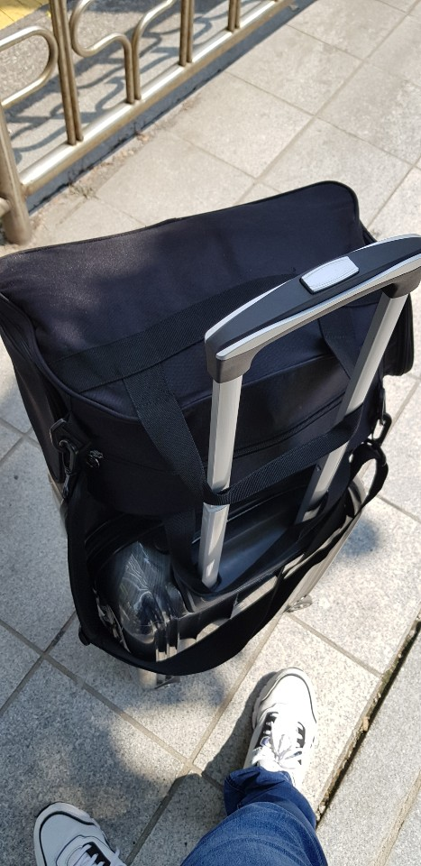
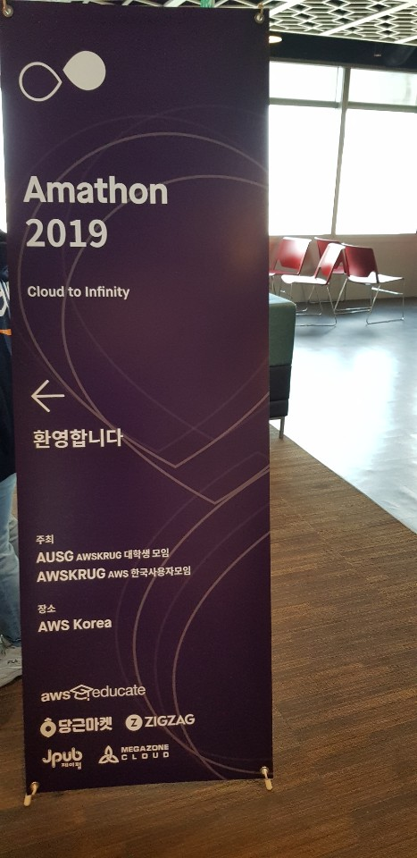
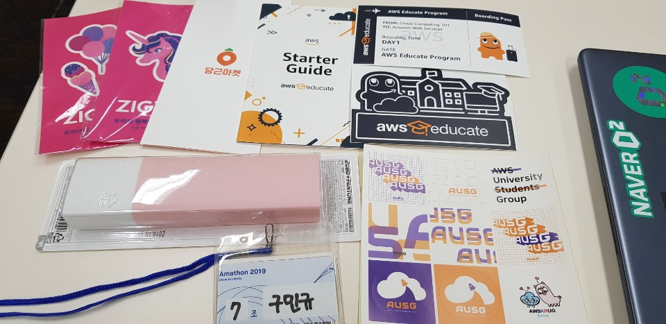
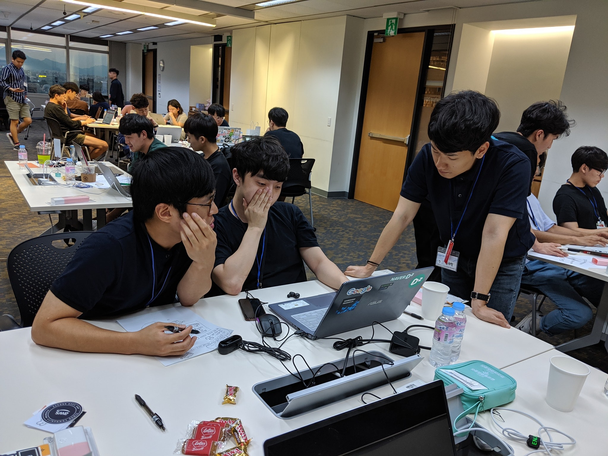

## Overview

서울에서의 인턴생활을 끝내고 이제 부산으로 내려가야할 시간이 돌아왔다.

내려가기전에 [Amathon](https://amathon.ga/)이라는 해커톤에 참여하게 되었다.

참여하기로 생각한 이유는 총 4가지로 다음과 같다.

1. AWS와 관련있다는 말 한마디가 흥미를 끔
2. 대학생 중의 마지막 해커톤을 해보자
3. 뛰어난 개발자를 만나서 뭔가 배우자
4. 9월 1일까지 해커톤하고 9월 2일 개학을 하니 시간이 딱 맞음

## 사진

서울에서의 마지막은 Amathon과 함께

굿즈

7팀 Youtube Creator를 위한 댓글 추첨 사이트

## 결과물

### repository

https://github.com/amathon-2019/YoutubeCreator

## 일기

### 8월 31일

행사가 진행됨에 따라 나는 흥미가 점점 사라졌는데 AMATHON이 백앤드 개발자들을 위한 행사인 만큼 프론트앤드 개발자인 내가 배울게 많이 없었기 때문이다.

특히나.. 우리 팀의 주제는 'Youtube Creator를 위한 댓글추첨 사이트'이기에 프론트개발자가 많이 필요함에도 불구하고 백앤드 개발자 두분 프론트 개발자는 나 혼자.. ㅠㅠ

배우는건 없고 그냥 노가다하는 느낌이였다. ㅠㅠ

예전에는 무언가를 개발하고 만들어내는데 흥미를 느꼈는데 요즘은 이론공부 하는데 흥미가 생기는 것 같다.

아무튼 끝까지 화이팅!