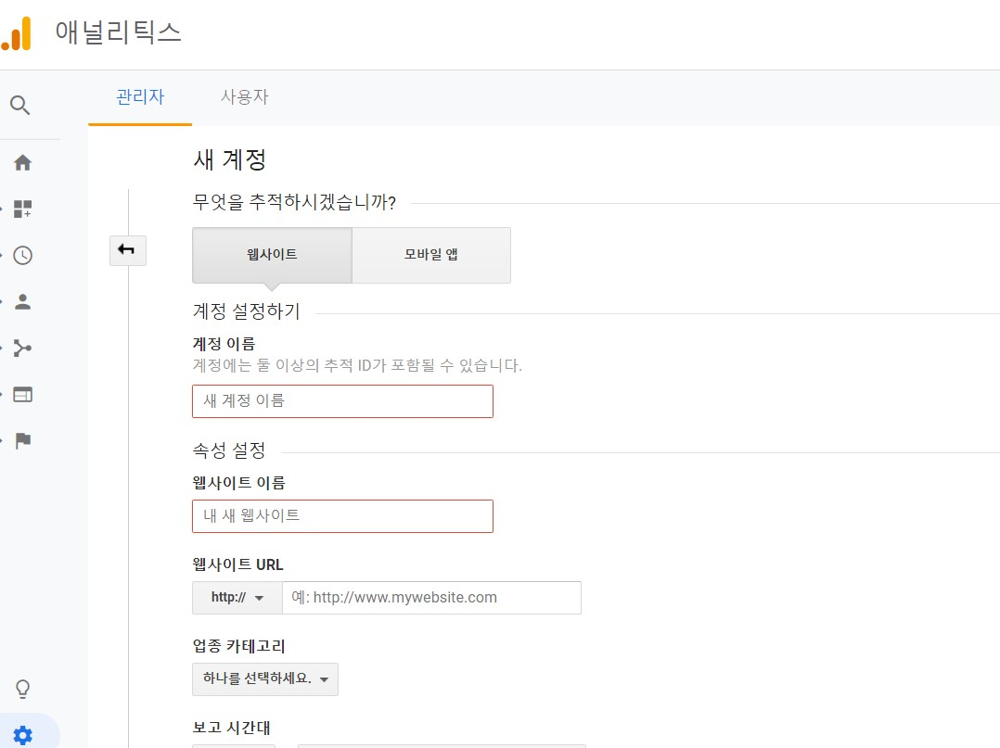
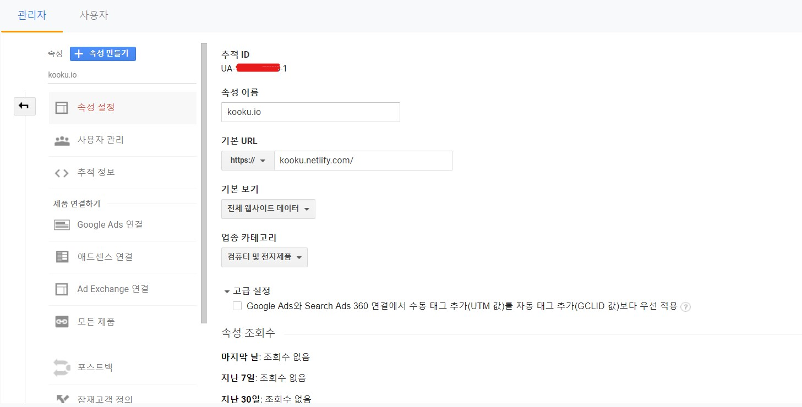
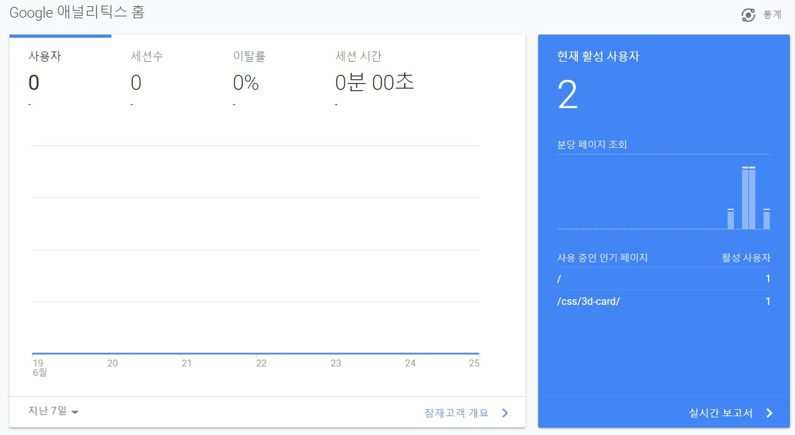
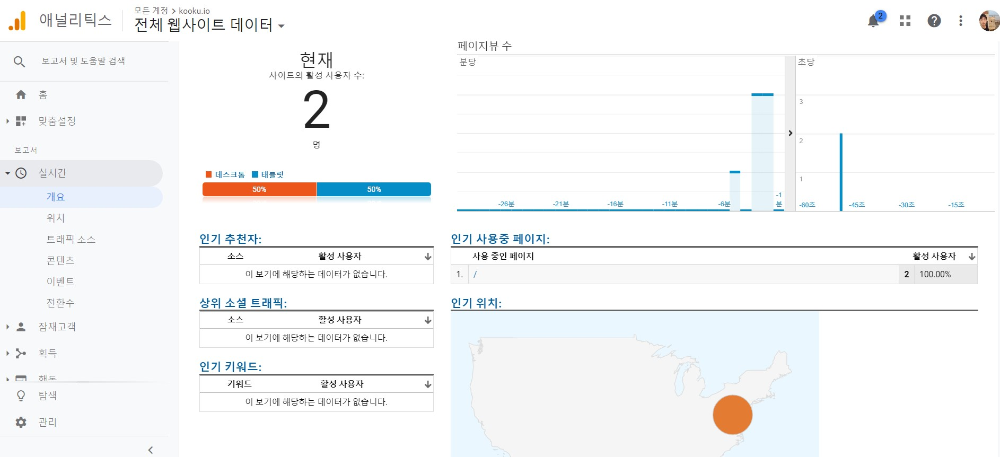

## Overview

T-story 같은 경우 방문자수를 표시해주는 대시보드가 있다. gatsby를 사용하여 netlify로 배포하는 나의 블로그는 그러한 기능이 없기에 google analytics를 붙히는 작업을 하였다.

## 계정 생성하기

google analytics에서 계정을 생성한다.



그러면 Tracking ID를 발급받게 된다.



이제 gatsby에 추가 해줘야하는데 우선 `gatsby-config.js`에서 `google-analytics` 플러그인이 셋팅되어 있는지 확인한다. 나의 경우에는 기존 템플릿에 추가 되어있어서 다른 설정은 하지 않았지만 만약에 되어 있지않다면 [Gatsby 문서](https://www.gatsbyjs.org/docs/adding-analytics/)를 참고하면 된다.

## Using `gatsby-plugin-google-analytics`

Now, it’s time to configure Gatsby to send page views to your Google Analytics account.

(including Google Analytics gtag.js and Google Tag Manager), check [other Gatsby analytics plugins](https://www.gatsbyjs.org/docs/adding-analytics/#other-gatsby-analytics-plugins).

```shell
npm install --save gatsby-plugin-google-analytics
```

gatsby-config.js

```js
module.exports = {
  plugins: [
    {
      resolve: `gatsby-plugin-google-analytics`,
      options: {
        // replace "UA-XXXXXXXXX-X" with your own Tracking ID
        trackingId: "UA-XXXXXXXXX-X",
      },
    },
  ],
}
```

> Note: Read more about [gatsby-config.js](https://www.gatsbyjs.org/docs/gatsby-config/)

발급받은 추적 ID를 넣어주기만 하면 셋팅 끝~! 

시간이 조금 지나서 들어가보면





위와 같이 방문자수와 어느 페이지를 보고 있는지, 접속 위치도 모두 알 수 있다.

## Reference

[https://www.gatsbyjs.org/docs/adding-analytics/](https://www.gatsbyjs.org/docs/adding-analytics/)