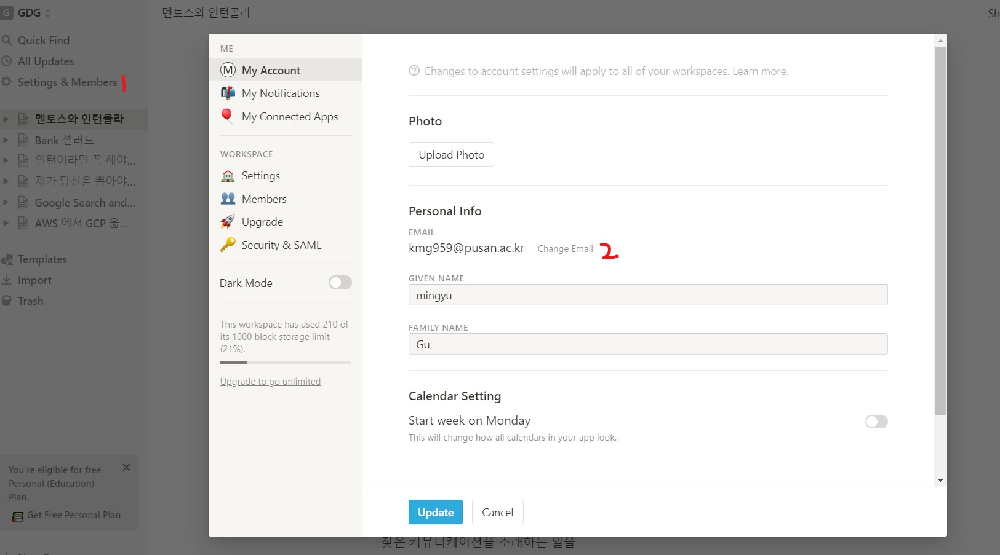
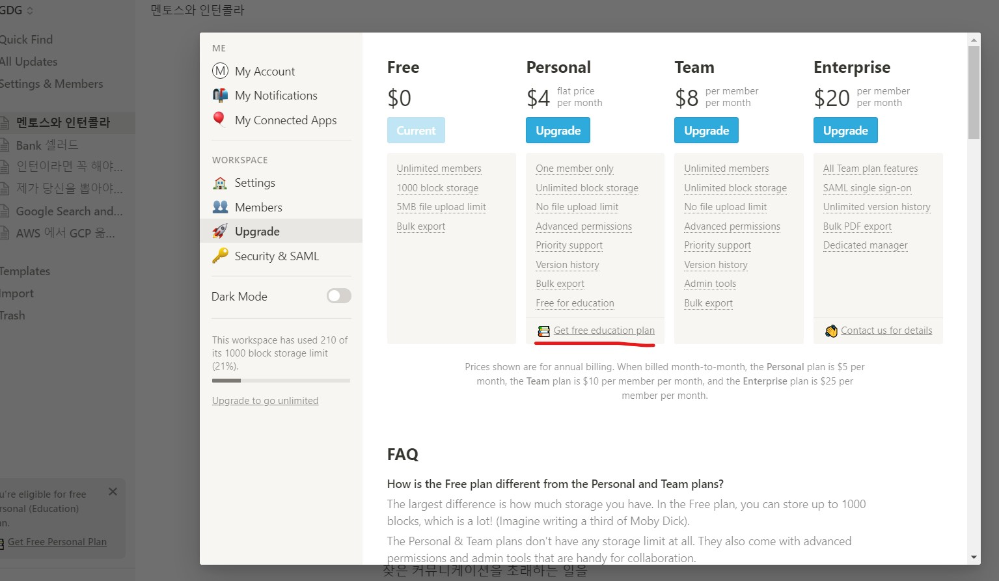

# Notion

노션은 온라인 마크다운 편집기 입니다. 단순한 마크다운 편집기는 아니고 TODO, DB등 여러가지 문서를 작성할 수 있습니다.

마침 [Notion 1년간 사용기](https://velog.io/@godori/Notion-1%EB%85%84%EA%B0%84%EC%9D%98-%EC%82%AC%EC%9A%A9%EA%B8%B0-x7jon062yu)에 관련 내용과 설명들이 있으니 모르시는 분들은 참고하면 좋을 것 같습니다.

저는 Notion을 사용한지 6개월 정도 되었는데요. 프로젝트를 할때 팀원들끼리 공유문서를 만들때 Notion을 사용하였습니다. 정말 편리하고 좋더군요.

## Notion 학생계정으로 무료로 사용하기

Notion을 무료 플랜으로 사용한다면 하나의 WorkSpace에 1000블록까지만 사용이 가능하죠. 하지만 이번에 학생계정 무료가 풀리면서 무제한으로 늘어났습니다.

그래서 이번에는 무료로 사용하는 법을 알아보겠습니다.

먼저 이전에 사용하던 아이디로 로그인을 한 후 Settings에서 change email을 누릅니다.

그 다음에 Upgrade Nav bar를 누르고

`Get free education plan`을 클릭하면 끝!

## 마무리

Notion으로 자신의 가치를 더욱 높히길 바랍니다~!