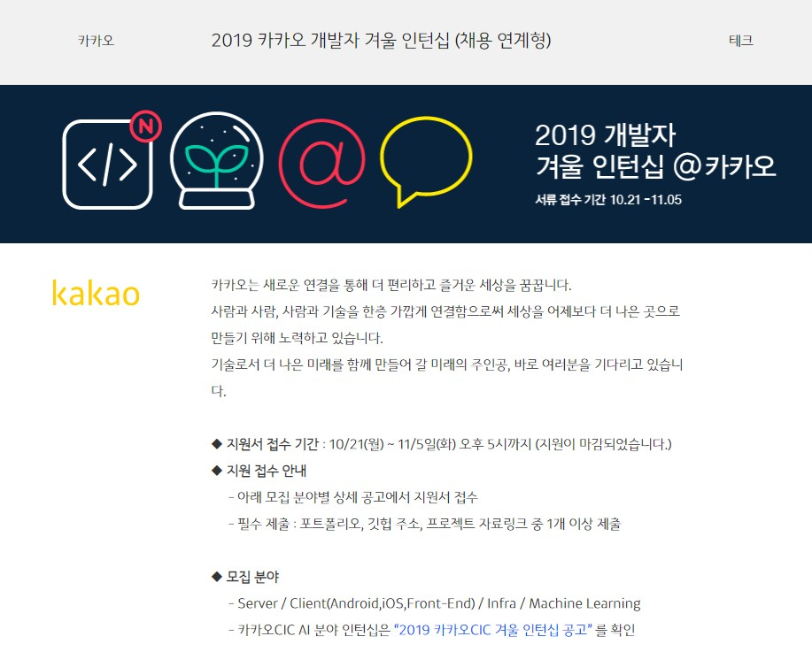
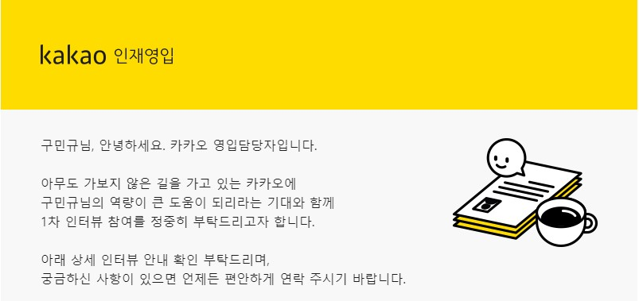
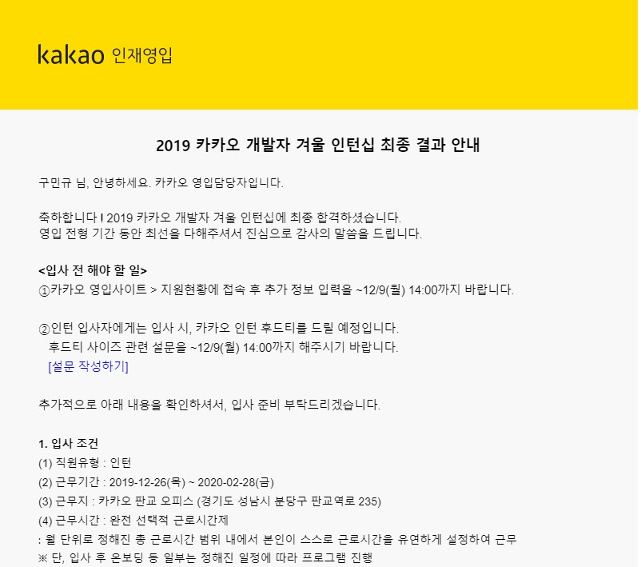
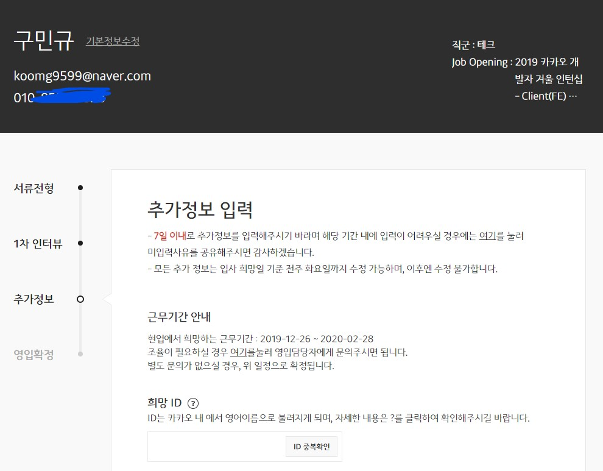
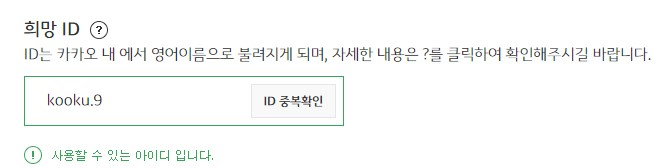
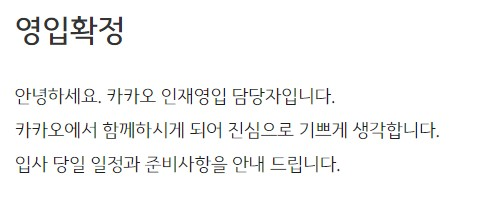

IT 개발자라면 누구나 가고 싶어하는 카카오 인턴에 합격했다! ㅎㅎ

밑의 모집공고를 보고 신청했는데.. 기대도 안했는데.. 합! 격!

카카오 인턴은 서류 + 코딩테스트 => 면접 순으로 진행되었다.

특히 카카오 면접 안내 메일을 받고 조금 감동했는데 

*아무도 가보지 않는 길을 가고 있는 카카오에 구민규님의 역량이 큰 도움이 되리라는 기대와 함께 1차 인터뷰 참여를 정중히 부탁드리고자 합니다.* 

이 글귀가 많이 감동적이였다. 마치 새로운 시대를 여는 사람처럼 느껴졌다. 그리고 정중히 면접을 부탁하는 글귀또한 인상이 깊었다.

면접은 카카오 판교사옥에서 보았다. 1대2 면접이였고 면접관님들께서 편하게 해주셔서 하고 싶은 말은 다 하고 나왔다. 말하지 못한 몇가지 질문은 나를 조금 두렵게 만들었지만 말이다.

### 하지만 결과는 합! 격! ㅎㅎ

아직도 기분이 너무 좋다.

카카오에서는 영어이름을 사용하기 때문에 뭘 해야할지 고민이다.

지금 떠오르는 건 그냥 **KooKu** ??

결국 **kooku.9**로 당첨 ㅎㅎ 카카오 메일도 kooku@kakao.com 이다 ㅎㅎ

처음부터 끝까지 자랑만 한 것 같다.

그런데 이번 카카오 인턴십은 나의 능력과 지금까지의 노력을 증명한 결과라고 생각한다. 

이번 계기로 나는 틀리지 않았다는 사실을 알 수 있었다.

자만하지 말아야겠지만 떨어진 나의 자존감은 이번 계기로 많이 회복되었다.

