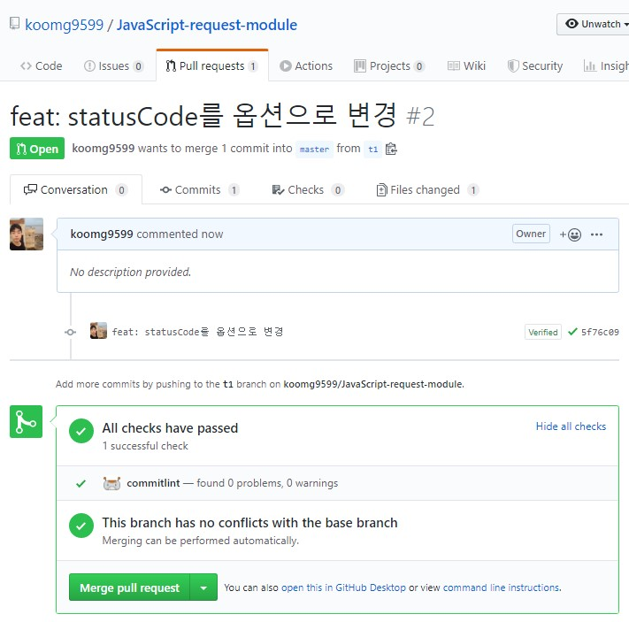
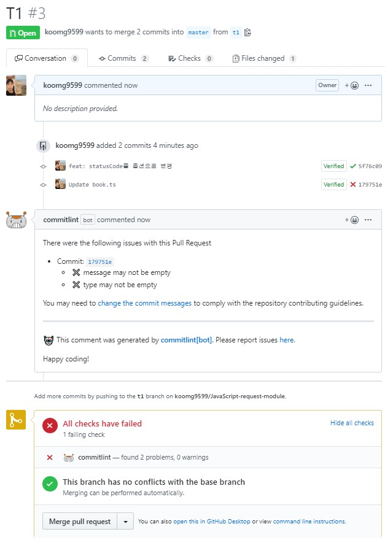

[커밋 메시지 작성법](https://kooku.netlify.com/etc/%EC%BB%A4%EB%B0%8B-%EB%A9%94%EC%84%B8%EC%A7%80-%EC%9E%91%EC%84%B1%EB%B2%95)에서 커밋 메시지를 작성하는 법을 정리하였습니다. 하지만 여러 팀원들과 같이 프로젝트를 진행할때 나말고 다른 사람들이 commitlint를 맞추지 않다면 아무 소용없겠지요? 그래서 이번에는 Git 레포에 commitlint-bot을 붙히는 법을 알아보겠습니다. 여기서 사용하는 GitHub App은 [commitlint-bot](https://github.com/z0al/commitlint-bot) 이곳이니 참고하시면 되겠습니다.

## 사용법

1. Browse to [GitHub Apps - commitlint](https://github.com/apps/commitlint)
2. Accept the permissions
3. Allow access to repositories

이것만 하면 끝!

## 예시

사용하는 GitHub bot은 모든 커밋 메시지에 검사를 하지는 않고 PR이 발생했을때만 검사합니다.

만약 올바른 커밋 메시지를 작성하였다면 이렇게 표시될 것이고 

잘못 작성하였다면

이렇게 표시될 것입니다. 잘못작성했다면 `amend`한 후에 다시 PR을 날려야겠죠?

## 마무리

한글은 안될줄 알았는데 테스트 해보니 되더군요. 하지만 type에 Emoji는 안되는 것 같습니다.

commitlint-bot을 프로젝트에 설치하여 팀원들과 commit message를 통일시켜 보시길 바랍니다.

그럼 즐코~!