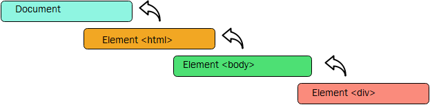
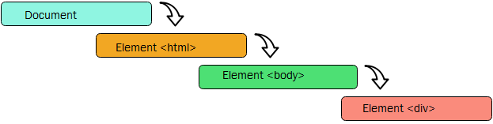
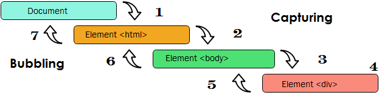
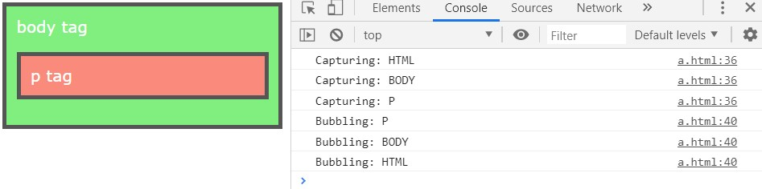

자바스크립트에서 중요한 **Event Flow**에 대하여 알아보자! 대부분 *Event Bubble*은 알고 있을 것 입니다. React에서는 이를 막기 위해 `event.stopPropagation()`을 사용한 경험이 많을 것 입니다. 하지만 **Event Flow**에는 *Event Bubble*말고도 다른 것들이 있다는 사실을 아시나요? 이번에는 **Event Flow**에 대하여 완벽하게 다루어 보겠습니다.

## 들어가기 전에

Event에는 3단계의 life cycle이 존재합니다. (cycle, target, bubbling)
웹페이지에서 이벤트를 인식하는 순서는 **Event Flow**라 불리며 이에 대하여 자세히 알아보겠습니다.

## Index

1. **[Event Bubble](#1-Event-Bubble)**
2. **[Event Capturing](#2-Event-Capturing)**
3. **[DOM Event Flow](#3-DOM-Event-Flow)**
4. **[마무리](#4-마무리)**

## 1. Event Bubble

특정한 element에서 이벤트가 발생했을때 상위 element로 event가 전파해 나가는 것을 **Event Bubbling**이라고 부릅니다.


```html
<!DOCTYPE html>
<html>
  <head>
    <title>......</title>
  </head>
  <body>
    <div id="demo">Press here.</div>
  </body>
</html>
```

위와 같은 HTML에서 **\<div\>**가 클릭되었을 때, 클릭 이벤트는 다음과 같은 순서로 전파되어 집니다.

1. \<div>
2. \<body>
3. \<html>
4. Document

가장 먼저 \<div\> 요소를 작동시키고 그 다음엔 DOM tree를 따라 올라가는 것입니다.

## 2. Event Capturing

또다른 event flow는 **_Event Capturing_**이라고 불리며 Netscape Browser에서 처음 소개되었습니다.

그림을 보면 알겠지만 *Event Bubbling*과는 반대입니다.
만약 \<div> 요소가 클릭된다면 이벤트는 다음과 같은 순서로 전파됩니다.

1. Document
2. \<html>
3. \<body>
4. \<div>

*Event Capturing*은 현대 브라우저에서 지원이 잘 안되므로 특별한 경우 사용하게 됩니다.

## 3. DOM Event Flow

표준 [DOM Events](https://www.w3.org/TR/DOM-Level-3-Events/)에서 event propagation의 3 단계가 있습니다.

1. Capturing phase – the event goes down to the element.
2. Target phase – the event reached the target element.
3. Bubbling phase – the event bubbles up from the element.



위의 단계 순서로 **Event Flow**가 발생하는게 원칙이지만 실제로는 3 단계로 발생하지는 않습니다.

만약 *capturing phase*를 사용하고 싶다면 handler `capture` 옵션을 `true`로 변경해야합니다.

`capture` 옵션에는 두가지 값이 들어갈 수 있습니다.

- 만약 `false` (default)라면, handler는 *bubbling phase*를 실행합니다.
- 만약 `true` 라면, handler는 *capturing phase*를 실행하게 됩니다.

예제 코드는 다음과 같습니다.

```html
<!DOCTYPE html>
<html>
  <head>
    <title>Example: Setting Event Handling using DOM</title>
    <style type="text/css">
      html {
        background-color: #fff;
      }
      body {
        font-family: Verdana;
        background: #7e7e;
        color: #fff;
        padding: 10px;
        border: 4px solid #555;
      }
      p {
        font-family: Verdana;
        background: #fa8b7c;
        color: #fff;
        padding: 10px;
        border: 4px solid #555;
      }
    </style>
  </head>
  <body>
    body tag
    <p>
      p tag
    </p>
  </body>

  <script>
    for (let elem of document.querySelectorAll('*')) {
      elem.addEventListener(
        'click',
        e => console.log(`Capturing: ${elem.tagName}`),
        true
      )
      elem.addEventListener('click', e =>
        console.log(`Bubbling: ${elem.tagName}`)
      )
    }
  </script>
</html>
```

p 태그 클릭시 Event Flow



## 4. 마무리

대부분의 사람들이 **Event Bubbling**은 들어봤지만 **Event Capturing**은 처음 들어봤을 겁니다. 이 포스팅으로 **Event Flow**에 대하여 많이 아셨으면 좋겠습니다.

### Reference

- [JavaScript : Event Flow :: tutorialspark](http://www.tutorialspark.com/javascript/JavaScript_Event_Flow.php)

- [Bubbling and capturing :: JAVASCRIPT.INFO](https://javascript.info/bubbling-and-capturing)
