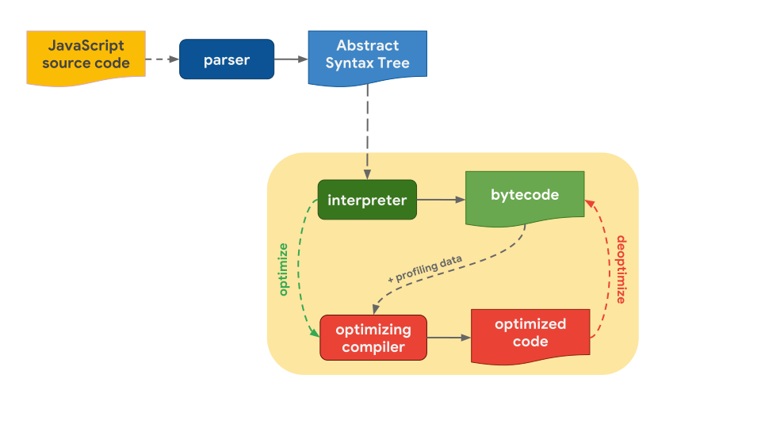
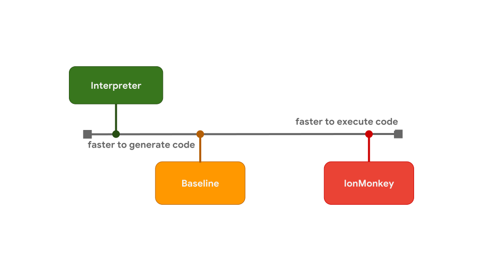

> 이 글은 [JavaScript engine fundamentals: Shapes and Inline Caches](https://mathiasbynens.be/notes/shapes-ics),  [How JavaScript works: inside the V8 engine + 5 tips on how to write optimized code](https://blog.sessionstack.com/how-javascript-works-inside-the-v8-engine-5-tips-on-how-to-write-optimized-code-ac089e62b12e) 의 글을 요약하여 정리하였습니다.
>
> 두개의 글은 각각 [JavaScript engine fundamentals: Shapes and Inline Caches](https://shlrur.github.io/javascripts/javascript-engine-fundamentals-shapes-and-Inline-caches/), [자바스크립트는 어떻게 작동하는가: V8 엔진의 내부 + 최적화된 코드를 작성을 위한 다섯 가지 팁](<https://engineering.huiseoul.com/%EC%9E%90%EB%B0%94%EC%8A%A4%ED%81%AC%EB%A6%BD%ED%8A%B8%EB%8A%94-%EC%96%B4%EB%96%BB%EA%B2%8C-%EC%9E%91%EB%8F%99%ED%95%98%EB%8A%94%EA%B0%80-v8-%EC%97%94%EC%A7%84%EC%9D%98-%EB%82%B4%EB%B6%80-%EC%B5%9C%EC%A0%81%ED%99%94%EB%90%9C-%EC%BD%94%EB%93%9C%EB%A5%BC-%EC%9E%91%EC%84%B1%EC%9D%84-%EC%9C%84%ED%95%9C-%EB%8B%A4%EC%84%AF-%EA%B0%80%EC%A7%80-%ED%8C%81-6c6f9832c1d9>) 의 블로그에 번역되어 포스팅 되어있습니다.

브라우저에서 V8엔진은 어떻게 돌아가는지 궁금한 찰나, 유용한 글이 있길래 읽고 정리하였습니다.

## V8(JavaScript engine) history

자바스크립트 엔진은 자바스크립트 코드를 실행하는 프로그램 혹은 인터프리터를 말합니다. 아래는 유명한 자바스크립트 엔진들입니다.

- [**V8**](https://en.wikipedia.org/wiki/V8_%28JavaScript_engine%29)**:** 오픈소스, 구글에서 개발, C++로 작성됨
- [**SpiderMonkey**](https://en.wikipedia.org/wiki/SpiderMonkey_%28JavaScript_engine%29) : 최초의 자바스크립트 엔진. 예전에는 넷스케이프 네비게이터에 사용됐고 지금은 파이어폭스에 사용됨
- [**JavaScriptCore**](https://en.wikipedia.org/wiki/JavaScriptCore): 오픈소스, 니트로라는 이름으로도 알려져 있으며 애플이 사파리를 위해 개발함
- [**Chakra** (JScript9)](https://en.wikipedia.org/wiki/Chakra_%28JScript_engine%29): 인터넷익스플로러
- [**Chakra** (JavaScript)](https://en.wikipedia.org/wiki/Chakra_%28JavaScript_engine%29): 마이크로소프트엣지

#### V8 엔진은 왜 만들게 되었나?

V8 엔진은 구글이 만들었으며 오픈소스이고 **C++**로 제작됩니다. 구글크롬에서 사용 중입니다. 그리고 다른 엔진들과 차이점은 노드js의 런타임으로도 사용된다는 점입니다.

V8은 웹 브라우저 내부에서 자바스크립트 수행 속도의 개선을 목표로 처음 고안되었습니다. 속도 향상을 위해 V8은 인터프리터를 사용하는 대신 자바스크립트 코드를 더 효율적인 머신 코드로 번역합니다. [**저스트인타임** 컴파일러](https://ko.wikipedia.org/wiki/JIT_%EC%BB%B4%ED%8C%8C%EC%9D%BC)를 구현함으로써 코드를 실행 시에 자바스크립트 코드를 머신 코드로 컴파일하는데, 이는 스파이더몽키나 리노와 같은 현대적인 다른 자바스크립트 엔진에서도 마찬가지입니다. 

### In 2010

5.9 버전이 출시 되기 전에는 V8에서 두 개의 엔진을 사용했습니다.

**1. 풀코드젠(Full-codegen) : 최적화되지 않은 코드를 생성하는 빠른 컴파일러**

자바스크립트 코드를 처음 수행할 때, V8은 풀코드젠(Full-codegen)을 이용해서 파싱된 자바스크립트 코드를 변형 없이 직접 머신 코드로 번역한다. 이를 통해 머신 코드의 실행을 매우 빠르게 시작할 수 있게 되는 것이다. 이와같이 V8은 중간 바이트코드를 이용하지 않기 때문에 인터프리터가 필요 없다.

**2. 크랭크샤프트(Crankshaft) : 빠르고 최적화된 코드를 생성하는 느린 컴파일러**

풀코드젠(Full-codegen)이 생성한 코드를 크랭크샤프트(Crankshaft)가 검사하여, 최적화가 필요하다고 판단되면 코드를 변경한다. 자바스크립트의 추상구문트리를 고수준 정적단일할당(SSA)로 번역하는데 이를 하이드로젠이라고 부른다. 크랭크샤프트는 또한 하이드로젠 그래프를 최적화하고자 노력하기도 한다.

V8 엔진은 또한 내부적으로 여러 개의 쓰레드를 사용합니다

- 메인 쓰레드는 독자들의 예상대로 코드를 가져와서 컴파일하고 실행하는 곳입니다
- 또한 컴파일을 위한 별도의 쓰레드가 있어서 이 쓰레드가 코드를 최적화하는 동안 메인 쓰레드는 쉬지 않고 코드를 수행할 수 있습니다
- 프로파일러 쓰레드는 어떤 메소드에서 사용자가 많은 시간을 보내는지 런타임에게 알려주어 크랭크샤프트가 이들을 최적화할 수 있게 해줍니다
- 그 외 가비지컬렉터 스윕을 처리하기 위한 몇 개의 쓰레드가 있습니다

자바스크립트 코드를 처음으로 수행할 때 V8은 **풀코드젠**을 이용해서 파싱된 자바스크립트 코드를 변형 없이 직접 머신 코드로 번역합니다. 이를 통해 머신 코드의 실행을 **매우 빠르게** 시작할 수 있습니다. V8은 이와 같이 중간 바이트코드를 이용하지 않기 때문에 인터프리터가 필요 없게 됩니다.

코드가 얼마간 수행된 다음 프로파일러 쓰레드는 충분한 데이터를 얻게 되고 어떤 메소드를 최적화할 지 알 수 있게 됩니다.

그러면 **크랭크샤프트**가 다른 쓰레드에서 최적화를 시작합니다. 크랭크샤프트는 자바스크립트의 추상구문트리를 고수준 정적단일할당(static single-assignment, SSA)으로 번역하는데 이를 **하이드로젠**(Hydrogen)이라고 부릅니다. 크랭크샤프트는 또한 하이드로젠 그래프를 최적화하고자 노력하기도 합니다. 대부분의 최적화가 이 수준에서 이루어집니다.

### In 2017

2017년에 V8엔진은 Ignition(interpreter)과 TurboFan(optimizing compiler)으로 구성된 완전히 새로운 compiler pipeline을 출시했습니다.

V8 버전 5.8부터 JavaScript 실행에는 Full-codegen 및 Crankshaft가 더 이상 사용되지 않습니다. 그 이유는 팀이 더 이상 새로운 자바스크립트 언어 기능, 또 그 기능에 필요한 최적화를 계속 관리할 수 없다고 생각했기 때문입니다.

## The JavaScript Engine pipeline (V8)

JavaScript 엔진은 소스 코드를 구문 분석(parse)하여 AST(Abstract Syntax Tree)로 변환합니다. Interpreter는 이 AST를 기반으로 일을 시작하고 바이트 코드를 생산할 수 있습니다. 그 시점에서 엔진은 실제로 JavaScript 코드를 실행하고 있습니다.

위의 과정이 더 빨리 실행되도록 하기 위해,  **bytecode**는 **profiling data**와 함께 **optimizing compiler** (TurboFan)로 보내집니다. **optimizing compiler**는 자신이 보유한 **profiling data**를 기반으로 특정한 가정을 한 다음 고도로 최적화된 시스템 코드(**optimized code**)를 생성합니다.

어느 시점에서 가정 중 하나가 잘못된 것으로 판명될 경우, **optimizing compiler**는 최적화를 수행하지 않고 다시 **interpreter**로 돌아가게 됩니다. (deoptimize)

V8의 interpreter는 **Ignition**이라고 불리며, **bytecode**를 생성하고 실행하는 역할을 합니다. **Bytecode**를 실행하는 동안, 이후에 실행 속도를 높이는데 사용하기 위해서 **profiling data**를 수집합니다. 예를 들어, 종종(often) 실행되는 기능에 부하가 걸리면, 생성된 **bytecode**와 **profiling data**는 **TurboFan**(최적화된 컴파일러)으로 전달되어 **profiling data**를 기반으로 최적화 머신 코드(**optimized code**)를 생성합니다.

### bytecode to optimized code

Interpreter는 bytecode를 재빨리 만들 수 있지만, 일반적으로 bytecode는 그리 효율적이지 않습니다. 반면에 optimizing compiler는 시간이 좀 더 걸리지만 결국 훨씬 더 효율적인 machine 코드를 생산합니다.

위의 그림에서 보듯이 bytecode 와 optimized code 사이에 trade-off가 발생하게 되는데요.

이러한 startup latency와 execution speed 간의 trade-off는 일부 JavaScript 엔진이 최적화 tier를 추가하기로 선택하는 이유입니다. 예를 들어 SpiderMonkey는 interpreter와 전체 IonMonkey 사이에 compiler를 최적화하는 Baseline tier를 추가했습니다.

Interpreter는 bytecode를 빠르게 생성하지만, bytecode의 실행속도는 비교적 느린편입니다. Baseline은 코드를 생성하는데 약간 더 오래 걸리지만 run-time 성능을 향상시킵니다. 마지막으로, optimizing compiler인 IonMonkey는 machine 코드를 생산하는데 가장 오래 걸리지만, machine 코드는 매우 효율적으로 실행됩니다.

## JavaScript engine의 최적화 기법

V8 엔진은 inlining, elision of expensive runtime properties, inline caching 등의 최적화 기법을 사용합니다.

### Inline Caches (ICs)

ICs는 JavaScript를 신속하게 실행할 수 있게하는 핵심 요소입니다. JavaScript 엔진은 ICs를 사용하여 object에서 property를 찾을수 있는 위치에 대한 정보를 암기하여, 높은 cost를 가지는 조회 횟수를 줄입니다.

이를 통해 object와 array에 대한 접근을 최적화할 수 있습니다.

### Inlineing

컴파일러는 많은 코드를 인라이닝(inlining)하려고 합니다. 인라이닝이란 호출 지점(함수가 호출된 곳의 코드 위치)을 호출된 함수의 내용으로 바꾸는 과정입니다. 이러한 단순한 과정으로 이후의 최적화가 더욱 큰 의미를 가지게 됩니다.

### reference

* https://en.wikipedia.org/wiki/V8_(JavaScript_engine)