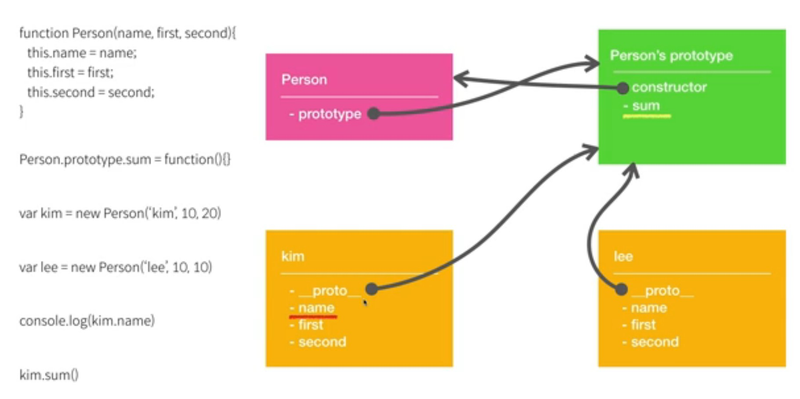
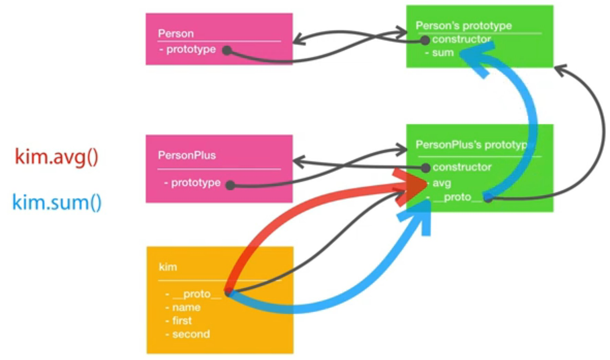

## constructor

Constructor function을 쓰면 코드의 간결화와 재사용성이 높아짐

```js
function Person() {
    this.name = 'kim';
    this.first = 10;
    this.second = 20;
    this.third = 30;
    this.sum = function () {
        return this.first + this.second + this.third;
	}
}
console.log(Person()); // 그냥 함수
console.log(new Person()); // Person이라는 객체가 만들어짐, 함수가 생성자가됨(constructor)
```

```js
var kim = new Person();
console.log(kim.sum()) // 60
```

```js
function Person(name, first, second, third) {
    this.name = name;
    this.first = first;
    this.second = second;
    this.third = third;
    this.sum = function () {
        return this.first + this.second + this.third;
	}
}
```

## 상속

```js
class Person {
    constructor(name, first, second) {
        this.name = name;
        this.first = first;
        this.second = second;
    }
    sum () {
    	return this.first + this.second;
	}
}
class PersonPlus extends Person {
    avg () {
        return (this.frist + this.second) / 2;
    }
}
var kim = new PersonPlus('kim', 10, 20);
```

## super

상속을 도입했을때 발생하는 여러 문제들, 자식과 부모 클래스간의 관계

`super` 부모 클래스를 사용하고, 하지 못하는 기능은 자식이 처리하게한다.

`super`에 괄호가 있으면 부모클래스의 생성자, 괄호가 없으면 부모클래스 자체를 뜻한다. 만약 `super`라는 기능이 없으면, 자식클래스에서 부모클래스의 속성과 기능에 추가적인 무언가를 넣어 활용할때 다시 부모클래스의 코드를 사용해야하는 중복이 발생할 것이다.

```js
class Person {
    constructor(name, first, second) {
        this.name = name;
        this.first = first;
        this.second = second;
    }
    sum () {
    	return this.first + this.second;
	}
}
class PersonPlus extends Person {
    constructor(name, first, second, third) {
        super(name, first, second); // 부모클래스 생성자가 호출됨
        this.third = third;
    }
    sum () {
    	return super.sum() + this.third; // 부모클래스 함수의 결과값을 사용한다.
	}
    avg () {
        return (this.frist + this.second + this.third) / 3;
    }
}
var kim = new PersonPlus('kim', 10, 20, 30);
```

## \_\_proto\_\_

subObj 가 superObj를 상속받을때 이 링크를 prototype link라고 하며, 부모객체를 prototype object 라고 한다.

```js
var superObj = {superVal: 'super'}
var subObj = {subVal: 'sub'}
subObj.__proto__ = superObj;
console.log('subObj,subVal =>', subObj.subVal); // sub
console.log('subObj,superVal =>', subObj.superVal); // super
```

```js
subObj.superVal = 'sub';
console.log('superObj.superVal =>', superObj.superVal); // super
```

여전히 'super' 이다. 그 객체를 바꾸는 것이지, 그 객체의 proto를 바꾸는게 아니다.

## Object.create()

객체끼리 연결할 때 Object.create() 또는 \_\_proto\_\_를 사용한다.

이게 더 좋은 방법이다.

```js
var superObj = {superVal: 'super'}
var subObj = Object.create(superObj);
subObj.subVal = 'sub';
console.log('subObj,subVal =>', subObj.subVal); // sub
console.log('subObj,superVal =>', subObj.superVal); // super
```

## 객체상속의 사용

```js
var kim = {
    name: 'kim',
    first: 10, second: 20,
    sum: function() {return this.first + this.second}
}
var lee = {
    name: 'lee',
    first: 10, second: 10,
    avg: function () {return (this.first + this.second) / 2}
}
lee.__proto__ = kim;
console.log('lee.sum() : ', lee.sum()); // 20
console.log('lee.avg() : ', lee.avg()); // 10
```

```js
var kim = {
    name: 'kim',
    first: 10, second: 20,
    sum: function() {return this.first + this.second}
}
var lee = Object.create(kim);
lee.name = 'lee';
lee.first = 10;
lee.second = 10;
lee.avg = function () {return (this.first + this.second) / 2}
```

## call

**call**은 실행되는 함수의 this값을 원하는 객체로 바꿔서 실행할 수 있게 해준다. 

```js
var kim = {name: 'kim', first: 10, second: 20}
var lee = {name: 'lee', first: 10, second: 10}
function sum() {
    return this.first + this.second;
}
// sum(); 과 같다. 모든 함수는 call이라는 method를 가지고 있다.
sum.call(kim); // sum이라는 객체를 실행시키는 것이다. sum 안의 this가 kim이 된다.
```

즉,  sum이 kim이라는 객체의 method가 된다.

첫번째 인자는 함수의 내부적으로 this를 뭐로 할 것인지 오고, 두번째 부터는 파라미터의 인자 값이 들어간다.

```js
var kim = {name: 'kim', first: 10, second: 20}
var lee = {name: 'lee', first: 10, second: 10}
function sum(prefix) {
    return prefix + this.first + this.second;
}
console.log(sum.call(kim, '=> ')); // => 30
```

## bind

**bind**는 실행되는 함수의 this값을 원하는 객체로 고정시키는 새로운 함수를 만들어낸다.

```js
var kim = {name: 'kim', first: 10, second: 20}
var lee = {name: 'lee', first: 10, second: 10}
function sum(prefix) {
    return prefix + this.first + this.second;
}
var kimSum = sum.bind(kim, '-> ');
console.log('kimSum()') // -> 30
```

## prototype vs \_\_proto\_\_

다음의 2개는 같다.

```js
function Person(){}
var Person = new Function();
```

자바스크립트에서 함수는 객체이다. 따라서 함수는 객체이기에 Property를 가질 수 있다.



## 생성자 함수를 통한 상속

```js
class Person {
    constructor(name, first, second) {
        this.name = name;
        this.first = first;
        this.second = second;
    }
    sum () {
    	return this.first + this.second;
	} // Person의 prototype에 소속되어 있기에 Person을 사용하는 모든 객체가 공유한다.
}
class PersonPlus extends Person {
    constructor(name, first, second, third) {
        super(name, first, second); // 부모클래스 생성자가 호출됨
        this.third = third;
    }
    sum () {
    	return super.sum() + this.third; // 부모클래스 함수의 결과값을 사용한다.
	}
    avg () {
        return (this.frist + this.second + this.third) / 3;
    }
}
var kim = new PersonPlus('kim', 10, 20, 30);
```

```js
function Person(name, first, second) {
    this.name = name;
    this.first = first;
    this.second = second;
}
Person.prototype.sum = function () {
	return this.first + this.second;
}
function PersonPlus(name, first, second, third) {
    Person.call(this, name, first, second);
    this.third = third;
}
// PersonPlus.prototype.__proto__ = PErson.prototype; // 비표준이다.
PersonPlus.prototype = Object.create(Person.prototype); // 새로운 객체의 Person을 만든다.
PersonPlus.prototype.constructor = PersonPlus; // constructor만 다시 PersonPlus로 바꾸어 준다.

PersonPlus.prototype.avg = function () {
    return (this.first + this.second + this.third) / 3;
}
var kim = new PersonPlus('kim', 10, 20, 30);
```



## Reference

[생활코딩 - JavaScript 객체 지향 프로그래밍](https://www.youtube.com/watch?v=DHIlPmJUDzk&list=PLuHgQVnccGMAMctarDlPyv6upFUUnpSO3&index=1)