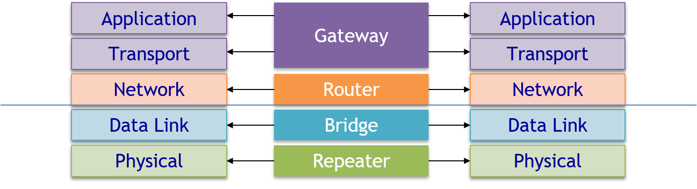
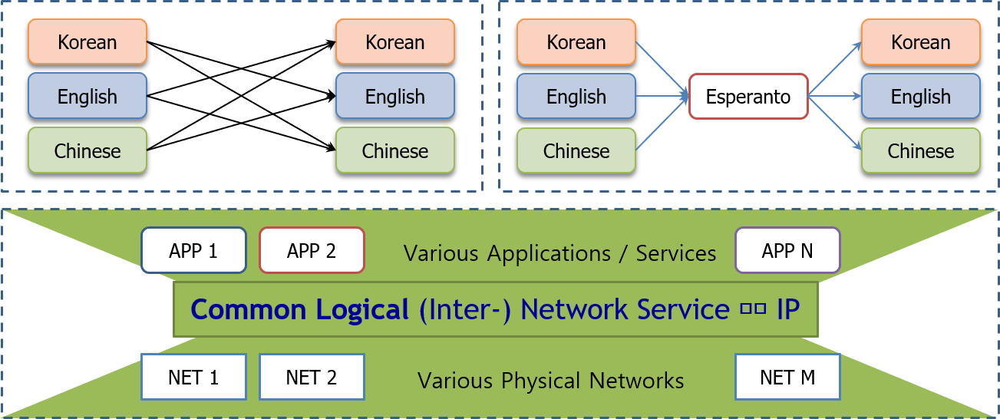
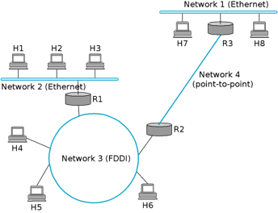
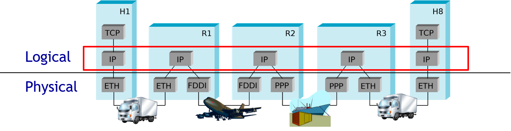
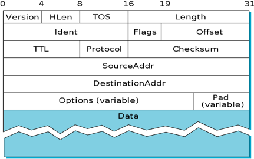
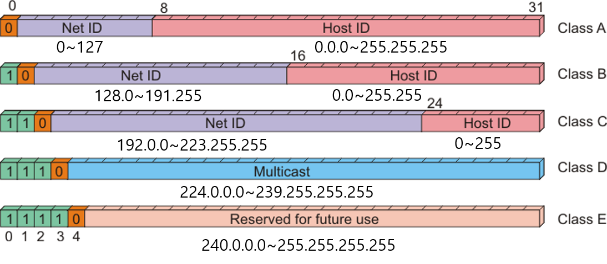
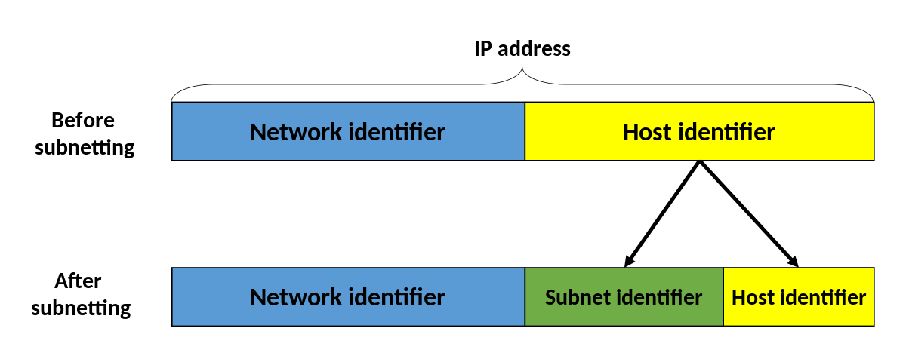
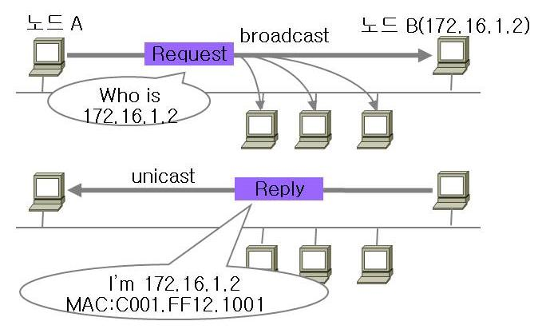

### Index

1. Internetworking
   * What & Why ? How ?
   * 다른 계층에서의 Internetworking - Bridge vs Router
2. IP Service Model
   * IP(Internet Protocol) Best Effort Service Model ?
   * 논리 네트워크/주소 vs 물리 네트워크/주소
   * 네트워크 주소는 누가 어떻게 할당하는가?
3. IP Address & ARP
   * 클래스 기반 계층적 주소 구조
   * ARP는 무엇의 약자인가? ARP가 필요한 이유는?
4. Forwarding vs Routing
   * Forwarding과 Routing의 차이
   * Forwarding/Routing Table의 이해
5. Fragmentation & Reassembly
   * MTU는 무엇의 약자인가?
   * Fragmentation & Reassembly, 필요한 이유는?

## 1. Internetworking

### internetwork - What

internetwork는 inter + network로 분리할 수 있으며 이를 풀어서 설명하자면 네트워크간의 통신입니다.

이러한 네트워크간의 통시능로 실제 network는 물리적으로 여러개 이지만 이를 묶어서 논리적으로 하나의 network로 만들어 버립니다.

Network of Networks  ==> internetwork / internetworking

### Internetworking - How

이 부분은 뒤에서 다시 자세히 설명하도록 하겠습니다.

* Routing - internetworking in Network Layer

  * 물리망의 다양성, 이질성을 효과적으로 대처하는 구조

  

  두개의 그림 중 위의 그림을 한번 보겠습니다.

  다국적 사람들이 여러개의 언어로 소통을 하게 되면 서로의 언어를 이해하지 못하여 소통이 어려워지게됩니다. 이걸 이질성이라고 부릅니다.

  이를 해결하기 위하여 Esperanto라는 언어를 새로 만들고 이것으로 소통을 하게된다면 어떨까요? 자신의 언어를 Esperanto로 변환한 후 다른 국적의 사람에게 전달한다면 그사람은 이해할 수 있을 겁니다.

  network service에서의 Esperanto를 IP 즉 'Internet Protocol'이라고 부릅니다.

* Bridging - internetworking in Data Link Layer

  * IEEE 002 LAN라는 공통 기술을 사용하는 망들을 결합해 논리적으로 하나인 연동망을 형성하는 것

* Repeater - Digital 통신에서 복원하는 역할이며 Analog에서는 Amplify(증폭)를 사용합니다.

#### 2 important Problems

internetworking에서는 두가지 문제점들이 있으며 이는 매우 중요한 문제이기에 외우는 걸 장려합니다.

* **Heterogeneity**: 이질성
* **Scalability**: 규모확장성

### IP Internet

위에서 Network간의 이질성 문제를 해결하기 위해서 IP라는 것을 사용한다는 사실을 알 수 있었습니다. 이 IP를 어떻게 사용할까요?

* Concatenation of Networks

  

* Protocol Stacks

  

위에 보시는 두가지 특성이 IP를 이용해서 통신하는 방법입니다.

Application(Network)는 자신의 Data를 IP Datagram(Common Box)에 넣어서 다른 Application(Network)에게 보내게 됩니다.

양끝단의 Application(Network)는 중간단계를 생각하지 않고 전송된 IP Datagram만 풀어서 읽으면 됩니다. 이를 **End To End Principle** 이라고 부릅니다.

> 만약 Data의 손실이 있을때에는 TCP가 재전송 요청을 합니다. IP는 Data 손실을 해결해주지 않습니다.(unreliable)

그리고 이때 IP 이동 Layer(2번째 그림의 빨간 박스)를 **Common Logical Layer**라고 부릅니다.

## 2. IP Service Model

IP의 특징은 밑의 두가지 특징이 있습니다.

#### 1. Simple

IP는 매우 간편합니다. 전송하고자 하는 Data를 Datagram에 넣어서 보내면 되죠.

그래서 IP Service를 **Datagram-based connectionless service** 또는 **Connectionless Service**라고 부릅니다.

#### 2. unreliable (No Garantee)

IP는 Data 무결성과 순서를 보장해주지 않습니다. 그래서 IP Service는 **Best-effort delivery**만 수행할 뿐 unreliable하다고 말합니다.

* packets may be lost, deliverer out of order, duplicated
* packets can be delayed for a long time

=> IP doesn't care these problems

이러한 문제는 End(TCP)가 해결합니다. (End to End Principle)

위의 그림은 IP Datagram이며 여기서 SourceAddr과 DestinationAddr에 IP 주소가 들어갑니다.

### Logical Network/Address vs Physical Network/Address

**Physical Address**: 48bit의 MAC 주소입니다.

**Logical Address**: 32bit이며 Network + Host ID로 이루어져 있습니다.

## 3. IP Address & ARP

### IP Address (IPv4)

IP주소는 **클래스 기반 계층 구조**입니다.

* **계층 주소 구조 : Network + Host** 
  * 동일 Network의 Host는 동일한 Network ID/Address를 가짐
  * Scalability를 고려한 디자인 : Routing Table을 개별 Host 단위가 아닌 Network 단위로 구성할 수 있음

* **클래스 기반 주소 :** **계층 구조 필드 길이가 클래스에 따라 다름**
  * Class A, B, C – 네트워크 크기를 고려하여 배정
  * Class D : 1110 + Multicast Address ; Class E : 1111~ : Reserved

### Subnetting & subnet mask

subnetting은 scalable을 위해 등장하였습니다. 

subnetting을 통해서 같은 Network ID에서도 Host ID를 다시 나누어 SubNetwork를 만들 수가 있게 됩니다.

이렇게 만들어진 SubNet 단위별로 Routing Table에 저장하여 Entry로 사용하게 되는겁니다.

이번에는 subnet ID의 크기를 구해봅시다.

`164.125.38.0/24` 다음과 같은 ip주소가 있다고 해봅시다. 

우선 위의 IP는 B 클래스로 Network ID는 16bit, Host ID는 16bit라는 것을 알 수 있습니다. 이때 '/' 뒤에 있는 숫자는 subnet mask의 길이로 우리는 subnet mask가 24bit라는 것을 알 수 있습니다. 따라서 subnet ID의 길이는 24 - 16 = 8bit가 되겠네요.

### 개별 Host/Device에 할당할 수 없는 IP 주소

* **Network Address** **: 네트워크 그 자체를 식별하기 위해 사용**

  * Host 주소 필드의 모든 bit 값이 0 Ex) **164.125.0.0** 

* **Broadcast Address** **: 네트워크 내의 모든 호스트에게 패킷을 방송하기 위해 사용**

  * **255.255.255.255** : Local Broadcast; Routers do not traditionally pass broadcast address.

  * All Host Broadcast : Host 주소 필드의 모든 bit 값이 1 – **Directed Broadcast** 

    –Ex) **164.125.255.255** 

  * Cf) Multicast Address – Class D Address, Cf) Unicast, Broadcast, Multicast, Anycast

* **Loopback Address** **:** 
  * 127.*.*.* : 자기 스스로를 목적지로 하는 IP 주소, 주로 **127.0.0.1**
  * 0.0.0.0 : IP가 할당되지 않은 상황에서 bootstrap 시 소스 주소로 사용

* **Private Addresses**
  * Can be used only on a private network ! 🡪 NAT/PAT에서 설명
  * Class A : **10.0.0.0** – 10.255.255.255 / 8 prefix
  * Class B : 172.16.0.0 – 172.31.255.255 / 12 prefix
  * Class C : **192.168.0.0** – 192.168.255.255 / 16 prefix

### ARP (Address Resolution Protocol)

Data Link Layer에서의 MAC주소(Ethernet)를 얻기 위해 ARP를 사용합니다.

#### Address Translation with ARP

ARP는 broadcast로 해당 IP주소에 대한 Ethernet 주소를 요청합니다. 그래서 모든 network이 이 요청을 들으며, 해당 IP주소를 B는 응답으로 MAC address를 전송합니다. 이때 reply또한 broadcast로 전송되며 다른 network들도 중복된 요청을 하지 않도록 **ARP Cashe**에 해당 ip와 MAC address를 저장합니다.

## 4. Forwarding vs Routing

Forwarding 과 Routing을 구분하는 것은 조금 애매한 부분입니다. 하지만 여기에서는 다음과 같이 정의하겠습니다.

* **Forwarding**: Forwarding/Routing Table을 이용하여 입력 받은 패킷을 적절한 출력으로 내보내는 작업 (어디로 보낼지 선택하는 작업)
* **Routing**: Forwarding/Routing Table을 만드는 작업

#### IP Forwarding Algorithm

match 된 것들 중에 Netmask가 제일 긴 것에 보내라.

### NAT: Network Address Translation

  IP 패킷의 TCP/UDP 포트 숫자와 소스 및 목적지의 IP 주소 등을 재기록하면서 라우터를 통해 네트워크 트래픽을 주고 받는 기술을 말합니다.

  NAT는 IPv4의 주소 부족 문제를 해결하기 위한 방법으로서 고려되었으며, 주로 비공인(사설, local) 네트워크 주소를 사용하는 망에서 외부의 공인망(public, 예를 들면 인터넷)과의 통신을 위해서 네트워크 주소를 변환하는 것입니다. 

#### NAT Types

**1) Static NAT**

* Fixed 1:1 mappings between private addresses and public address

**2) Dynamic NAT**

* When a public address is needed, choose a public address dynamically from the address pool and assign it

**3) PAT (Port Address Translation)**

* 가장 많이 사용하는 방법
* Only one public IP address is used
* Port Number로 구별한다.

## 5. Fragmentation & Reassembly

Each (physical) Network has some MTU

* MTU : Maximum Transmission Unit (IP Datagram이 MTU보다 크면 사용)

보내려는 Data의 양이 MTU보다 크므로 쪼개서 보내게 됩니다. 이때 offset은 fragment된 패킷들의 순서를 나타내고 flag는 마지막인지 뒤에 더 있는지를 표시합니다. 마지막으로 ID는 같은 것의 조각이라는 것을 표시합니다.