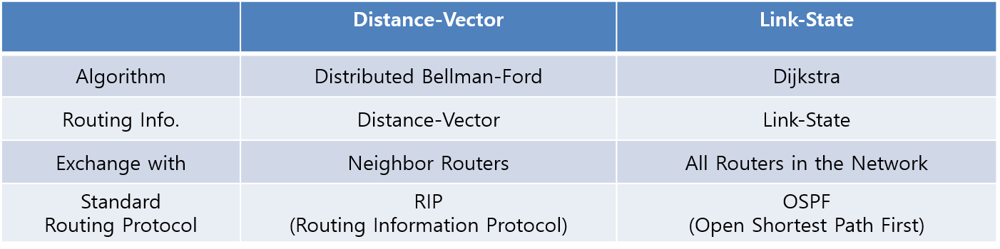

### index

1. Overview
2. Basic Routing Architecture
   * Distance-Vector : Distributed Bellman-Ford
   * Link-State: Dijkstra

3. Hierarchical Routing
   * AS: Autonomous System
   * Intra-AS Routing, Inter-AS Routing

## 1. Overview

이전 포스팅에서 Forwarding 과 Routing에 대하여 살펴보는데요. 여기서는 두 Network 통신을 할때 가장 cost가 적은 경로를 찾는 방법에 대하여 중점적으로 다룰겁니다.

## 2. Basic Routing Architecture

라우터들은 routing protocol을 통해서 서로 정보를 교환하고 이 정보를 통해 cost가 가장 적은 경로를 결정할 수 있게 됩니다.

### Distance Vector

  말 그대로 디스턴스(Distance : 거리)와 벡터(Vector : 방향)만을 위주로 만들어진 라우팅 알고리즘입니다.

따라서 라우터는 목적지까지의 모든 경로를 자신의 라우팅 테이블 안에 저장하는 것이 아니라 목적지까지의 거리 (Hop Count 등)와 그 목적지까지 가려면 어떤 인접 라우터(Neighbor Router)를 거쳐서 가야 하는 방향만을 저장합니다.

 **인접 라우터**들과 주기적으로 라우팅 테이블을 교환해서 자신의 정보에 변화가 생기지 않았는지를 확인하고 관리합니다.

#### 장점

* 메모리 절약 ( 한 라우터가 모든 라우팅 정보를 가지고 있을 필요가 없기 때문에 )
* 라우팅의 구성 자체가 간단 

#### 단점

- 트래픽 낭비 ( 라우팅 테이블에 아무런 변화가 없더라도 정해진 시간마다 한 번씩 라우팅 테이블의 업데이트가 일어나기 때문에 )
- Convergence Time이 느리다. ( Convergence Time : 라우팅 테이블에 생겨난 변화를 모든 라우터가 알 때까지 걸리는 시간 )
- **Count-to-infinity Problem**
  - Distance Vector의 중요한 문제로 shortest Path가 주변을 통해서 점진적으로 전파하여 만들어 지는데 이때 문제가 생길 수 있습니다.
  - 만약 끊어진 네트워크 Line으로 인하여 갈 수 있는 다른 경로가 있음에도 routing table에는 갈 수 없다고 update됩니다.

### Link State

Link State Algorithm 에서는 한 라우터가 **모든 라우터들**과 정보를 교환하며 목적지까지의 모든 경로 정보를 다 알고 있습니다. 

* Link State Algorithm 과정

​      ① Link-State Advertisements -> ② Topological Database -> ③ SPF Algorithm

​       -> ④ Shortest Path First Tree -> ⑤ Routing Table

#### 장점

* Convergence Time 이 짧다. ( 라우터가 모든 경로를 알고 있기 때문에 )

* 라우팅 테이블 교환이 자주 발생하지 않는다.

* 트래픽 절약 ( 교환이 일어나는 경우에도 테이블에 변화가 있는 것만을 교환 )

#### 단점

* 메모리 소모가 큼. ( 라우터가 모든 라우팅 정보를 관리해야 하기 때문에 )

* 라우터 CPU의 부담이 큼. ( SPF 계산 등 여러 가지 계산을 해야 하기 때문에 )

## 3. Hierarchical Routing

Hierarchy는 Scalability와 Administration 관점에서 필수적으로 필요한 개념입니다.

### 사용되는 곳

#### 1) Scalability

* 수백만의 목적지들을 모두 routing table에 저장할 수 없습니다.

#### 2) Administrative Autonomy

* internet = network of networks
* networks의 관리는 하나의 network에서 관리되어야 편리하다.

### Autonomous System (AS)

한 지역에서의 router들의 집합체를 **Autonomous System**이라고 부릅니다.

같은 AS에 있는 라우터들끼리는 같은 routing protocol을 사용하는데 이를 **"intra-AS"** 또는 **Interior Gateway Protocols (IGP)**라고 부릅니다.

> intra는 성능(속도)에 중점으로 protocol을 만들며 inter는 정책(보안, 가격)에 중점으로 protocol을 구성합니다.

다른 AS끼리는 다른 intra-AS를 사용하기 때문에 **Border Gateway Protocol (BIP)**이 필요합니다.

### Why different Intra-AS and Inter-AS routing?

#### Policy

* Inter-AS: 관리자는 어떻게 트래픽을 routed할지, 누가 routes 하는지 컨트롤하기를 원한다.
* intra-AS: 하나의 관리자만 있으므로 정책을 결정할 필요가 없다.

#### Scalability

* hierarchical routing은 table의 크기와 업데이트 traffic를 줄여준다.

#### Performance

* Intra-AS: 성능에 집중할 수 있다.
* Inter-AS: 성능보다는 정책에 집중한다.

### reference

* [라우터(Router) - 디스턴트 벡터(Distance Vector)와 링크스테이트(Link State) :: IT_Dexter](https://itdexter.tistory.com/183)