### Index

0. [Overview](#Overview)

1. [UDP vs TCP : Concept](#UDP vs TCP : Concept)
   * [UDP](#UDP)
   * [TCP](#TCP)
   * [TCP Segment Structure](#TCP Segment Structure)
   * [Connectionless vs Connection-Oriented](#Connectionless vs Connection-Oriented)
   * [Switching 기술들](#Switching 기술들)
   * [TCP Connection Setup - 3 Way Handshake](#TCP Connection Setup - 3 Way Handshake)
   * [TCP Connection Closure - 4 Way Handshake](#TCP Connection Closure - 4 Way Handshake)
   * [UDP & TCP Echo](#UDP & TCP Echo)

2. [UDP vs TCP : Reliability](#UDP vs TCP : Reliability)
   * [Error Detection & Recovery](#Error Detection & Recovery)
   * [Stop and wait](#Stop and wait)
   * [Sliding Window Protocol](#Sliding Window Protocol)
   * [Positive ACK / Negative ACK](#Positive ACK / Negative ACK)
   * [Cumulative ACK / Selective ACK](#Cumulative ACK / Selective ACK)
3. UDP vs TCP : Datagram vs Stream
   * Datagram
   * Stream

4. TCP Flow Control
   * Silly Window Syndrome
   * Nagle Algorithm

## Overview

이전까지 Network Layer의 IP에 대하여 공부하였습니다. 이번에는 그 윗 Layer인 Transport Layer 에서 2가지 Key Protocol (UDP, TCP)에 대하여 정리해보겠습니다.

#### Transport Layer : (Logical) End to End Protocol

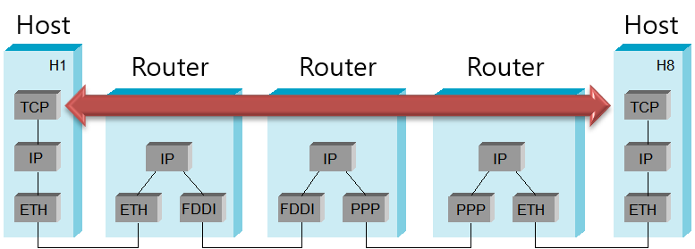

## UDP vs TCP : Concept

### UDP

#### UDP의 특징

* **Connectionless**
  * connection set-up 과정 없이 즉시 전송

* **Unreliable**
  * *Datagrams* may be lost, duplicated, out of order

* **No Flow/Congestion Control**

#### UDP - User Datagram Protocol

* UDP는 TCP와 달리 *reliability*와 *ordering*을 보장해주지 않는다.
* checking하는 과정이 없으므로 UDP는 *faster and more efficient* 하다.
* 시간이 중요한 서비스에는 UDP가 자주 사용된다. 왜냐하면 packet이 droped 된 것보다 delayed 된게 더 심각하므로
* 많은 수의 clients에게 작은 queries를 답해주는 서버에 유용하다. Domain Name Lookup과 같은
* TCP와 다르게 **broadcast**와 **multicasting**이 가능하다.

### TCP

#### TCP의 특징

* **Connection-Oriented**
  * data 교환 전에 connection set-up이 요구된다. 이를 "3-Way Handshaking"이라고 부른다.

* **Reliable**
  * 잃어버린 Segments는 *Retransmission*을 통해 복구한다.
  * Duplicate, Out-of-order는 *Sequence Number*를 이용해 해결한다.

* **Flow/Congestion Control**
  * sender는 **receiver의 수용량** 과 **network의 혼잡** 을 고려하여 전송률을 컨트롤한다.

#### TCP - Transmission Control Protocol

- Full-Duplex, Point to Point 방식이다.
  - Full-Duplex: 전송이 양방향으로 동시에 일어날 수 있다.
  - Point to Point: 각 연결이 정확히 2개의 종단점을 가지고 있다.
  - 멀티캐스팅이나 브로드캐스팅을 지원하지 않는다.
- 연속성보다 신뢰성있는 전송이 중요할 때에 사용된다.

### TCP Segment Structure

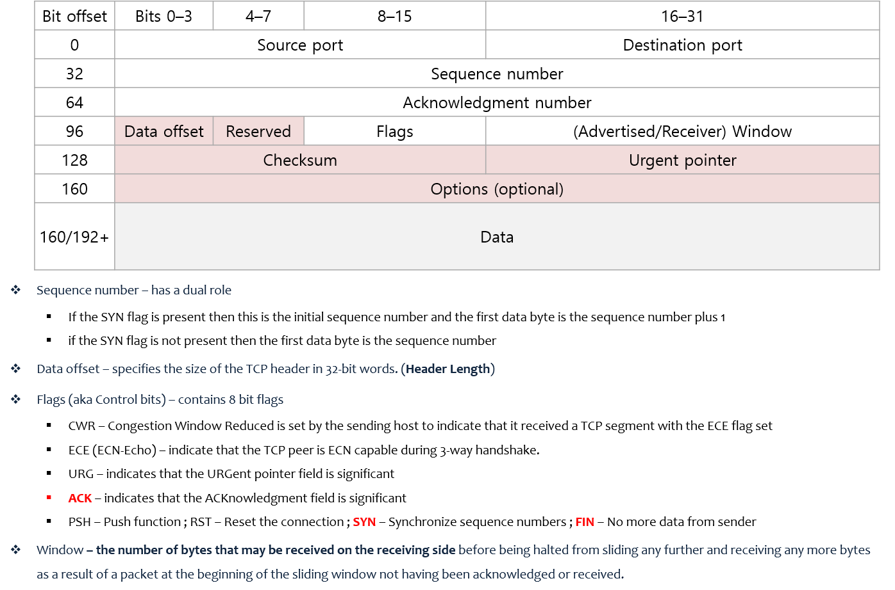

* Sequence Numer와 Acknowledgment number는 Sliding Window를 위해 사용한다.
* Flags는 받았는지 안받았는지 체크

#### TCP의 reliable을 가능하게 하는 Field는?

* Flag
* Sequence Number
* Acknowledgment Number

### Connectionless vs Connection-Oriented

#### Connection-Oriented ?

connection oriented service는 communication을 시작하기 전에 connection을 갖추어야합니다.

### Switching 기술들

대표적인 Communication Switching 기술은 *Circuit Switching*, *Virtual Circuit Packet Switching*, *Datagram Packet Switching* 이렇게 3가지가 있습니다.

여기서 TCP는 Circuit Switching을 사용하고 UDP는 Datagram Packet Switching을 사용합니다.

Circuit Switching을 살펴보면 경로가 고정되어 있고 Transmission하기 전에 set-up과정이 있다는 것을 알 수 있습니다. 또한 전송은 Datagram과 같이 하나씩 보내는게 아닌 Stream으로 전송하는 것을 알 수 있습니다.

Datagram Packet Switching을 살펴보면 Transmission하기 전에 set-up하는 과정이 없고 정해진 경로없이 Datagram으로 각각 보내는 것을 확인할 수 있습니다.

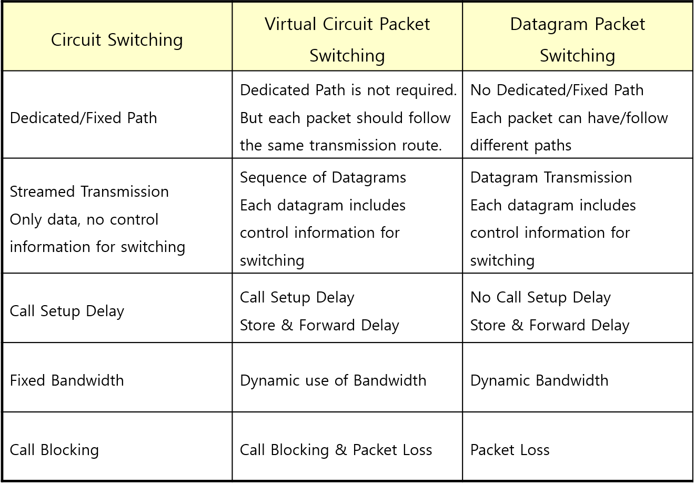

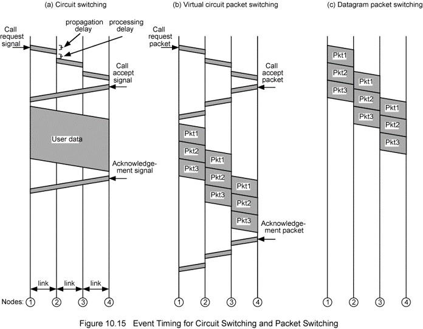

### TCP Connection Setup - 3 Way Handshake

TCP 통신을 이용하여 데이터를 전송하기 위해 네트워크 **연결을 설정(Connection Establish)**하는 과정

- 양쪽 모두 데이터를 전송할 준비가 되었다는 것을 보장하고, 실제로 데이터 전달이 시작하기 전에 한 쪽이 다른 쪽이 준비되었다는 것을 알 수 있도록 한다.

  - 즉, TCP/IP 프로토콜을 이용해서 통신을 하는 응용 프로그램이 데이터를 전송하기 전에 먼저 정확한 전송을 보장하기 위해 상대방 컴퓨터와 사전에 세션을 수립하는 과정을 의미한다.

- 예를 들어, A 프로세스(Client)가 B 프로세스(Server)에 연결을 요청

  

1. A -> B: SYN
   - 접속 요청 프로세스 A가 연결 요청 메시지 전송 (SYN)
   - 송신자가 최초로 데이터를 전송할 때 Sequence Number를 임의의 랜덤 숫자로 지정하고, SYN 플래그 비트를 1로 설정한 세그먼트를 전송한다.
   - PORT 상태 - B: LISTEN, A: CLOSED
2. B -> A: SYN + ACK
   - 접속 요청을 받은 프로세스 B가 요청을 수락했으며, 접속 요청 프로세스인 A도 포트를 열어 달라는 메시지 전송 (SYN + ACK)
   - 수신자는 Acknowledgement Number 필드를 (Sequence Number + 1)로 지정하고, SYN과 ACK 플래그 비트를 1로 설정한 세그먼트를 전송한다.
   - PORT 상태 - B: SYN_RCV, A: CLOSED
3. A -> B: ACK
   - PORT 상태 - B: SYN_RCV, A: ESTABLISHED
   - 마지막으로 접속 요청 프로세스 A가 수락 확인을 보내 연결을 맺음 (ACK)
   - 이때, 전송할 데이터가 있으면 이 단계에서 데이터를 전송할 수 있다.
   - PORT 상태 - B: ESTABLISHED, A: ESTABLISHED

### TCP Connection Closure - 4 Way Handshake

TCP의 **연결을 해제(Connection Termination)** 하는 과정

- 예를 들어, A 프로세스(Client)가 B 프로세스(Server)에 연결 해제를 요청

  

1. A -> B: FIN
   - 프로세스 A가 연결을 종료하겠다는 FIN 플래그를 전송
   - 프로세스 B가 FIN 플래그로 응답하기 전까지 연결을 계속 유지
2. B -> A: ACK
   - 프로세스 B는 일단 확인 메시지를 보내고 자신의 통신이 끝날 때까지 기다린다. (이 상태가 TIME_WAIT 상태)
   - 수신자는 Acknowledgement Number 필드를 (Sequence Number + 1)로 지정하고, ACK 플래그 비트를 1로 설정한 세그먼트를 전송한다.
   - 그리고 자신이 전송할 데이터가 남아있다면 이어서 계속 전송한다.
3. B -> A: FIN
   - 프로세스 B가 통신이 끝났으면 연결 종료 요청에 합의한다는 의미로 프로세스 A에게 FIN 플래그를 전송
4. A -> B: ACK
   - 프로세스 A는 확인했다는 메시지를 전송

### UDP & TCP Echo

#### UDP Echo

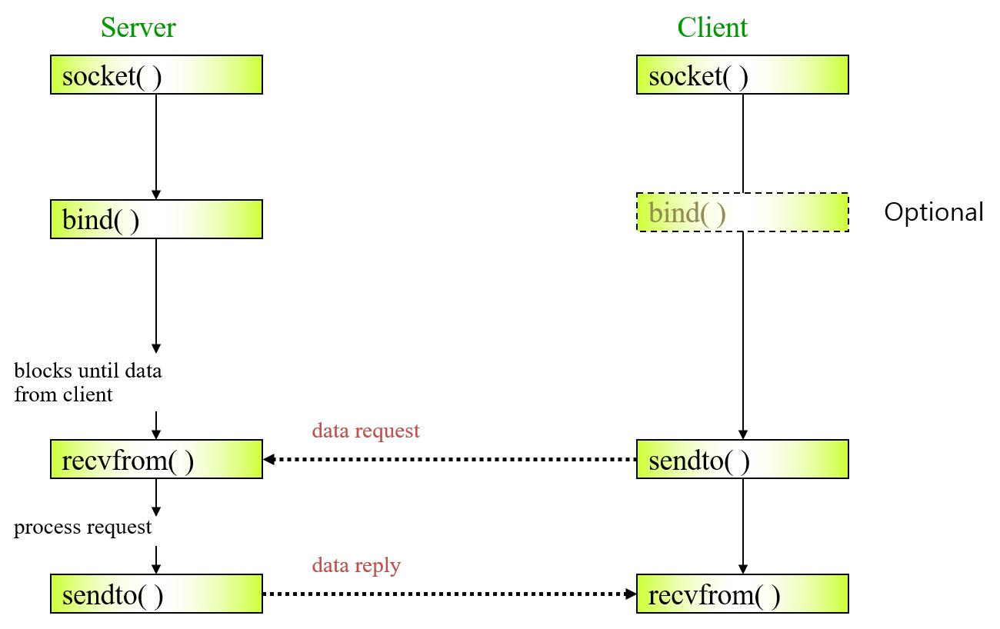

* bind에서 포트번호를 bind 해준다. `bind(Address, Port)`

#### TCP Echo

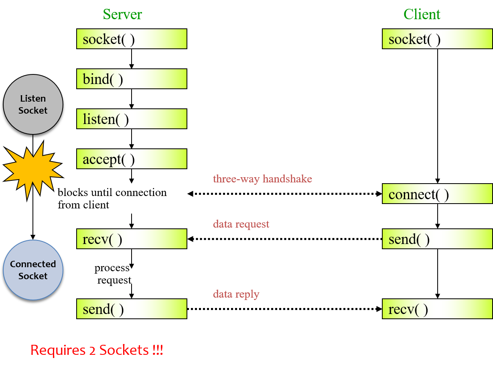

* listen과 accept 과정에서 client의 ip와 port 번호를 알게된다.
* connect 함수에서 Address와 port가 bind된다.

## UDP vs TCP : Reliability

UDP는 Unreliable하고 TCP는 Reliable하다는 사실을 아실겁니다. 이번에는 TCP의 Reliable이 어떻게 이루어지는지 확인해보겠습니다.

### Error Detection & Recovery

#### 2 Types of Error

Error라고 하면 보낸 Data와 받은 Data가 다를 경우를 이야기 합니다.

Error의 종류는 크게 두가지로 분류할 수 있습니다.

* **Bit Level Error**

  * Channel/Physical Link Level에서 발생하는 Error로 Data의 값이 바뀐 경우입니다.

* **Packet Level Error**

  * Network/Data Link Level에서 발생하는 Error로 Data가 사라지는 경우입니다.

  * Network의 router에서 입력 Data가 많으면 버퍼에 쌓이다가 없어지는 경우가 생깁니다.

    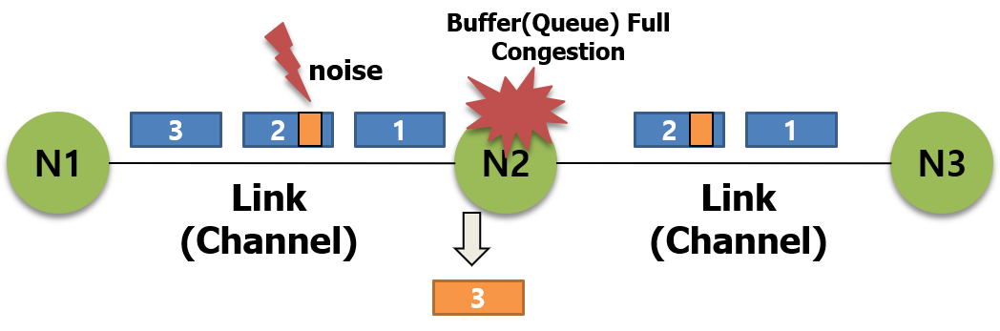

#### Error Detection

* **Bit Level Error**
  * CRC (Error Detection Code)
* **Packet Level Error** - Loss, Out of Order, Duplicate
  * ARQ (Acknowledgement, Sequence Number)

#### Error Recovery Approaches

* **Retransmission**
  * tcp에서 사용하는 방법

### Stop and wait

ACK를 이용해서 받았는지 확인합니다. RTT안에 ACK가 오지 않으면 재전송합니다.

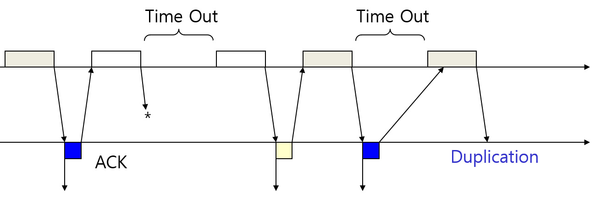

하지만 제대로 보내졌지만 ACK가 lost되거나 RTT를 넘기면 불필요한 재전송이 일어나게 된다는 단점이 있습니다.

#### 특징

* Simple

* Inefficient

  * RTT마다 1개 밖에 보내지 못합니다.

    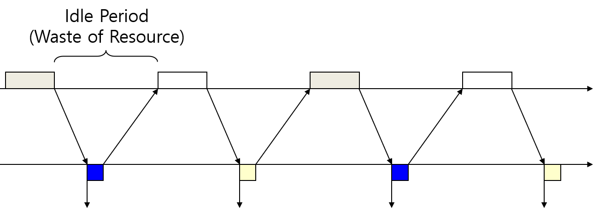

### Sliding Window Protocol

Stop and wait의 단점을 보완하는 방법으로 가장 많이 사용되는 방법입니다.

Window size를 정한 후 Data를 보낼 때마다 size를 줄입니다. 이후 ACK로 받은 sequence number만큼 window의 크기를 증가 시킵니다.

이 방법으로 stop and wait의 거의 모든 단점을 해결할 수 있습니다.

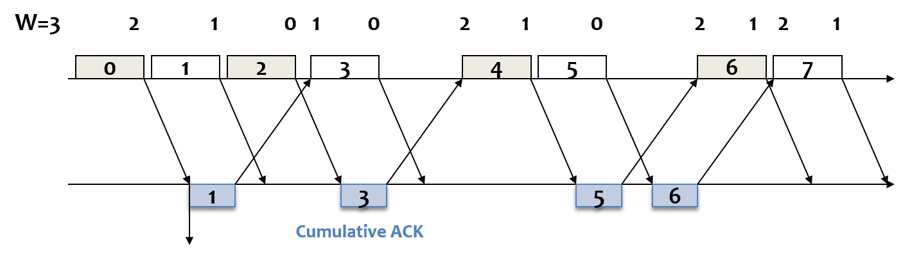

### Positive ACK / Negative ACK

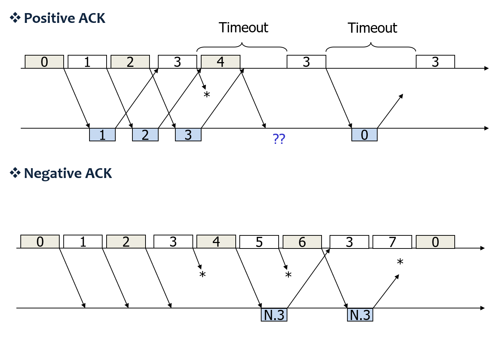

### Cumulative ACK / Selective ACK

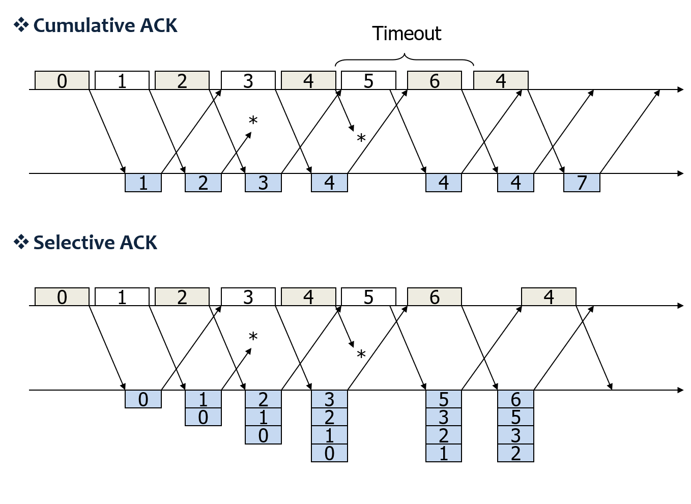

## UDP vs TCP : Datagram vs Stream

### Datagram

UDP에서 사용하는 Data communication 방식입니다.

Datagram은 Data가 개별적이고 독립적인 것입니다.

따라서 만약에 보내는 Data가 100이고 읽으려는게 20이면 받아지지 않습니다.

다시 말해 Receive Buffer Size >= Send Buffer Size 이어야만 합니다.

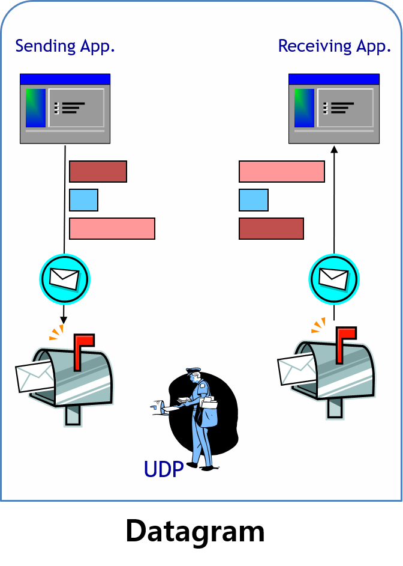

### Stream

TCP에서 사용하는 Data communication 방식입니다.

Stream은 buffer를 사용하는데 100이 system buffer에 들어가고, 20씩 읽어들입니다.

Header의 부하를 줄이기 위하여 최대한의 buffer (send buffer)를 보내려고 하는데 이때의 최대 buffer 크기를 **MSS (Maximum Segment Size)**라고 합니다. 

Data는 Stream처럼 서로 이어져있습니다. 이를 **No-Boundary**라고 부릅니다.

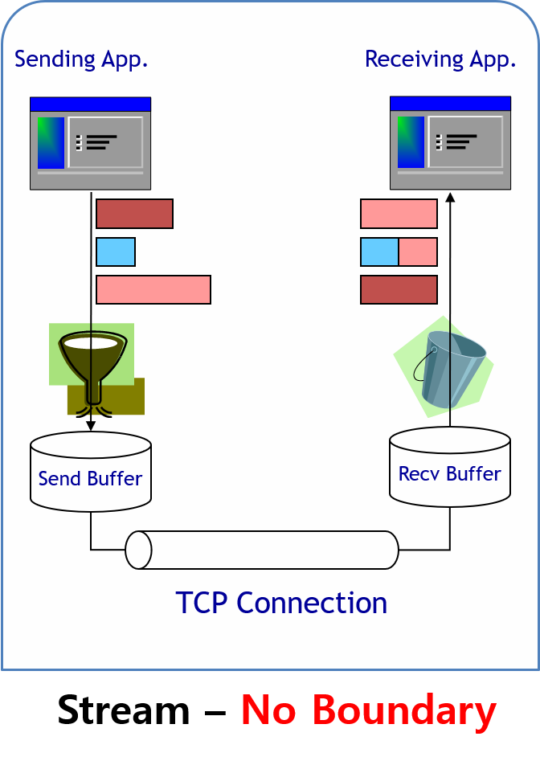

## TCP Flow Control

TCP가 Flow Control과 Congestion Control을 합니다.

이때 Flow Control은 receiver가 Data 보내는 속도를 제어하지 못하는 경우이고

Congestion Control은 Network에서 Control하지 못하는 것입니다.

* **Flow Control**
  * keep sender from overrunning receiver
* **Congestion Control**
  * Keep sender from overrunning network

Flow Control을 하기 위하여 sender는 **Window Based Approach**를 사용합니다.

receiver가 가능한 buffer의 크기를 알려주면 sender가 그것을 기반으로 전송을 컨트롤하는 것이지요. 이때의 Field가 '(Advertised / Receiver) Window'입니다.

### Silly Window Syndrome

수신측에서 처리가 늦어져서 window 크기를 작게 전송하게 되고, 송신측에서는 window 크기가 작게 오기 때문에 보낼 패킷을 잘게 나누어서 작은 사이즈로 잦은 전송을 하게 됩니다. 작은 크기의 패킷은 body보다 Header의 크기가 더 클 수도 있고, 전송이 잦음으로써 network가 더 혼잡해지게 됩니다.

이러한 문제를 **Silly Window Syndrome**이라고 합니다.

### Nagle Algorithm

위의 문제를 해결하기 위하여 sender는 MSS를 최대한 채워 보내고 안채워지면 timer를 두고 기다렸다가 보내게 됩니다.

하지만 이럴 경우 속도의 성능이 떨어지게 됩니다. MSS가 채워지지 않아 Data를 전송하지 않기 때문입니다. (실시간 서비스의 경우 매우 큰 타격이 됩니다.)

이러한 문제는 TCP No Delay Option을 사용해서 MSS를 채우지 않고 바로 보내게 할 수도 있습니다.

### Reference

- <http://needjarvis.tistory.com/157>
- <http://hyeonstorage.tistory.com/286>