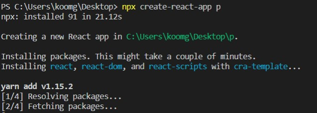
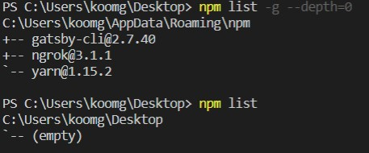
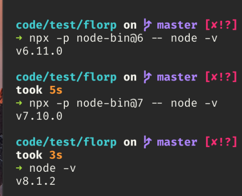

## 1. npm: node package manager

Node로 개발을 하다보면 npm 명령어를 정말 많이 사용했을 것이다. **npm**은 Node Package Manager의 약자로 모듈들을 관리해주는 툴입니다. **npm**은 Node.js를 설치하면 같이 설치가 되는데 이를 통해 **npm**이 중요한 것이라는 것을 유추해볼 수 있다.

```shell
npm install MODULE_NAME
```

보통 모듈 패키지들은 프로젝트 단위로 작업을 하기에 `npm init`을 통하여 만들어진 `package.json`파일로 프로젝트 모듈들을 관리한다. python에서의 `requirement.txt`와 같은 역할이다.

## 2. npx: npm package runner

[npm@5.2.0](https://github.com/npm/npm/releases/tag/v5.2.0) (2017-07-05) 이후로 npx가 추가되었습니다. 해당 릴리즈 노트에는 **npx**를 다음과 같이 소개하고 있습니다.

> #### npx!!!
>
> npx is a tool intended to help round out the experience of using packages from the npm registry — the same way npm makes it super easy to install and manage dependencies hosted on the registry, npx is meant to make it easy to use CLI tools and other executables hosted on the registry. It greatly simplifies a number of things that, until now, required a bit of ceremony to do with plain npm.

여기서 말하는 npm registry는 npm에서 운영하는 npm 모듈들을 관리하는 곳 입니다. 만약 `npm install MODULE_NAME`으로 모듈을 설치했다면 해당 모듈은 npm registry에 있는 것을 다운받는 것 입니다.

### 1) 한 번만 사용할 명령어를 사용할 때 (Executing one-ff commands)

React 프로젝트를 시작할때 `create-react-app` 패키지를 설치해서 사용하실 겁니다. 하지만 프로젝트 처음 만들때만 사용할 패키지를 왜 설치해서 사용해야 할까요?

1. 자주 사용하지 않는 무거운 패키지가 로컬 스토리지에 있음.
2. 로컬 스토리지에 있는 패키지의 새로운 버전이 나왔을 시 이미 존재한 패키지를 제거하고 다시 설치해야 함.

위의 두 문제를 해결하기 위해 나온 것이 **npx**입니다. **npx**는 모듈을 로컬 혹은 전역에 설치하지 않고 패키지를 실행시킬 수 있습니다.

로컬, 전역에 `create-react-app`가 설치되어 있지 않지만 다음과 같이 **npx**로 패키지를 실행할 수 있습니다.

물론 **npx**를 실행한 후에도 다음과 같이 패키지는 설치되어 있지 않습니다.


### 2) 여러 Node.js 버전을 실행할 수 있다. (Run commands with different Node.js versions)



nvm, nave 또는 n 같은 버전 관리자를 사용하지 않고도, 다른 node.js 버전을 사용하여 node 명령을 할 수 있습니다.

### Reference

- [the npm blog](https://blog.npmjs.org/post/162869356040/introducing-npx-an-npm-package-runner)

- [[npm]npx란 무엇인가? :: 빠리의 택시 운전사](https://geonlee.tistory.com/32)
