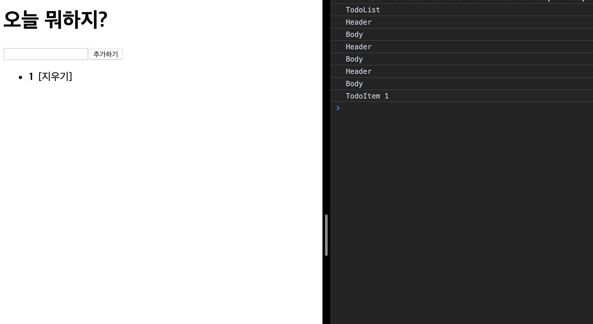
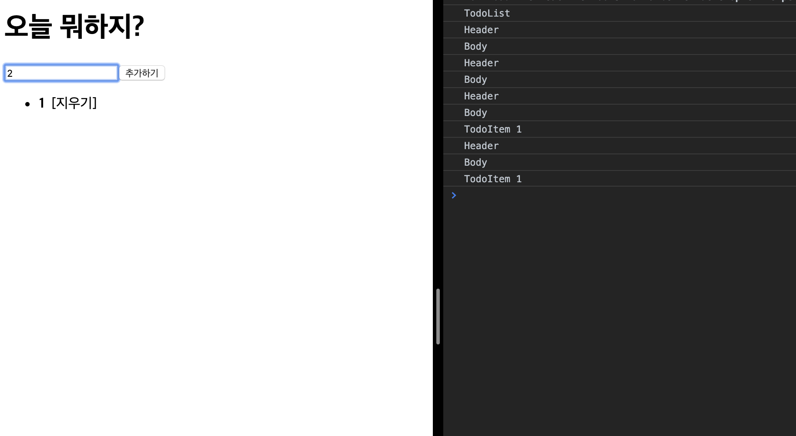
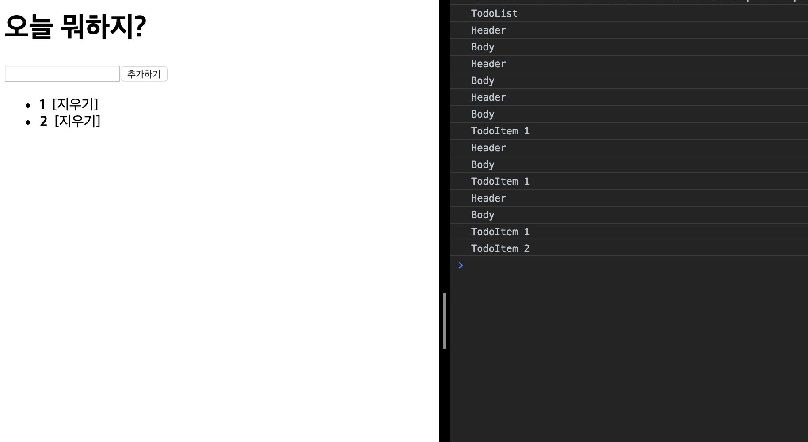

Todo List 를 최적화 시켜보자.

기존 템플릿의 코드는 다음과 같다.

https://github.com/koomg9599/optimize-todo-list/tree/template

할 일을 입력하면 Rendering은 다음과 같이 이루어진다.

### 1) 첫 화면

* TodoList render
* Header render
* Body render

### 2) 1 입력

* Header render
* Body render

### 3) 1 추가

* Header render
* Body render
* TodoItem(1) render

### 4) 2 입력

* Header render
* Body render
* TodoItem(1) render

### 5) 2 추가

* Header render
* Body render
* TodoItem(1) render
* TodoItem(2) render

