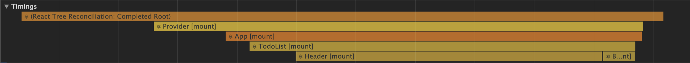
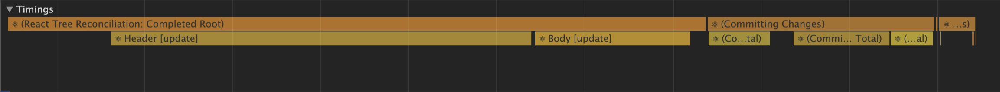
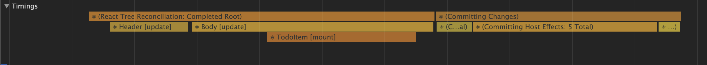
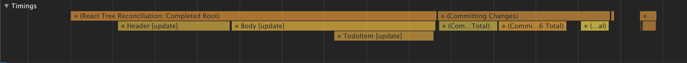
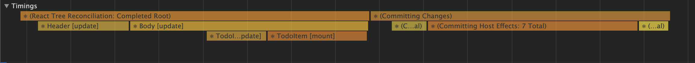

Todo List 를 최적화 시켜보자.

기존 템플릿의 코드는 다음과 같다.

https://github.com/koomg9599/optimize-todo-list/tree/0

할 일을 입력하면 Rendering은 다음과 같이 이루어진다.

### 1) 첫 화면

* Provider mount
* App mount
* TodoList mount
* Header mount
* Body mount

### 2) 1 입력

* Header update
* Body update

### 3) 1 추가

* Header update
* Body update
* TodoItem(1) mount

### 4) 2 입력

* Header update
* Body update
* TodoItem(1) update

### 5) 2 추가

* Header update
* Body update
* TodoItem(1) update
* TodoItem(2) mount

