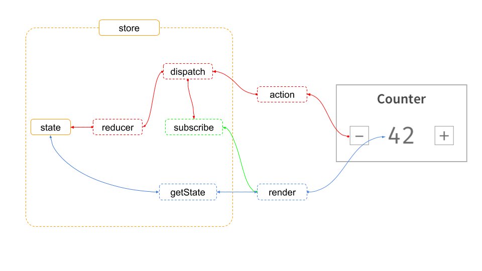

Redux의 러닝커브가 어렵다고 다들 말합니다. 이번 포스팅으로 Redux 개념을 다시 공부해 보겠습니다.

> 해당 그림은 생활코딩 Youtube 강의에서 참고했음을 밝힙니다.



## Store

상태를 관리하는 Store는 redux의 createStore로 만들며 보통 `index.tsx`파일에 생성합니다.

```js
var store = Redux.createStore(reducer)
```

## Action

화면 Counter의 `- 버튼`을 클릭하면 해당 action이 dispatch로 전달됩니다. 

## Dispatch

dispatch는 두 가지 일을 하는데, 

1. reducer를 이용해서 state값을 변경

   dispatch가 reducer를 호출할 때  `현재의 state` 과 `action type`이 두 가지를 전달합니다.

   ```js
   store.dispatch({type: 'decrease', payload: -1})
   ```

2. state값이 변경되면 subscribe를 호출 => 등록된 render 함수에게 전달

   ```js
   store.subscribe(render)
   ```

## Reducer

reducer는 state를 입력값으로 받고, action type을 참조해서 새로운 state를 만들어내는 state 가공자입니다.

리듀서가 리턴하는 값이 새로운 state값이 됩니다.

```js
function reducer(state, action) {
    if(action.type === 'decrease') {
        return {
            state += action.payload
        }
    }
}
```

## Render

이 후 dispatch가 subscribe에 등록되어있는 render를 호출하면 render가 getState를 호출하여 store안에 들어있는 state를 가져오게 되고, render 함수가 새롭게 화면을 갱신하게 됩니다.

```js
function render() {
    var state = store.getState()
    //...
    document.querySelectore('#app').innerHTML = `<H1>WEB</H1>`
}
```

# Reference

[Redux-2.1. 리덕스 여행의 지도 : 소개 :: 생활코딩](https://www.youtube.com/watch?v=N9PT9iNTZAE)