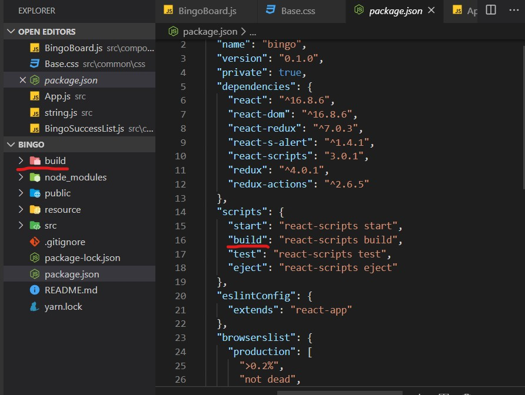
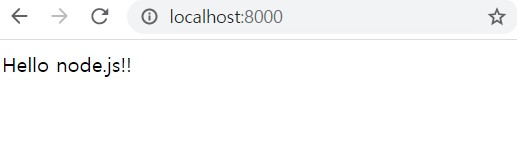

react 배포는 예전부터 작성하고 싶었던 부분인데 요즘 시간이 많아서 작성하게 되었습니다.

이전 프로젝트 경험을 바탕으로 작성하였으니 참고만 하시길 바랍니다.

## Overview

이전에 React 프로젝트를 배포하는 방법은 두가지 였습니다.

첫번째는 Web Server(Nginx)를 두어 80번 포트로는 React 프로젝트를 빌드한 static 파일을, 8000번 포트로는 Web Server Application로 serving하도록 하였습니다.

두번째 방법으로는 따로 Web Server를 두지않고 Web Server Application에서 static 파일을 serving하도록 하는것이였습니다.

이번 포스트에서는 WSA를 Node.js로 예시를 들겠습니다.

## Build React Project

먼저 React 프로젝트를 Build합니다.

Build 명령어의 경우 `package.json`에 스크립트 명령어가 있으니 참고하시면 됩니다.

별도로 수정하지 않았다면 다음과 같습니다.

```shell
npm run build
```

위의 스크립트 명령어를 실행시키면 프로젝트 root에 `build` 폴더가 만들어지게 됩니다.



만약 output 폴더를 변경하고 싶거나 webpack 설정을 변경하려면 eject후에 수정하면 됩니다.


### 간단한 test server 구축

>  [서버구축하기- http base :: 생활코딩](<https://javafa.gitbooks.io/nodejs_server_basic/content/chapter3.html>)에서 코드 참고

서버는 Node.js이고, 포트번호는 8000번으로 세팅합니다.

```javascript
var http = require("http");

var server = http.createServer(function(request, response) {
  response.writeHead(200, { "Content-Type": "text/html" });
  response.end("Hello node.js!!");
});

server.listen(8000, function() {
  console.log("Server is running...");
});

```

여기까지가 사전작업입니다.

최종적으로 폴더경로는 다음과 같습니다.

```shell
project
|-- client // react
|-- server // node.js
```


## 1. WebServer(Nginx)로 배포하기

제가 가장많이 사용했던 방법입니다.

포트는 자유지만 default포트가 80번 포트이므로 80번 포트는 Front, 8000번 포트는 Server로 설정하겠습니다.

우선 Nginx설치한 후 `nginx.conf`파일을 수정하면 됩니다.

```json
http {
    include       mime.types;
    default_type  application/octet-stream;

    sendfile        on;

    keepalive_timeout  65;

    server {
        listen       80;
        server_name  localhost;

        location / {
            root   ../client/build; // react build 폴더파일 경로
            index  index.html index.htm;
            try_files $uri /index.html?query_string;
        }

        error_page   500 502 503 504  /50x.html;
        location = /50x.html {
            root   html;
        }

    }

    server {
        listen 8000;
        
        location / {
            root ../server; // 서버 루트 폴더
        }
    }

}
```

위와 같이 수정을 하게되면 80번 포트는 front static 파일을, 8000번 포트는 서버로 연결되게 됩니다.



이후 react 코드에서 8000번 포트로 통신하면 됩니다.

## 2. WebServer에서 Static files serving

여기는 서버코드를 새로 작성해보겠습니다.

우선 `app.js `파일과 `server.js`파일 두개를 만듭니다

```javascript
// app.js

import express from 'express'
import bodyParser from 'body-parser'
import cors from 'cors'
import path from 'path'
import fs from 'fs'

const getEnvPath = () => {
  switch (process.env.NODE_ENV) {
    case 'production':
      return path.join(__dirname, '.env.production')
    case 'development':
    default:
      return path.join(__dirname, '.env.development')
  }
}
dotenv.config({ path: getEnvPath() })

const mimeType = {
  '.ico': 'image/x-icon',
  '.html': 'text/html',
  '.js': 'text/javascript',
  '.css': 'text/css',
  '.png': 'image/png',
  '.jpg': 'image/jpeg',
  '.eot': 'appliaction/vnd.ms-fontobject',
  '.ttf': 'aplication/font-sfnt',
  '.json': 'application/json',
}
class App {
  let app
  const whitelist = [
    'http://localhost',
    'http://localhost:80'
  ]
  constructor() {
    this.app = express()
    this.config()
    routes(this.app)
  }
  function createApp() {
    return this.app
  }

  function config() {
    const corsOptions = {
      origin: (origin, callback) => {
        if (!origin || this.whitelist.includes(origin)) {
          return callback(null, true)
        } else {
          return callback(new Error(origin + ': Not allowed by CORS'))
        }
      },
    }
    this.app.use((req, res, next) => {
      console.log('request path: ', req.path)
      console.log('origin: ', req.header['origin'])
      next()
    })
    this.app.use(cors())
    this.app.use(this.serveStaticFrontend)
    // config body-parser
    this.app.use(bodyParser.urlencoded({ extended: true }))
    this.app.use(bodyParser.json())
    // config CORS
  }

  function serveStaticFrontend(req, res, next) {
    const reqPath: string = req.path
    if (reqPath.startsWith('/api')) {
      return next()
    }
    const ext = path.parse(req.url).ext
    const staticFrontPath = path.join(__dirname, '../', 'client', 'build')
    console.log(reqPath)
    fs.readFile(`${staticFrontPath}${req.url}`, async (err, data) => {
      if (err) {
        const file = fs.readFileSync(`${staticFrontPath}/index.html`)
        await res.setHeader('Content-Type', 'text/html')
        return res.end(file)
      } else {
        res.statusCode = 200
        if (mimeType[ext]) {
          await res.setHeader('Content-Type', mimeType[ext])
        }
        return res.end(data)
      }
    })
  }
}
export default new App().createApp()
```

```javascript
// server.js

import app from './app'

// Shutdown codes
const errShutdown = (err) => {
  console.error(err)
  process.exit(1)
}

// Configure Port, Router
const PORT = 8000

// Run Server
app.listen(PORT, () => {
  console.log('Express server started on port ' + PORT)
})

```

이렇게 코드를 작성하게 되면, express 서버로 들어오는 요청들 중에 `/api` 경로가 포함되어 있지 않는 경로는 모두 `client/build` 폴더에서 서빙하게 된다.

하지만 이런 경우 서버 reqeust의 경우 경로에 무조껀 `/api`가 앞에 있어야한다.

## 마무리

첫번째 방법의 경우 test와 배포를 손쉽게 할 수 있다는 장점이 있지만 Web Server를 거쳐야한다는 단점이 있다.(장점일수도..)

두번째 방법의 경우 test와 배포가 매우 복잡해진다. 실제 test를 할 경우 무조껀 build를 한 후 test를 해야하므로... (코드를 잘짜면 안그래도 되겠지만 조금 복잡하다.) 하지만 조금더 깔끔한 방법으로 serving 할 수 있다.


### Reference

[Node.js 코드랩 6. 정적파일 :: 김정환 블로그](http://jeonghwan-kim.github.io/series/2018/12/06/node-web-6_static-files.html)