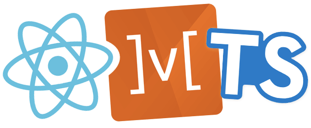

## Overview

DDP Portal 리뉴얼에서 Client Side Rendering 기반의 JS Framework를 사용하게 되면서 새롭게 환경구축을 할 필요가 생겼습니다. 이왕이면 잘 만들어보자 라는 생각으로 현재 가장 **핫**하고 많이 사용되는 Framework, Bundler, Language, Library를 이용하여 Client를 구축하였고, 개발환경 구축까지의 경험을 공유하려고 합니다.


혹시 설명을 보고도 이해가 안가시는 분들은 https://github.com/koomg9599/Chat-App 이곳의 코드를 참고하시면 됩니다.

## 1. Getting Started

먼저 위에 있는 네 가지가 무엇인지 알 필요가 있습니다. React, TypeScript는 많이 들어봤을테지만 Mobx와 Parcel은 React에 대하여 많이 공부해보지 않는 이상 접하기 어려운 것들 입니다.

따라서 여기서는 간단히 Mobx, Parcel에 대한 설명을 하겠습니다.

### Mobx

React는 state를 참조하여 rendering을 할지 결정합니다. 즉 state가 변경되어야 rendering을 시도하게 되는거죠.

상위 컴포넌트에서 this.setState를 통하여 state를 변경하는데, 이때의 단점은 다른 router에서 state를 사용할 수 없으며, 컴포넌트들의 계층구조가 복잡해지면 Prop drilling 이라는 문제점이 생깁니다.

> Props driling에 대한 내용은 여기서 확인할 수 있습니다. https://edykim.com/ko/post/prop-drilling/

이를 해결하기 위해 CRA(Create React App) 개발자인 [Dan Abramov](https://github.com/gaearon)는 Flux를 기반으로 Redux를 개발하였습니다. Redux를 사용하게 된다면 Component에 종속된 State를 Global Store로 관리할 수 있게 된다는 아주 큰 장점이 생겼으며 많은 React 개발자들 사이에서 사랑받았습니다. 하지만 Redux에서도 불편함을 느낀 많은 개발자들이 Redux-Saga, Redux-Thunks를 개발하였습니다. 이렇듯 React를 사용하려고 하니 너무 많은 것들을 공부해야하고 러닝커브가 높아지자 사람들은 React보다는 Vue.js를 선호하게 되었습니다. 이때 구세주처럼 떠오른게 react-hooks, Mobx입니다.

mobx는 배우기 어려웠고, 보일러플레이트도 엉망인 redux, redux-saga 로부터 React 개발자들을 해방시켜준 고마운 존재로 매우 쉽고 사용하기 간편한 라이브러리입니다.

아직 많은 곳에서 사용하지는 않지만 Redux를 대체하기 위해 많은 개발자들이 시도하고 있는 라이브러리이기에 이번에 적용하였습니다.

### Parcel

React를 시작하는 사람들은 CRA(Create React APP)을 이용하여 React Project를 시작합니다. 이때 React Bundler로 Webpack이 설치되는데 Webpack은 좋은 Bundler이긴 하지만 커스터마이징을 하기 위해서는 *eject* 명령어를 사용하여 수정해야하며 이때 파일구조가 매우 엉망으로 변하게 됩니다. 뿐만아니라 config 파일등을 수정했을 때에도 update된 내용이 다시 reset되는 문제가 생깁니다. 이를 해결하기 위하여 저는 Parcel을 적용하였습니다.

Parcel은 공식문서에서 **불꽃 튀게 빠르고 설정이 필요 없는 웹 애플리케이션 번들러**라고 소개하고 있습니다.

소개에서 말하듯 빠를 뿐 아니라 제가 가장 좋아했던 부분은 간편함 이었습니다. 단순히 `index.html`만 parcel에게 말해준다면 알아서 빌드를 해주며 기존의 Webpack에서 지원하는 기능들도 모두 다 사용이 가능하죠. Bundler 또한 Webpack에서 Parcel로 세대교체가 일어남이 확실하기에 이번 프로젝트에 적용하였습니다.


## 2. Plugin 설치

### GitLens


GitLens는 협업을 할 때 정말 필요한 기능입니다. 해당 코드 라인을 누가 작성했는지가 표시되고 해당 파일의 깃 로그들을 확인할 수 있습니다.

### Prettier

> [Prettier](https://prettier.io/) is an opinionated code formatter. It enforces a consistent style by parsing your code and re-printing it with its own rules that take the maximum line length into account, wrapping code when necessary.
>
> JavaScript · TypeScript · Flow · JSX · JSON
> CSS · SCSS · Less
> HTML · Vue · Angular
> GraphQL · Markdown · YAML​
> 
>\- parcel 공식문서-


Prettier는 자동으로 Code formatter을 해주는 플러그인 입니다. root 폴더의 상단에 `.prettierrc` 파일에 어떻게 포멧팅을 할지 적어주면 됩니다.

```json
{
  "singleQuote": true,
  "semi": false,
  "useTabs": false,
  "tabWidth": 2,
  "trailingComma": "all",
  "printWidth": 100
}
```

그리고 .vscode/settings.json 파일에 자동으로 포멧팅되도록 셋팅합니다.

```JSON
{
    "editor.formatOnSave": true,
    "editor.formatOnPaste": true
 }
```

### ESLint

ESLint는 [ESLint 조금 더 잘 활용하기 :: kakao Tech](https://tech.kakao.com/2019/12/05/make-better-use-of-eslint/) 이곳에 설명이 잘 되어 있으므로 따로 설명은 하지 않겠습니다.

## 3. package.json

먼저 npm 프로젝트는 만들어 줍니다.

```shell
npm init
```

```json
{
  "name": "client",
  "version": "1.0.0",
  "scripts": {
    "build": "parcel build src/index.html --out-dir ../server/build/public",
    "start:dev": "parcel src/index.html"
  },
  "repository": {
    "type": "git",
    "url": "http://gitlab.d-platform.doosan.com/ddp/test.git"
  },
  "author": "mingyu.gu@doosan.com",
  "license": "MIT",
  "dependencies": {},
  "devDependencies": {},
}
```

scripts 필드를 보면 build, start:dev 명령어가 있습니다. 저 명령어들은 src/index.html 파일을 parcel에게 넘겨주어 알아서 start, build 할 수 있게 하는 명령어 입니다.

npm 프로젝트는 `package.json`파일이 관리를 하게 되니 이 부분을 잘 적성해야 합니다.

다음으로 필요한 라이브러리들을 설치하겠습니다.

필요한 라이브러리들이 너무 많아서 일일히 쳐주기 보다는 다음의 dependencies를 `package.json`에 붙여 넣은 후 npm install 명령어를 쳐주면 모두 설치가 됩니다.

```json
"dependencies": {
    "@babel/runtime-corejs2": "^7.8.7",
    "@types/react": "^16.9.23",
    "@types/react-dom": "^16.9.5",
    "@types/react-redux": "^7.1.7",
    "@types/react-router-dom": "^5.1.3",
    "autobind-decorator": "^2.4.0",
    "axios": "^0.19.2",
    "bootstrap": "^4.4.1",
    "mobx": "^5.15.4",
    "mobx-react": "^6.1.8",
    "moment": "^2.24.0",
    "parcel": "^1.12.4",
    "parcel-bundler": "^1.12.4",
    "react": "^16.13.1",
    "react-bootstrap": "^1.0.0-beta.17",
    "react-dom": "^16.13.0",
    "react-redux": "^7.2.0",
    "react-router-dom": "^5.1.2",
    "redux": "^4.0.5",
    "sass": "^1.26.3",
    "src": "^1.1.2",
    "tslib": "^1.11.1"
  },
  "devDependencies": {
    "@babel/core": "^7.8.7",
    "@babel/plugin-proposal-class-properties": "^7.8.3",
    "@babel/plugin-proposal-decorators": "^7.8.3",
    "@babel/plugin-transform-runtime": "^7.8.3",
    "@babel/preset-react": "^7.8.3",
    "babel-plugin-styled-components": "^1.10.7",
    "babel-preset-mobx": "^2.0.0",
    "styled-components": "^5.0.1",
    "eslint": "^6.6.0",
    "eslint-config-prettier": "^6.5.0",
    "eslint-plugin-import": "^2.18.2",
    "eslint-plugin-prettier": "^3.1.1",
    "eslint-plugin-react": "^7.16.0",
    "eslint-plugin-react-hooks": "^2.2.0",
    "prettier": "^1.18.2",
    "typescript": "^3.8.3"
  }
```

## 4. tsconfig 설정

TypeScript를 사용할 것이기 때문에 `tsconfig.json`파일을 만들어 줘야합니다. TypeScript Compiler인 tsc가 root 폴더에 있는 tsconfig.json파일을 참조하여 컴파일을 하게 됩니다.

제 tsconfig파일은 다음과 같습니다.

```json
{
  "compilerOptions": {
    "outDir": "build/dist",
    "module": "esnext",
    "target": "es5",
    "lib": ["es6", "dom"],
    "sourceMap": true,
    "allowJs": true,
    "jsx": "preserve",
    "moduleResolution": "node",
    "rootDir": "src",
    "forceConsistentCasingInFileNames": true,
    "noImplicitReturns": true,
    "noImplicitThis": true,
    "noImplicitAny": true,
    "noUnusedParameters": true,
    "importHelpers": true,
    "strictNullChecks": true,
    "suppressImplicitAnyIndexErrors": true,
    "noUnusedLocals": true,
    "skipLibCheck": true,
    "esModuleInterop": true,
    "allowSyntheticDefaultImports": true,
    "strict": true,
    "resolveJsonModule": true,
    "isolatedModules": true,
    "experimentalDecorators": true,
    "noEmit": true,
    "baseUrl": ".",
    "paths": {
      "~*": ["src/*"]
    }
  },
  "exclude": ["node_modules", "build", ".cache"],
  "include": ["src/**/*.tsx", "src/**/*.ts"]
}
```

## 5. React 프로젝트 실행

react 소스코드는 모두 src 폴더에 모두 넣을 겁니다.

src 폴더를 만들어 주고 `index.html`파일을 만들어 줍니다.

```html
<!DOCTYPE html>
<html lang="ko">
  <head>
    <meta charset="UTF-8" />
    <title>Doosan Digital Platform</title>
  </head>
 
  <body>
    <div id="root"></div>
    <script src="index.tsx"></script>
  </body>
</html>
```

다음으로 `index.tsx`파일을 만들어 줍니다.

```tsx
import React from 'react'
import ReactDOM from 'react-dom'
import App from './App'

import 'moment/locale/ko'

ReactDOM.render(
    <App />,
  document.getElementById('root'),
)
```

tsx파일은 React 코드를 `index.html`파일에 넣어주는 역할을 합니다.

이제는 `App.tsx`을 만들어 줍니다.

```tsx
import React, { Component } from 'react'

export default class App extends Component {
  render() {
    return (
      <React.Fragment>
        Hello
      </React.Fragment>
    )
  }
}
```

이제 모두 완성되었습니다.


이제 실행시켜보겠습니다.

```shel
npm run start:dev
```

*끝~*