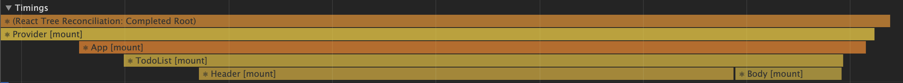

https://github.com/koomg9599/optimize-todo-list/tree/1

## 불필요한 Body의 rerender를 없애자


Header의 input만 상태만 update되었는데 Body도 rendering 된다.

기존 코드를 살펴보면 다음과 같다.

redux의 todos에 input, todoItems 두 개의 상태가 저장되어 있는데

```js
const initialState = {
  input: ''
  todoItems: [],
};
```

Header component에서 다음과 같이 input state를 불러와 사용하고,

```js
const { input } = useSelector((state) => state.todos);
```

Body component에서 다음과 같이 todoItems state를 불러와 사용하고 있었다.

```js
const { todoItems } = useSelector((state) => state.todos);
```

Header, Body 모두 todos state를 바라보고 있었고, todos state안에 있는 input의 상태가 변하자 아무런 관련없는 Body에서도 state 변경을 감지해 rerender되고 있었던 것이다.

todos state 에서 input 상태를 없애고, useState를 이용하여 Header component안에 state를 따로 만들어줌으로써 해결하였다.

```jsx
import React, { useState } from "react";
import { useDispatch } from "react-redux";
import { create } from "../store/reducers/todos";

function Header() {
  const dispatch = useDispatch();
  // const { input } = useSelector(state => state.todos);
  const [input, setInput] = useState("");
  const onChange = (e) => {
    const { value } = e.currentTarget;
    setInput(value);
  };
  return (
    <>
      {console.log("Header")}
      <h1>오늘 뭐하지?</h1>
      <form
        onSubmit={(e) => {
          e.preventDefault();
          dispatch(create(input));
          setInput("");
        }}
      >
        <input onChange={onChange} value={input} />
        <button type="submit">추가하기</button>
      </form>
    </>
  );
}

export default Header;
```

### 결과




Header input을 입력해도 Body가 rerender되지 않았다.