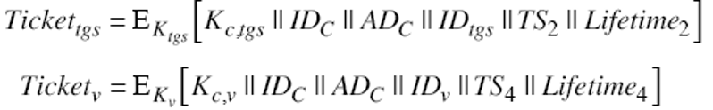

Kerberos는 티켓을 기반으로 동작하는 컴퓨터 네트워크 인증 암호화 프로토콜로서 비보안 네트워크에서 통신하는 노드가 보안 방식으로 다른 노드에 대해 식별할 수 있게 허용하는 방식입니다.

위의 내용을 조금 더 풀어서 설명하자면 distributed network안에서  third-party authentication을 이용해서 인증을 하는 방식입다.

커버로스는 대칭 키 기반으로 동작하며 앞에서 설명한 KDC와 같은 클라이언트/서버 외의 제3의 인증서버(Authentication Server, AS) + 티켓 발급 서비스(Ticket Granting Service, TGS)가 필요합니다.

## Kerberos Requirements

* secure

* reliable

* transparent

  사용자는 인증이 어떻게 이루어지는지 알 필요없고 패스워드만 입력하면 된다.

* scalable

이전 포스팅에서 설명한 Needhan-Schroeder 프로토콜을 기반으로 인증을 합니다.

## Kerberos의 특징

### 1. Secure

Kerberos는 패스워드를 전송하거나 하지 않기때문에 안전합니다.

인증을 위하여 Ticket이라고 불리는 유저의 신원을 확인할 수 있는 time-limited 암호화된 메세지를 사용합니다.

### 2. Single-sign-on

유저는 한번만 인증을하면 Kerberos를 지원하는 모든 network에 추가적인 인증없이 접근할 수 있습니다.

### 3. Trusted third-party

Kerberos는 모두가 신뢰하는 중앙인증서버(centralized Kerberos server)를 통해서 작동합니다.

### 4. Mutual authentication

클라이언트 뿐아니라 통신하는 서버도 증명하는 상호인증 방법을 사용합니다.

## Kerveros v4 Overview

기본적인 third-party authentication scheme

### Authentication Server (AS)

- 유저는 처음 AS에 자신을 식별시킵니다.
- AS는 3자가 조작할 수 없는 ticket(**ticket granting ticket**)을 제공하는데 이 티켓을 이용하여 TGS에서 인증 Ticket을 발급받습니다. 즉 티켓을 발급받기 위한 티켓이라고 생각하면 될 것 같습니다.

### Ticket Granting Server (TGS)

유저가 다른 서비스에 접근하기 위한 요청을 TGS에 보내면 순차적인 단계를 수행합니다.

* 클라이언트가 서버와 연결하기를 원할경우 third-pary (TGS)에게 **ticket**과 **session key**를 요청합니다.
* TGS에게 ticket을 요청하기 전에 client는 이미 **TGT(ticket granting ticket)**와 session key를 가지고 있어야합니다. 

* 1번 과정만 해서 인증하게 되면 다른 기관과 무리없이 소통할 수 있다.

AS를 살펴보면 문제가 있다는 점을 알 수 있다. 바로 단일 실패 거점이라는 것인데, 즉 하나의 AS를 사용하기에 AS에 문제가 생기게 되면 서비스를 이용할 수 없게 된다. 

이러한 중앙집중적 문제를 해결하기 위해서 분산인증(DID)이 탄생하게 되었고 이 기술이 Block-chain이다.

## Ticket

### TGT (Ticket Granting Ticket) 발급

(1) 나 Client인데 ~서비스를 받고 싶다고 요청을 보냅니다.

(2) AS는 client와 shared된 master key로 TGT를 암호화 합니다. TGT에는 sessing key, tgs의 ID, lifetime등이 포함되어 있습니다.

Ticket에 포함된 ADc의 경우 Client의 network address로 진짜 client ID가 맞는지 추가 인증하는 수단입니다.

lifetime의 경우 Reply Attack를 막기 위한 방어수단입니다.

### Ticket Contents

* Session Key for Client/Server
* Client name (user login name)
* Client Host network address
* Server name
* Creation timestamp
* Ticket lifetime

### Session Key

클라이언트와 서버사이에 임시로 사용하는 키로 Random number로 만들어집니다. (대칭 키)

Session Key는 client와 server간의 session을 보호하는 수단입니다.

### Authenticator

Authenticator는 client를 증명하는 것으로 밑의 3가지가 포함됩니다.

* Client user name
* Client network address
* Timestamp

Authenticators는 session key로 암호화되어 있습니다.

