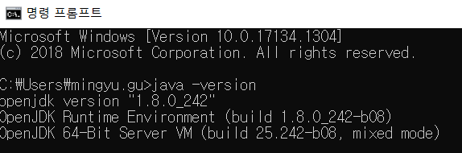

## Overview

VS Code는 제가 가장 좋아하는 에디터입니다. 그래서 C++, JS, TS, Python등 왠만한 언어와 프레임워크들은 VS Code를 사용하여 개발을 하였습니다. 하지만 Spring Boot는 VS Code에서 돌려본 경험이 없기에 이번 DDP Portal 리뉴얼 작업에 참여하며 시도하게 되었고 이를 공유하고자 합니다.

## Getting Started

VSCode는 미리 설치된 상태여야 합니다.

## 1. openJDK 1.8 설치

개인적으로 Oracel은 별로 안좋아하는 편이라 openJDK를 설치하겠습니다.

https://github.com/ojdkbuild/ojdkbuild 여기에서 **java-1.8.0-openjdk**를 설치하시면 됩니다.

1.8 버전을 설치하는 이유는 참여하고 있는 프로젝트에 명시된 jdk 버전이기 때문입니다.


다음으로 환경변수 설정을 해줍니다.


cmd 창에서 `java -version`을 쳤을 때 제대로 나오면 정상적으로 환경변수에 등록이 된 것 입니다.



다음으로 vs-code에 jdk 위치를 입력해줍니다.


## 2. VS Code Pugin 설치

확장 플러그인 버튼을 클릭하고 spring이라고 검색하면 주르륵~ 나오는데요.

그중

- Spring Boot Tools
- Spring Initializr Java Support
- Spring Boot Dashboard
- Spring Boot Extension Pack

이렇게 설치를 해 줍니다.

그러면 알아서 재시작을 할겁니다. (직접 하셔도 됩니다.)


추가적으로 만약에 slf4j 모듈등을 사용했다면


- Lombok

을 설치하셔야 합니다. 설치하지 않는다면

log caonnot be resolved 에러를 엄청나게 받아보실 수 있을 겁니다.

## 3. Spring-Boot:run

이제는 Spring-Boot를 실행시켜볼 차례입니다.


설치한 Spring Dashboard 플러그인으로 다음과 같은 창을 볼 수 있을 껀데 저기에서 start를 클릭하시면 Spring Boot가 실행됩니다.

만약에 저곳에 아무것도 없다면 **mainClass**의 위치를 찾지 못했기 때문이므로

`.vscode/launch.json`파일을 만든 후 다음과 같이 **mainClass**를 적어주면 됩니다.

```json
{
    "configurations": [
        {
            "type": "java",
            "name": "Spring Boot-DdpLibraryApplication<ddp-library>",
            "request": "launch",
            "cwd": "${workspaceFolder}",
            "console": "internalConsole",
            "mainClass": "com.doosan.ddpp.DdpLibraryApplication",
            "projectName": "ddp-library",
            "args": ""
        }
    ]
}
```

만약에 그래도 안된다면 terminal에

.mvnw spring-boot:run 명령을 실행시키면 됩니다.


## 마무리

몇 번 써봤는데.. 생각보다 별로입니다.

빌드 속도도 너무 느리고, spring에 특화된 에디터가 아니다 보니 조금 VS Code가 무거워진 느낌도 들었습니다.

결국은 Eclipse STS로 갈아탔습니다 ㅎㅎ

### Reference

- [VsCode로 SpringBoot 개발 환경 설정하기 :: Kyoungil's Blog](http://blog.leekyoungil.com/?p=479)
- [VSCODE 환경 SpringBoot 개발환경 :: 꿈꾸는 개발자 박혜웅](https://parkdream.tistory.com/95)