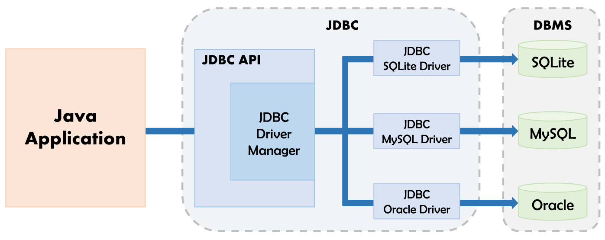
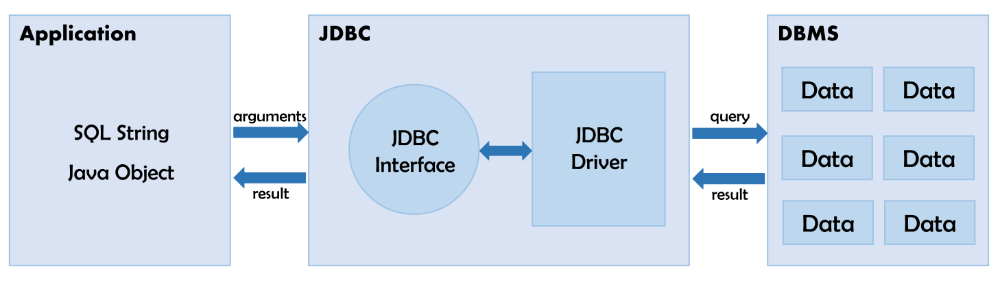

Spring-boot를 처음 사용하는데 처음 듣는 단어들이 너무 많았다. 왜 이렇게 어렵고 공부할께 많은건지..

DB 연동을 하면서 JPA, ORM, JDBC에 대하여 알게 되었고 간단히 공부를 해보았다. 어떤 차이가 있는지 정도?

# Overview

guideline에서는 Hibernate를 JPA provider로서 사용하는 것을 가정합니다.


# JPA (Java Persistent API)

JPA는 자바 ORM 기술에 대한 표준 명세를 정의한 것이다. JPA는 표준 명세일 뿐이라서 JPA 만으로는 실제 무언가를 할 수는 없다. JPA 표준 명세를 실제로 구현한 구현체들은 Hibernate, EclipseLink, DataNucleus, OpenJPA, TopLink Essentials 등이 있다. 이 구현체들을 ORM Framework, JPA 구현체 또는 JPA Provider라고 부른다.

> 스프링 부트에서 Spring Data JPA 디펜던시를 추가하면, 기본으로 Hibernate가 연동된다.


JPA를 사용하기 이전에는 JDBC를 사용하여 직접 DB connection한 후 SQL을 전달해 결과를 받아서 프로그래밍 해왔다. 

반복적인 DB Connection, SQL 재사용성을 개선하고자 만들어진 프레임워크가 SQL-Mapper이다.

그런데 이번에는 SQL Mapper의 Query가 xml로 관리되어지기 때문에 유지보수 과정에서 문제가 발생하였다.

빌드 과정에서 요류를 발생시키지 않기 때문에 SQL Query와 관련된 모든 Controller/Business/DAO Layer를 찾아서 유지보수해야했다.

그래서 드디어 JPA라는 표준을 만족하는 Hibernate와 같은 프레임워크가 만들어졌다.

그동안에 가졌던 JDBC, SQL Mapper(MyBatis와 같은)의 불편함을 해결해주고, 유지보수과정에서 type safe라는 개졈을 통해 간단한 빌드와 테스트코드만으로 유지보수과정에서 생기는 오류를 잡아주어 개발 생산성을 높였다.

물론 모든 장점만 있는 것은 아니다. SQL Mapper를 이용해서 복잡한 Query를 이용한 데이터 추출은 여전히 강점을 가지고 있다.

#### JPA가 가지고 있는 장점

1. Data 삽입 시

   ```
   SQL Mapper
   INSERT INTO USER(name, phone_num) VALUES('제니', '01012341234')
   
   JPA
   User user = new User('제니', '01012341234'); em.persist(user)
   ```

   위 과정이 간단하게 표현해서 별 차이가 없지만 필요한 형식의 데이터를 Parsing해서 SQL에 넘겨주는 코딩을 하는 입장에서는 곤욕이 아닐 수 없다.

2. Data 변경 시

   ```
   SQL Mapper
   UPDATE USER SET name='김용민' WHERE user_id=143
   
   JPA
   user 객체를 찾아서, User user = em.find(User.class, 143); user.setName('김용민')
   ```

   마찬가지로 필요한 부분만 변경해주면 아무리 변경해야할 컬럼이 많아도 알아서 SQL을 생성해서 바꾸어준다.

3. Data 삭제 시

   ```
   SQL Mapper
   DELETE FROM USER WHERE user_id=143;
   
   JPA
   User user = em.find(User.class, 143); em.remove(user);
   ```

   객체를 넘겨주면 삭제


위의 과정을 통해서 일일이 SQL 생성을 안해도 되는 부분에 큰 장점이 있다. 무엇보다도 도메인을 중심으로 Data를 가져오는 쿼리의 재사용성이 지켜진다는 게 가장 큰 장점이다.

그리고 Data를 객체로 다룰 수 있다는 점에서 JAVA 개발자에게는 원하는 곳에 쉽게 가공하여 사용할 수 있다는 장점도 있다.

# ORM (Object Relational Mapping)

이름 그대로 객체와 관계형 DB를 맵핑해주는 것이다. 개발자가 데이터 접근보다 로직 자체에 집중할 수 있게 해준다. ORM이 없을 때는 DB 작업을 위해서 SQL문을 직접 만들었다. 하지만 ORM을 사용하면 SQL문에서 자유로워지고 유지보수가 편해진다. 

ORM 기술에 대한 표준 명세가 바로 JPA이고, JPA 표준을 구현한 프레임워크가 바로 Hibernate이다. (Hibernate, EclipseLink, DataNucleus등이 있다.)

ORM을 이용하면 SQL Query가 아닌 직관적인 코드(메서드)로서 데이터를 조작할 수 있다.

예를들어, User 테이블의 데이터를 출력하기 위해서 MySQL에서는 `SELECT * FROM user;` 라는 query를 실행해야 하지만, ORM을 사용하면 User 테이블과 매핑된 객체를 user라 할 때, user.findAll()라는 메서드 호출로 데이터 조회가 가능하다.

query를 직접 작성하지 않고 메서드 호출만으로 query가 수행되다 보니, ORM을 사용하면 생산성이 매우 높아진다. 그러나 query가 복잡해지면 ORM으로 표현하는데 한계가 있고, 성능이 raw query에 비해 느리다는 단점이 있다. 그래서 JPQL, QueryDSL 등을 사용하거나 한 프로젝트 내에서 Mybatis와 JPA를 같이 사용하기도 한다.

> Java에서 DB를 다룰 때, JDBC를 직접 사용하는 것보다 Mybatis를 사용했을 때 코드가 간결해지고 유지보수가 편하다는 것을 느낄 수 있고,
>
> Hibernate를 배우게 되면 Mybatis보다 코드가 더 간결하며, 더 객체 지향적이고 생산성이 매우 높다는 것을 느낄 수 있다.

# JDBC (Java Database Connectivity)



JDK의 코어 API로 Java.sql 패키지에 내장되어 있다.

JDBC는 Java Application으로부터 사용되는 JDBC드라이버 매니저와 DBMS에 의존하는 JDBC 드라이버를 분리함으로써 DBMS에 의존하지 않고 개발이 가능하도록 하는 장점이 있다.

어느 DBMS를 사용하든 사용하는 DB의 Driver를 설치한 후 JDBC Driver Manager에 등록만 시켜놓으면 Application에서 수행되는 SQL 형태의 Query를 설치된 JDBC Driver가 해당 DBMS가 이해할 수 있는 Query로 변환하여 전달한다.



## Processing SQL Statements with JDBC

일반적으로 JDBC로 SQL 구문을 수행하게 되면 다음과 같은 과정을 거치게 됩니다.

1. Loading the Driver
2. Create the connections
3. Create a statement
4. Execute the query
5. Close the connections

### 1) Loading the Driver

프로그램에서 드라이버를 사용하기 위해서 드라이버를 로드 하거나 등록해야 합니다.

다음의 두 가지 방법중 하나로 등록할 수 있습니다.

* **Class.forName()** : runtime에 Driver의 Class 파일을 메모리에 로드합니다.

  ```java
  Class.forName("Oracle.jdbc.driver.OracleDriver")
  ```

* **DriverManager.registerDriver()** : DriverManager는 정적 멤버 레지스터가 있는 Java 내장 클래스 입니다. 여기서 compile 때 Driver Class의 생성자를 호출합니다.

  ```java
  DriverManager.registerDriver(new oracle.jdbc.driver.OracleDriver())
  ```

### 2) Create the connections

Connection 객체를 연결하는 것으로 DriverManager에 등록된 각 드라이버들을 getConnection(String url) 메소드를 사용해서 식별합니다. 이때 url 식별자와 같은 것을 찾아서 매핑(mapping)하고, 찾지 못하면 no suitable error 가 발생합니다.

```java
Connection con = DriverManager.getConnection(url, user, password)
```

### 3) Create a statement

Connection이 완료되면 DB와 상호작용을 할 수 있습니다. 

JDBCStatement, CallableStatement, PreparedStatement interface는 DB에 SQL 명령을 보내고 받을 수 있는 method를 정의합니다.

```java
Statement st = con.createStatement()
```

### 4) Excute the query

Statement 객체가 생성되면 Statement 객체의 executeQuery() 메소드나 executeUpdate() 메소드를 사용해서 쿼리를 처리합니다.

* Query for updating / inserting table in a database.
* Query for retrieving data .

executeQuery() 메소드는 DB에서 값을 검색하는 Query를 실행하며 Table의 모든 레코드를 가져오는데 사용할 수 있는 ResultSet Object를 return합니다.

```java
ResultSet rs = stmt.executeQuery("select \* from table");
```

executeUpdate(sql query) 메소드는 업데이트/삽입 쿼리를 실행하는데 사용됩니다. 성공한 row 수를 반환하며 Insert, Delete 문에서 사용됩니다.

```java
String sql = "update member1 set passwd = '3579' where id ='abc'";
stmt.executeUpdate(sql);
```

### 5) Close the connections

Connection을 닫으면 Statement, ResultSet Object도 자동으로 닫힙니다. Connection interface의 close() method를 사용합니다.

```java
con.close()
```


### Example Code

```java
importjava.sql.*; 
importjava.util.*; 
class Main 
{ 
    public static void main(String a[]) 
    { 
        //Creating the connection 
        String url = "jdbc:oracle:thin:@localhost:1521:xe"; 
        String user = "system"; 
        String pass = "12345"; 
  
        //Entering the data 
        Scanner k = new Scanner(System.in); 
        System.out.println("enter name"); 
        String name = k.next(); 
        System.out.println("enter roll no"); 
        int roll = k.nextInt(); 
        System.out.println("enter class"); 
        String cls =  k.next(); 
  
        //Inserting data using SQL query 
        String sql = "insert into student1 values('"+name+"',"+roll+",'"+cls+"')"; 
        Connection con=null; 
        try
        { 
            DriverManager.registerDriver(new oracle.jdbc.OracleDriver()); 
  
            //Reference to connection interface 
            con = DriverManager.getConnection(url,user,pass); 
  
            Statement st = con.createStatement(); 
            int m = st.executeUpdate(sql); 
            if (m == 1) 
                System.out.println("inserted successfully : "+sql); 
            else
                System.out.println("insertion failed"); 
            con.close(); 
        } 
        catch(Exception ex) 
        { 
            System.err.println(ex); 
        } 
    } 
} 
```

### Reference

* [JDBC란? :: 동그란 혜주](https://hzoou.tistory.com/64)
* [Spring Data JDBC in 스프링부트(1) :: Eddy Kim](https://brunch.co.kr/@springboot/105)
* [Database Access (JPA) :: Heee's Development Blog](https://terasolunaorg.github.io/guideline/5.1.0.RELEASE/en/ArchitectureInDetail/DataAccessJpa.html)
* [Spring JPA - ORM과 JPA 그리고 Hibernate :: victolee](https://victorydntmd.tistory.com/195)
* [JDBC, JPA/Hibernate, Mybatis의 차이](https://gmlwjd9405.github.io/2018/12/25/difference-jdbc-jpa-mybatis.html)
* [JDBC를 사용한 데이터베이스 연동 :: 개발이 하고 싶어요](https://hyeonstorage.tistory.com/110)
* [JDBC, JPA/Hibernate, Mybatis의 차이 :: MISTERY](https://sugerent.tistory.com/569)
* [JDBC란 :: 지우아빠의 촌철활인](https://m.blog.naver.com/PostView.nhn?blogId=yayatom&logNo=10114709858&proxyReferer=https:%2F%2Fwww.google.com%2F)

* [JDBC와  ODBC의 차이점에 대해서 :: ojava](https://ojava.tistory.com/24)

* [JDBC란 :: 공부하는 신입의 기록](https://shs2810.tistory.com/18)

* [Java의 JDBC: 시작하기 전에 알아야 할 5가지 :: 케코폰지갑](https://blog.naver.com/PostView.nhn?blogId=ki630808&logNo=221757377416)
* [What Are the Types of JDBC Drivers? :: Progress](https://www.progress.com/faqs/datadirect-jdbc-faqs/what-are-the-types-of-jdbc-drivers)

* [JDBC Interview Questions And Answers :: Facing Issues On IT](https://facingissuesonit.com/jdbc-interview-questions-and-answers/)

* [JPA를 사용해야하는 이유 :: 라이언곰돌이푸](https://interconnection.tistory.com/107)

* [Processing SQL Statements with JDBC :: ORACLE](https://docs.oracle.com/javase/tutorial/jdbc/basics/processingsqlstatements.html)

* [Establishing JDBC Connection in Java :: GeeksforGeeks](https://www.geeksforgeeks.org/establishing-jdbc-connection-in-java/)