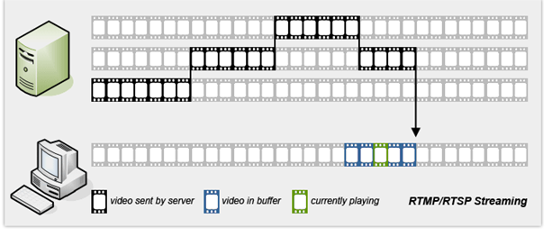
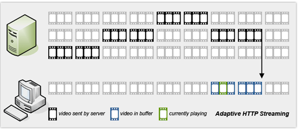
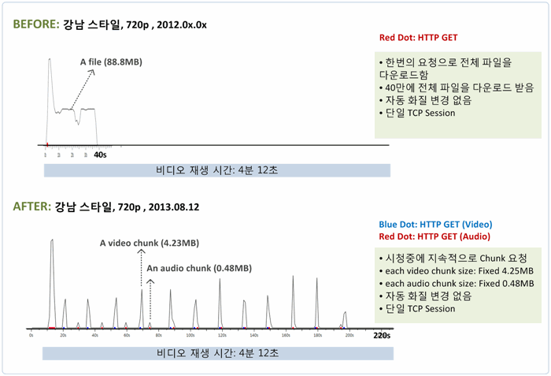

## Streaming Protocol

예전에 토이 프로젝트로 Streaming 서비스를 만들어보려고 한 적이 있었습니다. 그때 공부한 내용을 옮겨 적었습니다.

HLS Protocol을 이용한 audio downstream 구현 : <https://github.com/koomg9599/HlsAudioDownstream>

실시간 영상, 오디오 모두 잘 동작한다. 다만 동영상의 경우 크롬 플러그인(HLS)을 설치해야 제대로 보여졌던 것 같다. (오래돼서 기억이..)

### 1. Progressive Download

- HTTP protocol을 사용하여 미디어 파일을 서버에서 클라이언트로 이동시킨다.
- 사용자는 다운로드가 완료되기 전에 미디어를 재생할 수 있다. (미디어 플레이어는 파일의 헤더에 위치한 `meta data` 에 의존하여 Progressive Download의 재생을 할 수 있다.)
- 서버는 전체 파일을 전송하며, 클라이언트는 서버가 전달해주는 전체 파일을 저장한다. 다운 받은 부분 내에서만 재생할 수 있다.
- Youtube의 예전 방식 (~2013)

#### 장점

* 구현이 쉽다. (웹 서버에 업로드 후 클라이언트 측에 URL만 알려주면 된다.)

#### 단점

* 네트워크 사용량이 많음

* 시청한 만큼이 아닌 다운로드 받은 만큼의 네트워크 Traffic을 사용한다.

* 비디오 품질 변경 불가

* 다운로드 시작 중에는 비디오 품질을 변경할 수 없다.

* 전체 파일을 가져오는 방식이므로 유료 서비스에 부적합 (ex.  youtube 영상을 파일로 다운로드 프로그램)

### 2. RTSP/RTMP Streaming

- Progressive Download가 가지는 약점 때문에, Hulu와 같은 곳에서는 RTMP/RTSP Streaming을 주로 사용한다. 이 방법에서는 사용자가 현재 시청하고 있는 비디오 프레임만을 전송해주는 전문 웹서버를 사용한다.
- 사용자가 현재 시청하고 있는 비디오 프레임만을 전송해주는 별도 웹서버를 사용.
- 데이터를 미리 다운로드해 놓지 않으며 사용자가 이미 시청한 데이터는 버린다.
- 가장 널리 사용되는 솔루션은 RTMP(Real Time Messaging Protocol)이며 대부분의 CDN 서버들이 지원하는 프로토콜이다.
- 서버 측에서 많이 지원하지 않고 있다는 점이 RTMP/RTSP의 가장 큰 약점이다.
- 회사의 방화벽에 막히는 경우가 종종 있다.
- 라이브러리와 기타 protocol 자료들이 폐쇠적인 부분이 있다.
- 효율성은 좋지만 Progressive Download보다 복잡하며 비용이 비싸고 제약이 많다.

### 3. Adaptive HTTP Streaming

- 동영상 콘텐츠를 다양한 해상도로 인코딩해 저장해두고 데이터 단위도 동영상 콘텐츠 하나로 저장하는 게 아니라 잘게 쪼개 저장해둔다.
- 네트워크 상황에 따라서 적절한 해상도를 내려준다.
- 서버에 저장되어 있는 미디어 데이터를 작은 조각들(몇 초에 해당하는)로 나누는 동작을 한다.
- Player는 그 조각들을 이어 붙여 연속적인 stream으로 만든다.
- 서버는 미디어 파일을 몇 초 단위로 단편화 시킨다. 클라이언트는 단편화된 미디어 파일들을 받아 연속된 미디어 스트림으로 조합하여 재생에 사용한다.
- 현재 youtube가 사용하는 방식 (20초에 한번씩 Chunk를 요청) ⇒ 실제 시청한 만큼의 데이터만 나가기 때문에 서버의 부하를 줄임
- 현재 가장 대중적인 사례는 애플의 HLS(HTTP Live Streaming)이다.

#### 장점

* 네트워크 Traffic의 부하 분산

* Progressive Download의 경우 파일 전체를 다운받는 동안 집중적으로 Tracffic이 증가하며, Adaptive Http Streaming의 경우 Play Time동안 Play에 필요한 데이터를 요청하기 때문에 Traffic이 분산됨

* 네트워크 Traffic 감소

* 불필요하게 시청중이지 않는 부분을 download받지 않음. 서버에 Traffic 부하를 줄여줌(절약)

#### 단점

* 표준화의 부족

* 각 공급자마다 서로의 protocol이 존재

* 단편화된 파일/MP4 간의 변환 툴이 일반화되지 않음

### Youtube

2013년 4월 이전에는 Progressive Download 방식으로 구현되었지만, 현재는 Adaptive HTTP Streaming 방식으로 서비스하고 있다.

아래 그림과 같이 Progressive Download 방식보다 현재 방식인 Adaptive HTTP Streaming  방식이 약 20초에 한번씩 Chunk를 요청하여 재생하며 실제 시청한만큼 Traffic만 소비하여 서버의 부하를 줄여준다.

### Reference

* [웹 기술로 구현하는 Adaptive HTTP Streaming](https://meetup.toast.com/posts/131)

* [YouTube의 비디오 전달 방식 변경 (1): Progressive Download의 종말](https://www.netmanias.com/ko/post/blog/5819/google-http-adaptive-streaming-http-progressive-download-ott-video-streaming-youtube/youtube-switched-to-chunking-and-adaptive-streaming)
* [스트리밍 서비스의 종류와 프로토콜](https://dg087.tistory.com/84)