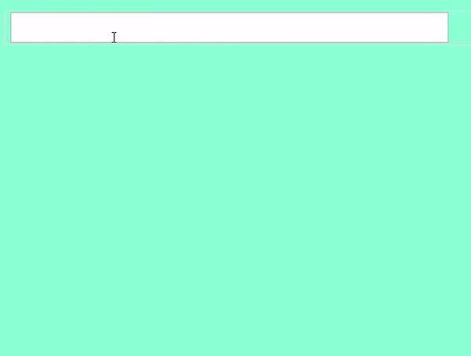

<https://github.com/koomg9599/auto-complete> 

auto-complete 모듈을 만들면서 정말 고민이 많았다.

모듈을 만들면서 가장 큰 고민은 item-list 외부 element를 클릭했을때 item-list가 close 되는 것이였다.

이걸 구현하려고 Event-flow, mouseOver, Blure, focusIn등을 공부하고 많은 노력을 하였지만 그렇게 해결하는게 아니였다.



이걸 구현하기 위하여 먼저 window의 클릭 이벤트를 달고, 만약 클릭한게 list-item이 아니면 item-list window가 close되게 하였다.

```javascript
 const windowCloseHandler = e => {
    if (e.target.className !== 'input_item') {
      windowInvisible()
    }
  }
```

