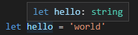
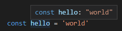
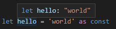
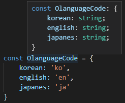
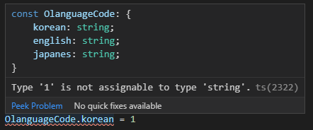
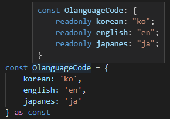
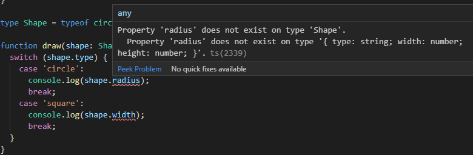

타입스크립트 카테고리는 안만들려고 했지만ㅠㅠ 결국 만들게 되었다.

`as const`를 왜 쓰지? 라는 생각이 여기까지 왔다.

하나씩 차근차근 살펴보자!

> 이 내용도 다른분께서 정리해두셔서 옮겨 적어 보았다.
>
> [TypeScript 3.4: const assertion :: Kim Seungha](https://medium.com/@seungha_kim_IT/typescript-3-4-const-assertion-b50a749dd53b)

# 타입 추론

## Dynamically Typed Language vs Statically typed Language

먼저 동적 타입 과 정적 타입을 비교해보자.

이 둘의 차이는 다음과 같다.

**dynamically typed language**는 run-time 때 type checking & binding이 일어나고

**statically typed language**는 compile time 때 type checking & binding이 일어난다.

TypeScript는 statically typed language이고, JavaScript는 dynamically typed language이다.

## TypeScript의 타입 추론

여기서 TypeScript는 조금 더 똑똑하여, 타입을 추론하여 자동으로 지정해준다.

```js
// 굳이 이렇게 적어주지 않아도
let hello: string = 'world'

// 타입 추론이 되어, 아래와 같이 짧게 적어줄 수 있다.
let hello = 'world'
```

‘world’ 라는 문자열을 hello 변수에 대입했을때. TypeScript는 똑똑하게도 hello 변수가 string 타입이어야 한다는 사실을 알아차렸다.

<div align='center'></div>

<div align="center"><small>let 변수에 대한 타입 추론(문자열 리터럴)</small></div>

위 예제에서 let 대신 const 변수로 선언하면, 아래와 같이 string 대신에 ‘world’ 타입으로 추론된다.

<div align='center'></div>

<div align="center"><small>const 변수에 대한 타입 추론(문자열 리터럴)</small></div>

TypeScript는 특정 문자열 자체를 타입으로 다룰 수 있게 해주는 string literal type을 지원합니다. 즉, 위와 같은 타입 정보는 hello 변수는 반드시 “world” 문자열이어야 하며, 다른 문자열이 될 수 없다는 사실을 나타냅니다.

위에서 보신 바와 같이 변수를 let으로 선언하느냐, const로 선언하느냐에 따라 타입 추론의 규칙이 달라집니다. 이는 합리적인데, let 변수는 다른 값이 대입될 수 있고, const 변수에는 다른 값이 대입될 수 없기 때문입니다.

# const assertion

TypeScript 3.4에 추가된 const assertion 기능을 사용하면, let 변수에 대해서도 const 변수를 사용할 때와 같은 타입 추론 규칙을 적용할 수 있다.

const assertion을 적용하려면, ‘const’ 라는 키워드로 타입 단언을 하면 됩니다.

```js
let hello = 'world' as const; // ts, tsx 파일에서
let hello = <const>'world'; // ts 파일에서
```

타입 추론이 어떻게 되었는지 볼까요?

<div align='center'></div>

<div align="center"><small>let 변수에 대한 const assertion</small></div>

hello를 let 변수로 선언했음에도, **마치 const 변수로 선언한 것처럼** “world” 타입으로 추론되었습니다. 위의 경우, hello 변수에 “world” 이외의 다른 값을 대입하려고 하면 컴파일 타임 에러가 난다.

# 객체에 대한 const assertion

이렇게 별 쓸모 없어 보이는 기능이 왜 추가된 걸까요?

이번에는 const 변수에 객체를 대입해서, 타입 추론이 어떻게 되는지 보겠습니다.

<div align='center'></div>

<div align="center"><small>const 객체에 대한 타입추론</small></div>

모든 속성이 string으로 정의되어 있습니다.

따라서 다음과 같이 value로 int값을 넣으면 에러가 발생합니다. 대신 string을 대입하게 되면 에러가 나지 않죠.

<div align='center'></div>

<div align="center"><small>const 객체에 value 변경</small></div>

객체 const에서 value값들을 변경하는건 아마 개발자가 의도하진 않을겁니다.

그러면 속성값들을 변경할 수 없게 만들어 보겠습니다.

```js
// 하나의 속성에 대한 const assertion
const OlanguageCode = {
    korean: 'ko' as const,
    english: 'en',
    japanes: 'ja'
}
// 모든 속성에 대한 const assertion
const OlanguageCode = {
    korean: 'ko',
    english: 'en',
    japanes: 'ja'
} as const
```

<div align='center'></div>

<div align="center"><small>객체 속성 cosnt assertion</small></div>

# const assertion + discriminated union

TypeScript에는 discriminated union이라는 기능이 있습니다. 이 기능을 통해 타입 추론의 범위를 좁혀줄 수 있습니다.

아래 예제를 생각해봅시다.

```
const circle = {
  type: 'circle',
  radius: 10
};const square = {
  type: 'square',
  width: 10,
  height: 20
};type Shape = typeof circle | typeof square;function draw(shape: Shape) {
  switch (shape.type) {
    case 'circle':
      console.log(shape.radius);
      break;
    case 'square':
      console.log(shape.width);
      break;
  }
}
```

JavaScript에서라면 크게 문제가 되지 않을 코드입니다. 하지만 TypeScript에선 컴파일이 되지 않습니다.

<div align='center'></div>

<div align="center"><small>객체 내부의 문자열 리터럴에 대한 타입 추론이 이루어지지 않음</small></div>

이런 에러가 나는 이유는, shape.type의 값이 ‘circle’ 인지 확인되었음에도 불구하고 shape 변수의 타입이 [typeof circle]로 좁혀지지 않았기 때문입니다. 

이 때,

- 각 객체의 type 속성에 const assertion을 적용하거나,
- 두 객체에 통째로 const assertion을 적용하면,

위에서 발생한 타입 에러가 해결됩니다.