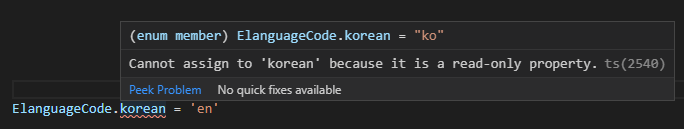
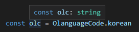
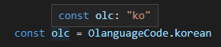
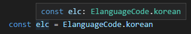
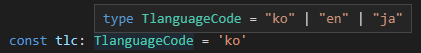

다른 사람이 TypeScript로 작성한  코드에 `enum`이 있는걸 보고 `object`를 써도 될 것 같은데 왜 굳이 `enum`을 썻지? 그리고 TypeScript는 왜 `enum`을 만들었을까? 라는 고민을 하게 되었고 그러한 고민이 이 포스팅을 하게된 이유이다.

> 나랑 똑같은 고민을 하셨던 분이 잘 설명 해놓으셔서 살짝 옮겨 적으며 나의 생각까지 덧붙혀 보고자 한다.[TypeScript enum을 사용하는 이유]([https://medium.com/@seungha_kim_IT/typescript-enum%EC%9D%84-%EC%82%AC%EC%9A%A9%ED%95%98%EB%8A%94-%EC%9D%B4%EC%9C%A0-3b3ccd8e5552](https://medium.com/@seungha_kim_IT/typescript-enum을-사용하는-이유-3b3ccd8e5552)) 여기에 설명을 너무 잘해주셨다! 감사합니다 ㅠ

# Enum vs Object

대학교에서 c++을 배우며 `enum`을 처음 접했다. 당시 `enum`은 시험칠때만 공부 해놓고 한 번도 써보지 않은 녀석이였는데, typescript에서 사용하게 되었다. ㅎㅎ

typescript `enum`은 `object`와 상당히 비슷한 구석이 많다. 그리고 `type`도

```typescript
enum ElanguageCode {
    korean = 'ko',
    english = 'en',
    japanese = 'ja'
}

const OlanguageCode = {
    korean: 'ko',
    english: 'en',
    japanes: 'ja'
}
```

이걸 컴파일하면?

```js
"use strict";

var ElanguageCode;
(function (ElanguageCode) {
    ElanguageCode["korean"] = "ko";
    ElanguageCode["english"] = "en";
    ElanguageCode["japanese"] = "ja";
})(ElanguageCode || (ElanguageCode = {}));


const OlanguageCode = {
    korean: 'ko',
    english: 'en',
    japanes: 'ja'
};

```

뭔가 다른 구석을 찾을 수 있을 것이다. 보면 알겠지만 `enum`은 그 자체로 `object`이다. 그러면 어떤 차이점이 있을까?

1. 객체는 속성을 자유로이 변경할 수 있는데 반해, **enum의 속성은 변경할 수 없다.**

   - 객체에 **const assertion**을 하면 변경할 수 없게 할 수는 있다.
   - 

2. 객체의 속성은 (별다른 처리를 해주지 않았다면) 리터럴의 타입이 아니라 그보다 넓은 타입으로 타입 추론이 이루어집니다. enum은 **항상 리터럴 타입이 사용됩니다.**

   * **객체**
     

     만약 별다른 처리를 해준다면?

     ```js
     const OlanguageCode = <const>{
         korean: 'ko',
         english: 'en',
         japanes: 'ja'
     }
     
     // or
     
     const OlanguageCode = {
         korean: 'ko',
         english: 'en',
         japanes: 'ja'
     } as const
     ```

     

   * **enum**

     

     

3. 객체의 속성 값으로는 JavaScript가 허용하는 모든 값이 올 수 있지만, **enum의 속성 값으로는 문자열 또는 숫자만 허용됩니다.**

## 정리

정리하자면, **같은 ‘종류’를 나타내는 여러 개의 숫자 혹은 문자열을 다뤄야 하는데, 각각 적당한 이름을 붙여서 코드의 가독성을 높이고 싶다면 enum을 사용하세요.** 그 외의 경우 상수, 배열, 객체 등을 사용하시면 됩니다.


# Enum vs Type

type도 비슷하니 한번 보면

```ts
type TlanguageCode = 'ko' | 'en' | 'ja'
```

사용할 때는 이렇게 사용할껀데



'ko' or 'en' or 'ja'만 보고 korean인지 english 인지 japanese 인지 알 수 없다.

확실히 저렇게 사용할 때는 `enum`이 맞는 것 같다.