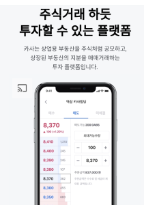

브랜드 사이트에 비디오를 넣게 되면서 발생했던 문제들을 나열해 보았다.

## 공통

### 모바일 웹에서 비디오 다운로드 막기

모다일에서 비디오를 꾹~ 클릭하게 되면 비디오를 다운받을 수 있게 된다. 이를 막기 위해서는 `contextmenue` 이벤트를 막으면 된다.

```js
noContext = document.getElementById('noContextMenu')

noContext.addEventListener('contextmenu', e => {
  e.preventDefault()
})
```

### playsinline 속성 넣기

아이폰에서는 playsinline 속성을 꼭 넣어줘야한다. 안넣어주면 동영상이 전체 화면 모드로 재생된다.

### autoplay & muted

video에 muted 속성을 넣어줘야만 autoplay가 가능하다.

### 1) IE

| 문제                                                                                                                                                                                                      | 해결방법                                                        | 참고자료                                                                            |
| :-------------------------------------------------------------------------------------------------------------------------------------------------------------------------------------------------------- | :-------------------------------------------------------------- | :---------------------------------------------------------------------------------- |
| 사양이 낮은 브라우저일 경우 autoplay & video.load()를 사용할 시 비디오가 로드될 때 컴포넌트 깜빡임 현상이 있다.<br />해당 컴포넌트로 진입시 비디오를 다운받는데, 다운받아 로드하는 시간이 오래걸리기 때문 | autoplay 보다는 preload="auto" 와 video.currentTime을 섞어 사용 | [링크](https://developer.mozilla.org/ko/docs/Web/HTML/Element/Video) |

### 2) Safari

**For static video files, use H.264-encoded MP4 files.**

| 문제                                                                                                                         | 해결방법                                                                                          | 참고자료                                                                                                                              |
| :--------------------------------------------------------------------------------------------------------------------------- | :------------------------------------------------------------------------------------------------ | :------------------------------------------------------------------------------------------------------------------------------------ |
| 오디오가 없는 비디오는 재생되지 않는 문제가 있다. (오디오코덱인 AAC가 없는 경우)<br /> | 영상은 H.264, 오디오는 AAC로 인코딩된 MP4 file로 교체<br /> | [링크](https://developer.apple.com/documentation/webkit/safari_tools_and_features/delivering_video_content_for_safari) |

### 3) Android Chrome

| 문제                                                                                                                                                   | 해결방법                                               | 참고자료                                                                                                                                                                                                                                |
| ------------------------------------------------------------------------------------------------------------------------------------------------------ | ------------------------------------------------------ | --------------------------------------------------------------------------------------------------------------------------------------------------------------------------------------------------------------------------------------- |
| video tag에서 HTML property height만 정의하고, css height를 정의하지 않았을 때, 스크롤을 내릴 때 비디오가 밀리는 현상이 있다.                          | css에도 height를 정의한다.                             | [링크](https://stackoverflow.com/questions/3562296/whats-the-difference-between-the-html-width-height-attribute-and-the-css-widt)                                                                                                       |
| Galaxy S10 모델에서 동영상 밝기가 어두워지는 문제가 있다.개발자 옵션에서 Disable HW overlays를 끄면 제대로 동작하는 것으로 보아 Android 문제로 보인다. | `video { filter: brightness(100%) }`                   | [링크](https://forums.androidcentral.com/android-8-0-oreo/865544-why-my-screen-has-grey-layer-when-i-turn-video-full-screen.htmlhttps://stackoverflow.com/questions/16983018/chrome-html5-video-cant-display-white-has-gray-background) |
| 집에 크롬 캐스트가 있는 경우 **cast button** 이 나온다. <br />                                                   | `<video disableRemotePlayback src="..."></video><br/>` |  [링크](https://stackoverflow.com/questions/28153166/android-chrome-chromecast-icon-over-html5-video-positionhttps://developer.mozilla.org/en-US/docs/Web/API/HTMLMediaElement/disableRemotePlayback)                    |
