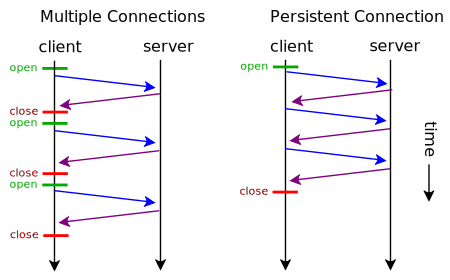
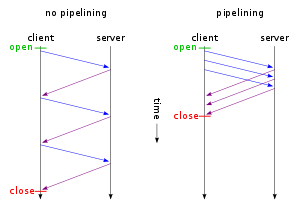

> [리얼월드 HTTP]  '4장 HTTP/1.1의 신택스: 고속화와 안전성을 추구한 확장' 를 요약하였습니다.

이번에는 HTTP/1.1 이후에 추가된 새로운 기능을 설명하겠습니다.

이번에 다룰 내용은 다음과 같습니다.

* 통신 고속화
  * Keep-Alive가 기본적으로 유효하다.
  * 파이프라이닝
* TLS에 의한 암호화 통신을 지원한다.
* 새 메서드 추가
  * PUT과 DELETE가 필수 메서드가 됐다.
  * OPTION, TRACE, CONNECT 메서드가 추가됐다.
* 프로토콜 업그레이드
* 이름을 사용한 가상 호스트를 지원
* 크기를 사전에 알 수 없는 콘텐츠의 청크 전송 인코딩 지원

## 3.1 통신 고속화

### 3.1.1 Keep-Alive

Keep-Alive는 HTTP의 아래층인 TCP/IP 통신을 효율화하는 구조입니다. Keep-Alive를 사용하지 않으면 하나의 요청마다 통신을 닫아야 하지만, Keep-Alive를 사용하면 연속된 요청에는 접속을 다시 이용합니다. 이로써 TCP/IP는 접속까지의 대기 시간이 줄어들고, 통신 처리량이 많아지므로 속도가 올라간 것처럼 느껴집니다.

HTTP/1.1에서는 이 동작이 기본으로 되어 있습니다. HTTP/1.0에서는 `Connection: Keep-Alive`를 헤더에 추가하여야 했습니다.

뒤에 소개할 TLS 통신을 이용할 경우, 특히 통신 시간을 많이 줄여줍니다. HTTP 아래 계층의 프로토콜인 TCP/IP도 접속할 때는 1.5회 왕복의 통신을 필요로 합니다. 패킷이 1회 왕복하는 시간을 1RTT(round-trip time)로 부르며, TLS에서는 서버/클라이언트가 통신을 시작하기 전에 정보를 교환하는 handshake 과정에서 2RTT만큼 시간이 걸립니다. 이때 Keep-Alive를 이용하면, handshake 횟수를 줄일 수 있습니다. 게임 에셋을 다운로드할 때 1회 요청의 HTTP 통신을 반복한다고 가정하면, 두 번째 이후의 에셋 다운로드 시간을 최대 4RTT에서 1RTT로 줄일 수 있습니다.

Keep-Alive를 이용한 통신은 클라이언트나 서버 중 한 쪽이 다음 헤더를 부여해 접속을 끊거나 타임아웃될 때까지 연결이 유지됩니다.

`Connection: Close`

통신 종료가 규정되어 있긴 하지만, 모든 통신이 확실히 끝났는지 서버가 판정할 수 없습니다. 따라서 HTML을 정적으로 해석하는 것 만으로는 클라이언트 측에서 모든 통신의 완료를 탐지할 수 없습니다. 그 때문에 서버에서 Keep-Alive 종료를 명시적으로 보내는 것이 간단하지 않고, 실제로는 타임아웃으로 접속이 끊어지기를 기다리게 됩니다.

Keep-Alive 지속 시간은 클라이언트와 서버 모두 가지고 있습니다. 한쪽이 TCP/IP 연결을 끊는 순간에 통신은 완료되므로, 어느 쪽이든 짧은 쪽이 사용됩니다. 인터넷 익스플로러는 60s, 파이어폭스는 115s, Nginx는 75s, Apache는 5s 입니다.

통신이 지속되는 동안 OS의 자원을 계속 소비하므로, 실제 통신이 이루어지지 않는데 접속을 유지하는 것은 바람직하지 않습니다.

### 3.1.2 파이프라이닝

파이프라이닝은 최초의 요청이 완료되기 전에 다음 요청을 보내는 기술입니다. 다음 요청까지의 대기 시간을 없앰으로써 네트워크 가동률을 높이고 성능을 향상시킵니다. Keep-Alive 이용을 전제로 하며, 서버는 요청이 들어온 순서대로 응답을 반환합니다.

하지만 실제로 써봤지만 성능이 거의 좋아지지 않았다는 보고도 있고, 요청받은 순서대로 응답해야만 하므로, 응답 생성에 시간이 걸리거나 크기가 큰 파일을 반환하는 처리가 있으면 다른 응답에 영향을 줍니다. 이는 HOL Blocking(head of line blocking)이라고 불리는 문제입니다.

## 3.2 전송 계층 보안(TLS)

HTTP/1.1과 병행해 통신 경로를 암호화하는 전송 계층 보안(Transport Layer Security)이 규격화됐습니다.  TLS는 기존 프로토콜에 통신 경로의 안전성을 추가해 새로운 프로토콜을 만들어낼 수 있는 범용적인 구조로 되어 있습니다. HTTP의 잘 알려진 포트는 80번이지만, HTTPS는 443번을 사용해 다른 서비스로 취급합니다.

HTTP 통신을 중계하는 게이트웨이 입장에서 보면, '암호화되어 통신 내용을 엿보거나 변경할 수 없는 양방향 통신'입니다. TLS를 사용하면 조작할 수 없는 안정된 통신로가 생기므로, HTML5에서 새로 도입된 웹소켓 같은 통신 프로토콜이나 HTTP/2 등 HTTP/1.1 이전과 상위 호환성이 없는 수많은 새로운 시스템을 원만하게 도입하는 인프라가 됐습니다.

TLS에는 몇 가지 버전이 있으며, SSL이라고 불리던 시절도 있습니다. 현재에도 TLS 부분을 맡은 라이브러리로서 높은 점유율을 자랑하는 소프트웨어 이름이 'OpenSSL'이라거나 서버를 보증하는 인증서에 'EV SSL'이라는 분류가 있는 등 SSL로 불리는 일이 많습니다. 다만 실제 SSL은 여러가지 취약성이 알려져 있어 RFC에서도 권장하지 않습니다. 인터넷 서비스에서도 무효화된 것이 많고, 실제로 사용되는 것은 대부분 TLS입니다.