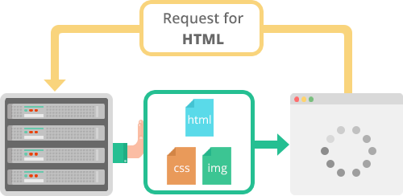

## Overview

HTTP1.1은 1999년 출시 이후 지금까지 가장 많이 사용되고 있습니다. HTTP는 웹상에서 클라이언트와 웹서버간 통신을 위한 프로토콜 중 하나입니다. HTTP1.1은 기본적으로 연결당 하나의 요청과 응답을 처리하기 때문에 동시전송 문제와 다수의 리소스를 처리하기에 속도와 성능 이슈를 가지고 있습니다.


이렇다 보니, HOL(Head Of Line) Blocking-특정응답지연, RTT(Round Trip TIme) 증가, 헤비한 Header구조라는 문제점들을 가지고 있습니다. 이러한 문제점들을 해결하기 위해, UI 개발자/프론트엔드개발자는 이미지 스프라이트, 도메인샤딩, CSS/JavaScript 압축, Data URI 등을 업무에 사용하였습니다.

그렇게 고군분투 하던 중, HTTP2가 세상에 소개되었습니다. HTTP2는 성능 뿐만 아니라 속도면에서도 월등한 녀석입니다. Multiplexed Streams(한 커넥션에 여러개의 메세지를 동시에 주고 받을 수 있음), Stream Prioritization(요청 리소스간 의존관계를 설정), Server Push(HTML문서상에 필요한 리소스를 클라이언트 요청없이 보내줄 수 있음), Header Compression(Header 정보를 HPACK압충방식을 이용하여 압축전송)을 사용하여 선을을 획기적으로 향상 시켰습니다.


## HTTP란 무엇인가?

**HTTP**(Hypertext Transfer Protocol)는 인터넷 데이터 통신의 기초가 되는 응용 프로그램 프로토콜입니다.

## HTTP/2란 무엇인가?

2015년에 IETF (Internet Engineering Task Force)는 가장 유용한 인터넷 프로토콜인 HTTP의 두 번째 주요 버전 HTTP/2를 출시합니다.

## HTTP의 역사


HTTP 1.1이 발표된 1997년 이후 16년이 지난 2015년에 HTTP 2가 공개되었다.

16년이 흐르면서 웹에서는 많은 변화가 생겼다.

1996년 야후 웹페이지 리소스는 34KB, 2017년에는 리소스 크기의 평균이 2300KB라고 한다. 필요한 리소스의 크기가 이전에 비해 60배나 증가하였다.

위와 같이 데이터의 양이 늘어나자 웹 페이지 로딩속도는 사용자 측면에서 매우 중요한 요소가 되었다. 이러한 요구사항들을 만족시키기 위해 HTTP 2가 탄생하게 되었다.

<https://www.httpvshttps.com/>

이 사이트에 들어가면, HTTP 1과 HTTP2의 웹페이지 랜딩 속도를 비교해볼 수 있다.

보면, HTTP2가 HTTP1보다 2배 빠른 것을 확인할 수 있다.

HTTP2는 보안 강화라는 특징도 갖고 있지만, 이번 시간에는 HTTP2가 웹페이지를 요청하고, 응답받을 때까지 기다려야하는 시간을 어떻게 단축했는지에 대한 내용에 집중에서 이야기하려고 한다.


## HTTP/1.1이 느린 이유

HTTP/1.1는 기본적으로 **Connection당 하나의 요청을 처리** 하도록 설계되어있다. 그래서 위 그림과 같이 **동시전송이 불가능**하고 **요청과 응답이 순차적**으로 이루어 지게 된다.

그렇다 보니 HTTP 문서안에 포함된 다수의 리소스를 처리하려면 요청할 리소스 개수에 비례하여 Latency(대기 시간)이 길어지게 된다.

HTTP/1.1의 단점을 알아보자.

### HOL (Head Of Line) Blocking - 특정 응답의 지연

WEB 환경에서 HOLB는 실제로 두 종류가 존재한다.

* HTTP의 HOL Blocking
* TCP의 HOL Blocking

우리의 관심은 HTTP의 HOLB이고 이에 대해 알아보자

HTTP/1.1의 connection당 하나의 요청처리를 개선할 수 있는 기법중 pipelining이 존재하는데 이것은 하나의 Connection을 통해서 다수개의 파일을 요청/응답 받을 수 있는 기법을 말하는데 이 기법을 통해서 어느정도의 성능 향상을 꾀 할 수 있으나 큰 문제점이 하나 있다.

하나의 TCP연결에서 3개의 이미지(a.png, b.png, c.png)를 얻을려고 하는경우 HTTP의 요청순서는 다음 그림과 같다.

```
| --- a.png --- |
            | --- b.png --- |
                        | --- c.png --- |
```

순서대로 첫번째 이미지를 요청하고 응답받고 다음 이미지를 요청하게 되는데 만약 첫번째 이미지를 요청하고 응답이 지연되면 아래 그림과 같이 두,세번째 이미지는 당연히 첫번째 이미지의 응답처리가 완료되기 전까지 대기하게 되며 이와 같은 현상을 **HTTP의 Head of Line Blocking** 이라 부르며 파이프 라이닝의 큰 문제점 중 하나이다.

```
| ------------------------------- a.png --------------- --- |
                                                       | -b.png- |
                                                               | --c.png-- |
```


#### 1) HTTP Pipelining

HTTP/1.1 에서는 다수의 HTTP Request 들이 각각의 서버 소켓에 Write 된 후, Browser 는 각 Request 들에 대한 Response 들을 순차적으로 기다리는 문제를 해결하기 위해 여러 요청들에 대한 응답 처리를 뒤로 미루는 방법을 사용한다.

즉, HTTP/1.1 에서 클라이언트는 각 요청에 대한 응답을 기다리지 않고, 여러개의 HTTP Request 를 하나의 TCP/IP Packet 으로 연속적으로 Packing 해서 요청을 보낸다.

파이프라이닝이 적용되면, **하나의 Connection 으로 다수의 Request 와 Response 를 처리할 수 있게끔 Network Latency 를 줄일 수 있다**.

#### 2) HTTP Persistent Connection

HTTP 1.0 초기의 HTTP 연결은 요청시 TCP 의 3-way handshake 방식으로 연결이 이루어졌었다.

즉, 웹클라이언트와 서버간의 연결 성립 이후 SYN, SYN-ACK, ACK 핸드셰이킹이 발생하고 이를 바탕으로 통신을 구성한 뒤 연결을 끊는 순서가 필요했다..

웹의 초창기에는 컨텐츠의 수가 많지 않았기 때문에 이런 TCP 연결은 부담되지 않았지만, 웹을 통한 멀티미디어 컨텐츠의 발달로 인해, TCP Connection 의 재사용이 요구되게 되었다.

웹에서의 커넥션 재사용을 Keep-alive 또는 Connection reuse 라 하며, HTTP/1.0 에서는 클라이언트가 서버에게 요청하는 Request Header에 다음과 같은 값을 통해 연결을 유지하였다.

**Connection: keep-alive**
HTTP/1.1 에서는 이 헤더를 사용하지 않더라도 모든 요청/응답이 Connection을 재사용하도록 설계되어 있으며, 필요없는 경우에만 TCP 연결을 종료하는 방식으로 변경되었다.


### RTT( Round Trip Time ) 증가

앞서 말한것처럼 http/1.1의 경우 일반적으로 하나의 connection에 하나의 요청을 처리 한다.  이렇다 보니 매 요청별로 connection을 만들게 되고 TCP상에서 동작하는 HTTP의 특성상 [**3-way Handshake**](http://mindnet.tistory.com/entry/%EB%84%A4%ED%8A%B8%EC%9B%8C%ED%81%AC-%EC%89%BD%EA%B2%8C-%EC%9D%B4%ED%95%B4%ED%95%98%EA%B8%B0-22%ED%8E%B8-TCP-3-WayHandshake-4-WayHandshake) 가 반복적으로 일어나고 또한 불필요한 RTT증가와 네트워크 지연을 초래하여 성능을 저하 시키게 된다.

### 무거운 Header 구조 (특히 Cookie)

http/1.1의 헤더에는 많은 메타정보들이 저장되어져 있다.  사용자가 방문한 웹페이지는 다수의 http요청이 발생하게 되는데 이 경우 **매 요청시 마다 중복된 헤더값을 전송**하게 되며(별도의 domain sharding을 하지 않았을 경우) 또한 해당 domain에 설정된 cookie정보도 매 요청시 마다 헤더에 포함되어 전송되며 어쩔땐 요청을 통해서 전송하려는 값보다 헤더 값이 더 큰경우도 비일비재 하다.(심지어 User-Agent 정보 하나만 해도 대략 120Byte가 넘는다. ㅜㅜ )

즉 배보다 배꼽이 더 큰 경우도 많다는 것이다.


## HTTP/1.1의 속도를 극복하기 위한 방법들

### Image Spriting

웹페이지를 구성하는 다양한 아이콘 이미지 파일의 요청 횟수를 줄이기 위해 아이콘을 하나의 큰 이미지로 만든다음 CSS에서 해당 이미지의 좌표 값을 지정해 표시한다.

<left></left>

출처: Google 검색

### Domain Sharding

HTTP/1.1는 하나의 도메인에 하나의 connection만을 맺을 수 있다. 이러한 단점을 극복하고자

서버는 같지만, 도메인명을 여러개 설정해서 이를 리소스 주소로 내려주면, 한 브라우저에서 여러개의 커넥션을 맺을 수 있게 된다. 이렇게 되면, 리소스를 병렬적으로, 동시다발로 받을 수 있게 된다. 

하지만 너무 많은 도메인을 연결하는 경우, DNS 검색과 TCP Handshake에서 발생하는 시간 때문에 역효과가 날 수도 있다고 한다.

> 브라우저별로 도메인 커넥션 갯수 제한이 있어서... 근본 해결책은 되지 못했다고 한다...* 

[Domain당 Connection개수의 제한이 존재](http://www.browserscope.org/?category=network&v=top)

<left></left>

출처: Google 검색

### Minify CSS/Javascript

http를 통해서 전송되는 데이터의 용량을 줄이기 위해 CSS, Javascript 코드를 축소하여 적용하기도 한다.


## HTTP/2의 특징

자 이제 우리가 영접해야 하는 바로 그분 HTTP/2에 대해서 알아 보자. HTTP/2는 앞서 설명한것 처럼 SPDY를 기반으로 http2 작업그룹이  2012년 10월 부터 시작한 새로운 프로토콜 구현 프로젝트 이다. http2 공식 github 페이지의 서문을 보면 http2의 목적을 명확히 알 수 있다.

> "HTTP/2 is a replacement for how HTTP is expressed “on the wire.” It is **not** a ground-up rewrite of the protocol; HTTP methods, status codes and semantics are the same, and it should be possible to use the same APIs as HTTP/1.x (possibly with some small additions) to represent the protocol. The focus of the protocol is on performance; specifically, end-user perceived latency, network and server resource usage. One major goal is to allow the use of a single connection from browsers to a Web site."

발번역 해보면 "HTTP/2는 HTTP가 유선상에서 표현 방법을 대치 하는것이다. 이것은 프로토콜을 완전히 다시 작성하는게 아니라 HTTP 메소드, 상태 코드 및 의미는 동일하며 프로토콜을 나타 내기 위해 HTTP/ 1.x와 동일한 API (일부 작은 추가 기능 포함)를 사용 할 수 있어야 한다. HTTP/2의 초점은 성능에 있다. 특히 최종 사용자가 대기 시간, 네트워크 및 서버 리소스 사용을 인식한다. 주요 목표 중 하나는 브라우저에서 웹 사이트로의 단일 연결을 허용하는 것입니다." 라고 소개되어 있다.  즉 완전히 새로운 프로토콜을 만들었기 보단 성능향상에 초점을 맞춘 프로토콜 이라는것이다.

HTTP/2가 어떤 방식으로 성능을 향상 시키고 있는지 주요 요소에 대해 알아보자.

### Multiplexed Streams

한 커넥션으로 동시에 여러개의 메세지를 주고 받을 있으며, 응답은 순서에 상관없이 stream으로 주고 받는다. HTTP/1.1의 Connection Keep-Alive, Pipelining의 개선이라 보면 된다.

<left></left>

출처 : kinsta.com

### Stream Prioritization

예를 들면 클라이언트가 요청한 HTML문서안에 CSS파일 1개와 Image파일 2개가 존재하고 이를 클라이언트가 각각 요청하고 난 후 Image파일보다 CSS파일의 수신이 늦어지는 경우 브라우저의 렌더링이 늦어지는 문제가 발생하는데 HTTP/2의 경우 리소스간 의존관계(우선순위)를 설정하여 이런 문제를 해결하고 있다.

<left></left>

출처 : kinsta.com/


### Server Push

서버는 클라이언트의 요청에 대해 요청하지도 않은 리소스를 마음대로 보내줄 수 도 있다.

무슨 소리인고 하면 클라이언트(브라우저)가 HTML문서를 요청했고 해당 HTML에 여러개의 리소스(CSS, Image...) 가 포함되어 있는경우 HTTP/1.1에서 클라이언트는 요청한 HTML문서를 수신한 후  HTML문서를 해석하면서 필요한 리소스를 재 요청하는 반면 HTTP/2에선 Server Push기법을 통해서 클라이언트가 요청하지도 않은 (HTML문서에 포함된 리소스) 리소스를 Push 해주는 방법으로 클라이언트의 요청을 최소화 해서 성능 향상을 이끌어 낸다. 이를 PUSH_PROMISE 라고 부르며 PUSH_PROMISE를 통해서 서버가 전송한 리소스에 대해선 클라이언트는 요청을 하지 않는다.

<left></left>

출처 : kinsta.com


### Header Compression

HTTP/2는 Header 정보를 압축하기 위해 **Header Table**과 **Huffman Encoding** 기법을 사용하여 처리하는데 이를 HPACK 압축방식이라 부르며 별도의 **명세서(RFC 7531)**로 관리하고 있다.

<left></left>

출처 : Google 검색

위 그림처럼 클라이언트가 두번의 요청을 보낸다고 가정하면 HTTP/1.x의 경우 두개의 요청 Header에 중복값이 존재해도 그냥 중복 전송한다. 하지만 HTTP/2에선 Header에 중복값이 존재하는 경우 **Static/Dynamic Header Table** 개념을 사용하여 중복 Header를 검출하고 중복된 Header는 index값만 전송하고 중복되지 않은 Header정보의 값은  **Huffman Encoding** 기법으로 인코딩 처리 하여 전송한다.

<left></left>

출처: Google 검색

## 이진 프로토콜

최신 HTTP 버전은 텍스트 프로토콜에서 바이너리 프로토콜로 변환하는 것과 같은 기능 및 특성 측면에서 크게 발전했습니다. 요청 - 응답주기를 완료하기 위해 텍스트 명령을 처리하는 데 사용되는 HTTP1.x입니다. HTTP/2는 동일한 태스크를 실행하기 위해 1 및 0의 2 진 명령을 사용합니다. 이 속성은 프레이밍과 관련된 복잡성을 줄이고 텍스트와 선택적 공백이 포함 된 명령으로 인해 혼동스럽게 혼합 된 명령의 구현을 단순화합니다.

HTTP/2 구현을 사용하는 브라우저는 동일한 텍스트 명령을 네트워크를 통해 전송하기 전에 바이너리로 변환합니다.

[](https://3.bp.blogspot.com/-hcqEhAvK_cA/XEiRFW2jAII/AAAAAAAARJY/F8HLWveBZuQwJwYhCgPrnuZ94jN6Kw7KQCK4BGAYYCw/s1600/binary.png)

#### 장점

- 데이터 분석시 오버 헤드가 적습니다. 이는 HTTP/2와 HTTP1의 중요한 가치 제안입니다.
- 오류가 발생하지 않습니다.
- 네트워크의 공간 절약화.
- 효과적인 네트워크 리소스 활용.
- 응답 분할 공격과 같은 HTTP1.x의 텍스트 특성과 관련된 보안 문제를 제거합니다.
- 압축, 다중화, 우선 순위 지정, 흐름 제어 및 TLS의 효과적인 처리를 포함하여 HTTP/2의 다른 기능을 사용 가능하게합니다.
- 보다 쉬운 처리 및 구현을위한 컴팩트 한 명령 표현.
- 클라이언트와 서버 간의 데이터 처리면에서 효율적이고 견고합니다.
- 네트워크 대기 시간 감소 및 처리량 향상.

## HTTP/1.1 과 HTTP/2 성능비교

두 프로토콜의 객관적인 성능비교 지표는 테스트 환경과 각각 테스트시 외부 인터넷 품질등의 영향으로 정확하게 알 수는 없지만, 일반적으로 HTTP/2를 사용만 해도 웹 응답 속도가 HTTP/1.1에 비해 15~50%가 향상 된다고 한다.

다음 이미지는 동일 개수/용량의 png이미지를 웹사이트에 로딩시켜 HTTP/1.1 과 HTTP/2의 속도를 비교한 결과이다.

이 테스트의 경우 둘 간의 효율성 차이가 90%이상 나기도 한다.

참으로 놀라지 않을수가 없다.


http/2 로딩 속도

위 그림에선 HTTPS로 나와 있으니 이는 우리가 알고 있는 HTTPS가 아닌 HTTP/2를 말하는것이므로 오해하지 않아도 됨. 속도 테스트 사이트는 절대 **모바일에선 클릭하지 마세요!**

**이유는 테스트 이미지 로딩시 많은 양의 데이터가 소모됨**.


## Reference

* [HTTP 2의 탄생 배경과 특징 :: 복세편살](https://americanopeople.tistory.com/115)

* [나만 모르고 있던 http/2 :: 심천보](https://www.popit.kr/%EB%82%98%EB%A7%8C-%EB%AA%A8%EB%A5%B4%EA%B3%A0-%EC%9E%88%EB%8D%98-http2/)
* [HTTP/1 vs HTTP/2 차이점 :: 후회하기 싫으면 그렇게 살지 말고, 그렇게 살거면 후회하지 마라](https://lalwr.blogspot.com/2019/01/http1-vs-http2.html)
* <https://tools.ietf.org/html/rfc7540>
* <http://d2.naver.com/helloworld/140351>
* <https://kinsta.com/learn/what-is-http2/>

**외국 자료**

HTTP 히스토리 : <https://kinsta.com/learn/what-is-http2/>

SPDY 피피티 자료 : <https://libosong.appspot.com/spdy/index.html#16>

How NGINX Plans to Support HTTP/2: <https://www.nginx.com/blog/how-nginx-plans-to-support-http2/>

CDN 업체인 CloudFlare에서 작성한 HTTP2 서버 푸시에 대한 자료 (1) : <https://blog.cloudflare.com/announcing-support-for-http-2-server-push-2/>

CDN 업체인 CloudFlare에서 작성한 HTTP2 서버 푸시에 대한 자료 (2) : <https://www.cloudflare.com/website-optimization/http2/serverpush/>

루비와 HTTP2에 대해서 발표한 일본인 영상 : https://www.youtube.com/watch?v=_KFxWyJrzso

오를리 사 책 중 스트림과 프레임에 대한 내용 - [streams-messages-and-frames](https://hpbn.co/http2/#streams-messages-and-frames)
바이너리프로토콜 - [binary-framing-layer](https://hpbn.co/http2/#binary-framing-layer)
레일즈에서 서버푸시를 사용한 케이스의 스크립트 - <https://gist.github.com/tomfuertes/6978b594d34038d763a9ee3c4d4c9b14>
서버푸시가 잘못 사용되고 있다는 내용의 포스팅 - <https://www.daveyshafik.com/archives/69603-http2-server-push-youre-doing-it-all-wrong.html>


**한글 자료**

Spriting 이미지, 왜 만들게 되었을까? (HTTP 1.1 커뮤니케이션 구<http://www.popit.kr/%EB%82%98%EB%A7%8C-%EB%AA%A8%EB%A5%B4%EA%B3%A0-%EC%9E%88%EB%8D%98-http2/>조의 이해) : [http://nuli.navercorp.com/sharing/blog/post/1132449](http://nuli.navercorp.com/sharing/blog/post/1132449http://nuli.navercorp.com/sharing/blog/post/1132449)

SPDY by Google, Speed+Mobility by Microsoft and HTTP 2.0 : <http://nuli.navercorp.com/sharing/blog/post/1132452>

MDN의 HTTP/1.x의 커넥션 관리 포스팅 : <https://developer.mozilla.org/ko/docs/Web/HTTP/Connection_management_in_HTTP_1.x>

POPIT - 나만 모르고 있던 HTTP2 : http://www.popit.kr/%EB%82%98%EB%A7%8C-%EB%AA%A8%EB%A5%B4%EA%B3%A0-%EC%9E%88%EB%8D%98-http2/

HTTP2 스트림와 프레임 브랜치 : <https://brunch.co.kr/@sangjinkang/3>

HTTP2 전체적인 동작 방식 : <https://b.luavis.kr/http2/http2-overall-operation>

https://jins-dev.tistory.com/entry/HTTP11-의-HTTP-Pipelining-과-Persistent-Connection-에-대하여

<https://developers.google.com/web/fundamentals/performance/http2/?hl=ko>

