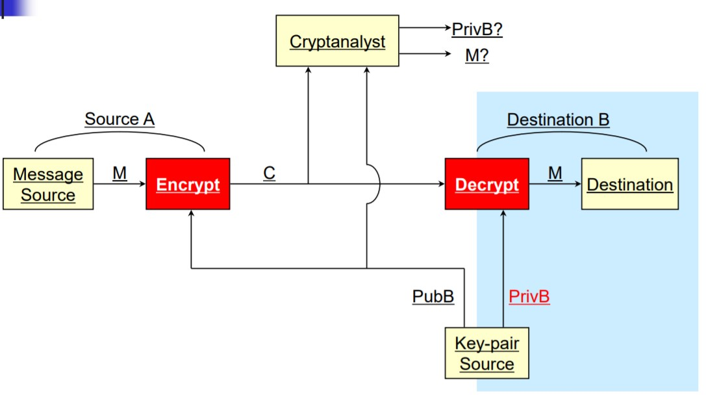
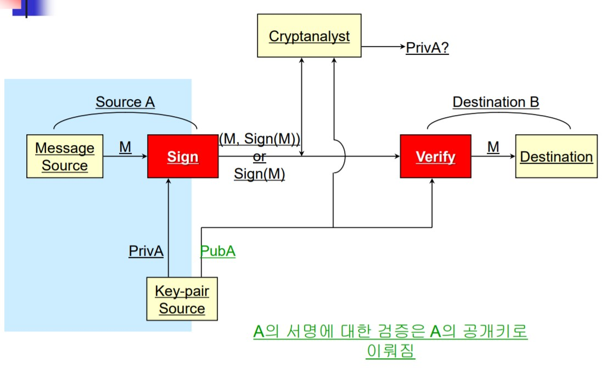
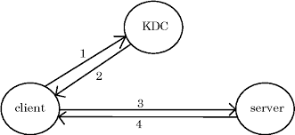
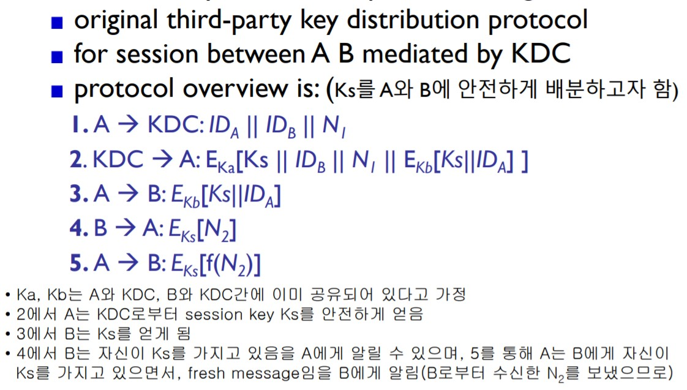
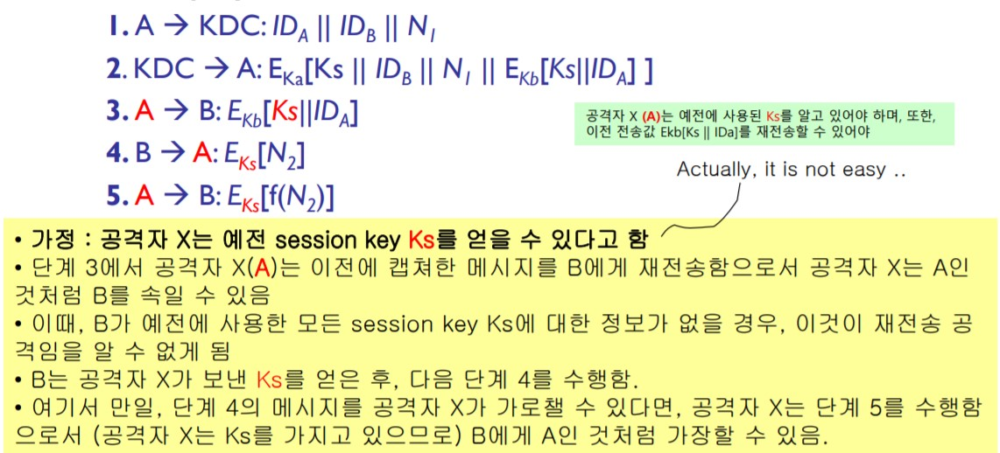

>  수업시간에 배운 내용을 정리하였습니다.

많이 알려진 보안 프로토콜에는 **대칭키**(Symmetric key)암호 그리고 **비대칭키**(Asymmetric key)암호가 있습니다. *비대칭키 암호*는 **공개키암호**라고도 부르는데요. 이 두가지를 자세하게 다루어 보겠습니다.

## Public Key Cryptography

Asymmetric key cryptography는  *private key* , *public key*  이렇게 두개의 키를 사용합니다.

공개키 암호화를 사용하는 방법은 두가지인데요. 각각 알아보도록 하겠습니다.

### 1. PKC: Encryption / Decryption

첫번째 방법은 가장 유명한 방법입니다.

A는 자신의 메세지를 B의 *public key*를 사용해서 암호화한 후 B에게 암호화한 메세지를 전달합니다. 그러면 B는 자신의 *private key*를 사용해서 암호화된 메세지를 복호화한 후 메세지를 읽습니다.

즉,  B의 *private key*를 아는 사람(B)만이 이를 해독할 수 있습니다.

### 2. PKC: Digital Signature (서명 검증 방식)

2번의 방법은 1번 방법보다 많이 사용하는 방식인데요. 그 이유는 1번보다 속도가 빠르기 때문입니다.

A는 자신의 *private key*로 메세지가 진짜 자신의 것이라고 인증하기 위해 sign을 합니다. 이 메세지는 B에게 전달되고 B는 A의 *public key*로 복호화하여 메세지가 진짜 A가 썻다는 것을 확인할 수 있게 되는 겁니다.

많이 들어본 내용이지 않나요? 넵! 바로 공인인증서와 https 통신에서 이 방법을 사용하고 있습니다.

### RSA

RSA는 대표적인 공개키 암호로 1977년에 개발되었습니다.

RSA는 큰 수를 소인수 분해(Prime Factorization Problem)하는 cost에 기반을 두고 있습니다.

> RSA를 이용해서 private key, public key를 만드는 과정과 얼마나 안전한지 등에 대한 내용은 넘어가도록 하겠습니다.

## Authentication Protocols

드디어 제가 정말 중요하다고 생각한 부분이 나왔습니다. 글을 따라가다 보면 분명히 흥미로우실 겁니다!

### Message Authentication

**Message Authentication**은 메세지를 교환하는 두 당사자를 제 3자로 부터 보호하는 걸 의미합니다.

그런데 만약에 메세지를 교환하는 두 당사자중 한명이 사기를 친다면? 굉장히 난감한 상황이 펼쳐질 겁니다. 예를 들자면, Json이 Mary에게 인증된 메세지를 보내는데, Mary가 msg를 위조할 수도 있고, Json이 Msg를 보내고는 안보냈다고 할 수 있습니다.

따라서 Message Authentication은 메세지를 주고받는 서로간에 신뢰가 깨졌을때 무의미해집니다.

### Digital Sinature

공개키인증방식에서는 위에서 배운 **Digital Signature**로 이 문제를 해결할 수 있습니다.

1. 메세지에 보내는 사람, 날짜, 시간을 넣어 서명을 한다.
2. 검증을 담당하는 third parties를 둔다.

### User Authentication

User Authentication은 말 그대로 그 사람이 맞는지 인증하는 과정입니다.

인증에는 두가지 과정이 있는데요

* **identification** (식별) : 이 사람은 'kim'이다.
* **verification** (검증) : 진짜 'kim'이 맞는지 binding하는 과정

### Replay Attacks

Replay Attacks은 많이 일어나는 공격방법으로 valid signed message를 복사하여 나중에 사용하는 방법입니다. 

#### 공격종류

* simple replay
  * 메세지를 복사하여 나중에 재전송
* repetition that can be logged
  * 허용시간 범위 내에서의 재전송공격
* repetition the cannot be detected
  * 원본 메세지는 정지 된 상태이며, 재전송 공격용 메세지만 도착 (가장 감지하기 힘듬)
* backward replay without modification
  * 수정 없는 역방향 재전송, 송수신 메세지의 내용에 차이가 별로 없을 때 발생 가능

#### 방어수단

* use of sequece numbers
  * 메세지에 숫자를 기록하여 마지막 숫자를 tracking하는 방법으로 가장 simple하다.

* Timestamps
  * 메세지를 보내는 시간을 기록하여 보낸다.
  * 주고받는 당사자의 시간의 동기화가 필요하다.

* **challenge/response (using unique nonce)**
  * 메세지를 보낸 곳에 난수를 암호화하여 보낸다. 그러면 난수를 받은 곳은 복호화하여 나온 난수에 합의한 알고리즘(예, nonce++)을 통해 난수를 update한 후 다시 보낸다.

### Using Symmetric Encryption

위의 **Message Authentication**에서의 보안 방법으로 third party를 둔다고 하였는데요. 대칭키 암호화에서는 믿을 만한 **Key Distribution Center (KDC)**를 두는 것으로 메세지를 검증하는 third party를 대체합니다.

#### Key Distrubution Center

* 모든 party는 KDC와 *master key*를 공유한다.

* KDC가 생성한 *session key*를 사용하여 parties간에 msg를 주고받는다.
* 이때의 *session key*는 *master key*를 이용해서 만들어집니다.

지금까지는 조금 헷갈릴 수 있습니다. 하지만 계속 읽어보면 이해하실겁니다.

#### session key 발급 과정 (out of band)

1. client는 자신의 master key를 KDC에게 보냅니다.
2. KDC는 master key를 암호화하여 생성된 session key를 client에게 보냅니다.

이때의 session key를 통신하고자 하는 서버에게 분배하여 메세지를 주고받게 됩니다. 위에서 설명한 session key 발급과정을 **out of band (키 설정 과정)**라고 부릅니다.

여기서 KDC로 부터 발급받는 키를 session key라고 부르는 이유는, 보안상의 이유로 session마다 key를 업데이트하기 때문에 한 session에서 사용할 수 있는 key라고 해서 session key라고 부릅니다.

#### session key 분배 과정 (key distribution protocol)

session key를 분배하는 과정도 쉽지만은 않습니다. session key를 분배할때 사용하는 protocol로는 **Needham-Schroeder Protocol**을 사용합니다.

#### 공격방법

그런데 4 & 5 단계에서 이 protocol도 replay attack을 당하기 쉽습니다. 밑에 설명된 것처럼 공격자가 이전에 받은 Ks를 나중에 재사용할 수 있기 때문입니다. 

#### 방어수단

- Adding timestamps
- using an extra nonce
  - 위에서 설명한 것 같이 자신이 보낸 것이라는 것을 입증하는 nonce를 보내고 그걸 update해서 다시 보내는 방식으로 msg를 verify합니다.