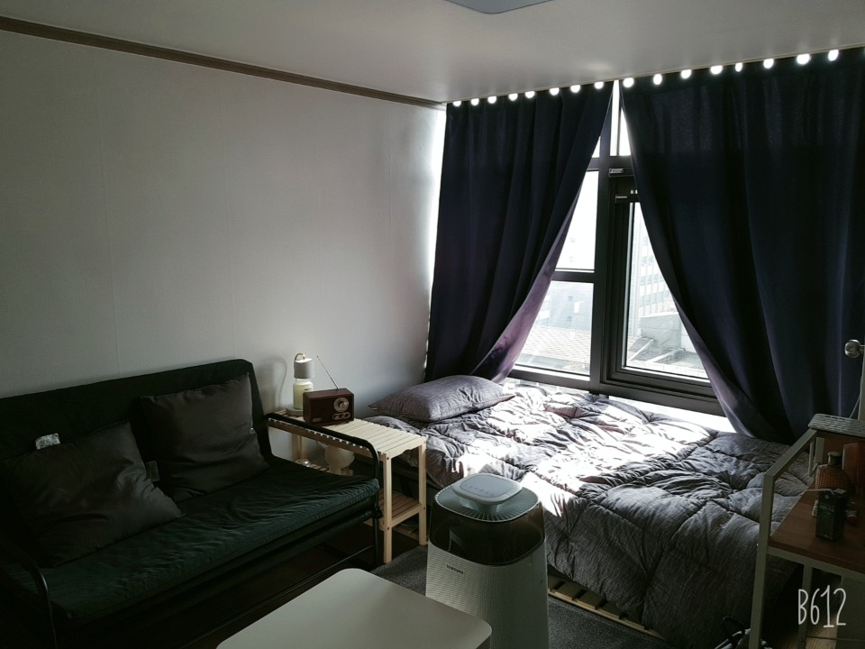

취업을 하고 집을 구할때 전세로 집을 구하려고 했으나, 부동산 4곳을 둘러본 결과 전세방이 아무데도 없었다. 그래서 오피스텔에 월세로 들어가서 살게 되었다. 열군데 정도 둘러보던중 이 방은 보자마자 바로 계약해야겠다는 생각이 들었던 방인데 가장 큰 이유는 한쪽 벽면이 전부 창문, 8층 남향이라 햇빛이 잘들어 오기 때문이다. 

이사한지 벌써 10일째이다.

저번 주말에는 이케아가서 Flex도 하고,

오늘의 집에서 집에 필요한 가구들을 구매하기 시작했다. 뭐...  신용카드는 140만원이 나왔고.. 월말에는 통장에 2만원이 남았지만..

저기 위에 있는 브라운 무드등은 라인인턴 할 때 받은것~! 저게 진짜 이쁘다 ㅎㅎ